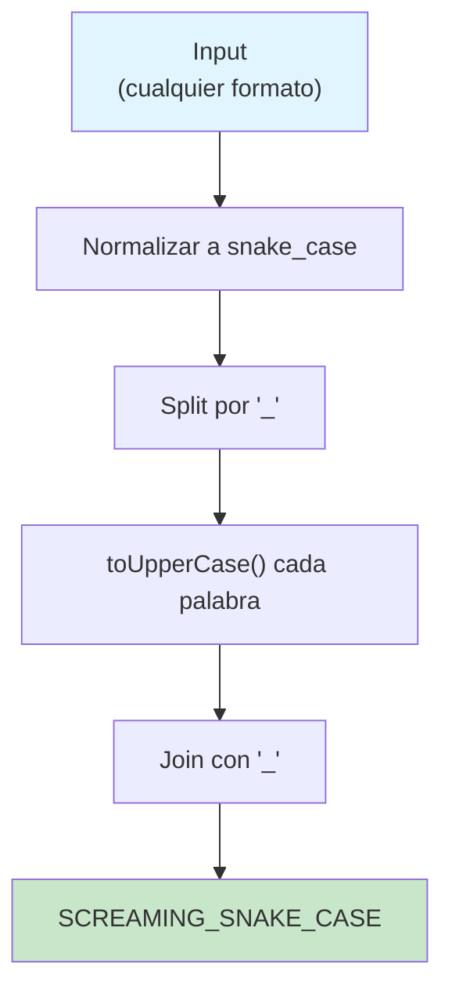

## Enunciado

Convertir un nombre de variable desde cualquiera de estos formatos:

- **camelCase**: `"thisIsVariable"`
- **PascalCase**: `"ThisIsVariable"`
- **snake_case**: `"this_is_variable"`
- **kebab-case**: `"this-is-variable"`

A **SCREAMING_SNAKE_CASE**:

- Todas las letras en mayúsculas
- Palabras separadas por guiones bajos (`_`)

## Análisis Inicial

### Objetivo

Identificar palabras individuales independientemente del formato original:

- **Guiones**: `-` o `_` marcan límites de palabras
- **Mayúsculas**: indican inicio de nueva palabra en camelCase/PascalCase

Luego unir con `_` y convertir a mayúsculas.

### Casos de Prueba

| Entrada | Salida | Formato |
|---------|--------|---------|
| `"userEmail"` | `"USER_EMAIL"` | camelCase |
| `"UserPassword"` | `"USER_PASSWORD"` | PascalCase |
| `"user_id"` | `"USER_ID"` | snake_case |
| `"user-address"` | `"USER_ADDRESS"` | kebab-case |
| `"username"` | `"USERNAME"` | palabra simple |
strategia: Normalizar → Transformar



## Implementación

```javascript
function toScreamingSnakeCase(variableName) {
  // 1. Insertar _ antes de mayúsculas: "userEmail" → "user_Email"
  const withUnderscores = variableName.replace(/([a-z])([A-Z])/g, '$1_$2')

  // 2. Normalizar guiones: "user-address" → "user_address"
  const normalized = withUnderscores.replace(/-/g, '_')

  // 3. Dividir: "user_Email" → ["user", "Email"]
  const words = normalized.split('_')

  // 4. Mayúsculas + unir: ["user", "Email"] → "USER_EMAIL"
  return words.map(word => word.toUpperCase()).join('_'
  )
}
```

## Análisis de Complejidad

### Temporal: $O(n)$

Cada operación recorre el string linealmente:

| Operación | Complejidad | Descripción |
|-----------|-------------|-------------|
| `replace` (regex) | $O(n)$ | Examina cada carácter una vez |
| `replace` (guiones) | $O(n)$ | Recorre el string completo |
| `split('_')` | $O(n)$ | Divide el string |
| `map().join()` | $O(n)$ | Itera palabras y reconstruye |

**Total**: $O(n) + O(n) + O(n) + O(n) = O(n)$

### Espacial: $O(n)$

Estructuras auxiliares creadas:

- Strings intermedios (`withUnderscores`, `normalized`)
- Array `words` con palabras extraídas
- String de salida

Todas proporcionales a la longitud del input
**O(n)** donde `n` es la longitud del string de entrada.

La función realiza las siguientes operaciones lineales:

- **`replace(/([a-z])([A-Z])/g, '$1_$2')`**: Recorre el string una vez para identificar transiciones de minúscula a mayúscula. En el peor caso, cada carácter se examina una vez.
- **`replace(

### ✅ Manejados Correctamente

| Input | Output | Nota |
|-------|--------|------|
| `""` | `""` | String vacío |
| `"username"` | `"USERNAME"` | Palabra simple |
| `"aB"` | `"A_B"` | Letras individuales |
| `"mixedFormat_case"` | `"MIXED_FORMAT_CASE"` | Formatos combinados |

### ⚠️ Limitaciones

**Acrónimos**: `"XMLParser"` → `"X_M_L_PARSER"` (cada mayúscula genera separación)

**Números**: `"user2Email"` → `"USER2EMAIL"` (la regex actual no detecta números como límites)

**Guiones bajo

### Conceptos Clave

- **Regex con grupos de captura**: `/([a-z])([A-Z])/g` + `'$1_$2'` inserta caracteres entre grupos
- **Normalización de datos**: Convertir múltiples formatos a uno intermedio reduce complejidad
- **Pipeline funcional**: `replace → split → map → join` es declarativo y legible
- **Regex simple vs. compleja**: Una sola regex que maneje todos los casos sería más difícil de mantener. La claridad prima sobre la brevedad.

### Lo que Aprendí

✨ Normalizar primero simplifica el problema
✨ Las regex con `$1`, `$2` permiten inserciones precisas
✨ `split → map → join` es un patrón común en transformaciones de textoos.

## Recursos y Referencias

- [MDN - String.prototype.replace()](https://developer.mozilla.org/es/docs/Web/JavaScript/Reference/Global_Objects/String/replace)
- [MDN - Regular Expressions](https://developer.mozilla.org/es/docs/Web/JavaScript/Guide/Regular_Expressions)
- [MDN - String.prototype.split()](https://developer.mozilla.org/es/docs/Web/JavaScript/Reference/Global_Objects/String/split)
- [MDN - Array.prototype.map()](https://developer.mozilla.org/es/docs/Web/JavaScript/Reference/Global_Objects/Array/map)
- [Naming Conventions in Programming](<https://en.wikipedia.org/wiki/Naming_convention_(programming)>)
