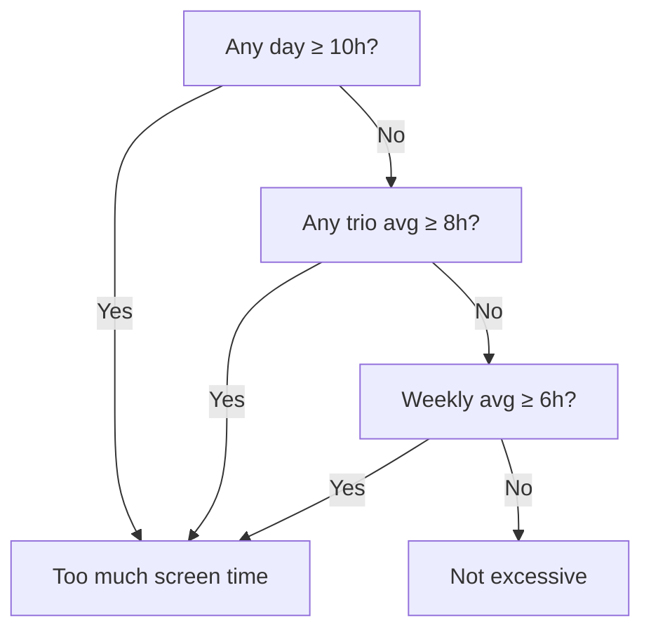

## Problem Statement

Given an array of seven integers, each representing the number of hours spent on your phone per day in a week, determine if the screen time is excessive based on these criteria:

- If any day has 10 or more hours, it's too much.
- If the average of any three consecutive days is 8 hours or more, it's too much.
- If the weekly average is 6 hours or more, it's too much.

## Analysis & Strategy

If any condition is met, the function should return `true`. The problem is solved with three checks:

1. Is there any day with 10+ hours?
2. Does any consecutive trio average 8+ hours?
3. Is the weekly average 6+ hours?

## Test Cases

1. `[1, 2, 3, 4, 5, 6, 7]` → **false**
   - No day exceeds 10 hours, no trio averages 8+, and the weekly average is below 6.
2. `[7, 8, 8, 4, 2, 2, 3]` → **false**
   - No day with 10+, no trio averages 8+, weekly average below 6.
3. `[5, 6, 6, 6, 6, 6, 6]` → **false**
   - No day with 10+, no trio averages 8+, weekly average below 6.
4. `[1, 2, 3, 11, 1, 3, 4]` → **true**
   - Day 4 has 11 hours (condition 1).
5. `[1, 2, 3, 10, 2, 1, 0]` → **true**
   - Day 4 has 10 hours (condition 1).
6. `[3, 3, 5, 8, 8, 9, 4]` → **true**
   - Trio [8, 8, 9] averages 8.33 (condition 2).
7. `[3, 9, 4, 8, 5, 7, 6]` → **true**
   - Weekly average is 6 (condition 3).

**Edge cases:**

- `[0, 0, 0, 0, 0, 0, 0]` → **false**
  - No day or average exceeds the limits.
- `[6, 6, 6, 6, 6, 6, 6]` → **true**
  - Weekly average is exactly 6 (condition 3).
- `[8, 8, 8, 1, 1, 1, 1]` → **true**
  - The initial trio averages 8 (condition 2).

## Solution Development

We use a sliding window for moving averages and short-circuit as soon as a condition is met. Everything can be done in a single pass through the array. The approach is:

1. Check if any day has 10 or more hours.
2. Calculate averages for every three consecutive days.
3. Calculate the weekly average.
4. Return `true` if any condition is met, otherwise `false`.

## Decision Diagram



### Implementation

```javascript
function tooMuchScreenTime(hours) {
  let totalHours = 0
  for (let i = 0; i < hours.length; i++) {
    // Check if any day has 10 or more hours
    if (hours[i] >= 10) {
      return true
    }

    totalHours += hours[i]

    // Check averages of three consecutive days
    if (i >= 2) {
      const threeDayAvg = (hours[i] + hours[i - 1] + hours[i - 2]) / 3
      if (threeDayAvg >= 8) {
        return true
      }
    }
  }

  // Calculate weekly average
  const weeklyAvg = totalHours / hours.length
  if (weeklyAvg >= 6) {
    return true
  }

  return false
}
```

## Complexity Analysis

- **Time:** $O(1)$ (array size is fixed)
- **Space:** $O(1)$ (only scalar variables)

## Reflections & Learnings

- Sliding window for moving averages
- Short-circuiting for efficiency
- Importance of covering all edge cases

## Resources & References

- [Sliding window - Wikipedia](https://en.wikipedia.org/wiki/Sliding_window)
- [freeCodeCamp - Daily Coding Challenge](https://www.freecodecamp.org/learn/daily-coding-challenge/2025-09-12/)
