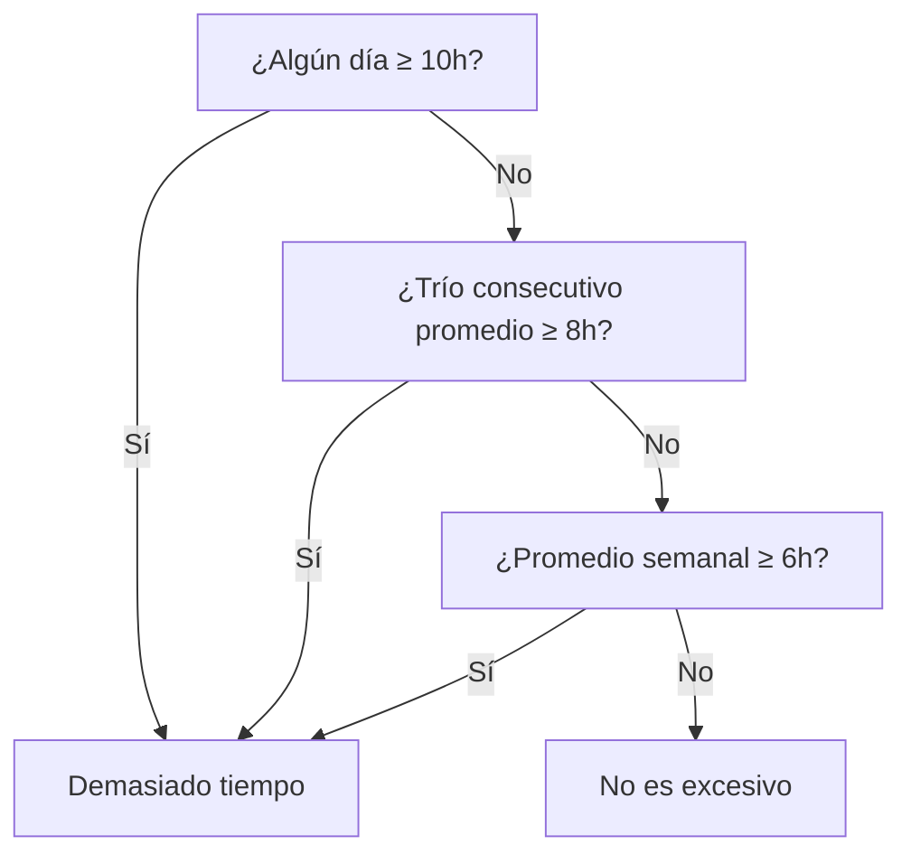

## Enunciado del Problema

Dado un array de siete números enteros, cada uno representa las horas de uso del teléfono por día en una semana. ¿Cuándo se considera excesivo?

- Si algún día tiene 10 horas o más.
- Si el promedio de cualquier trío de días consecutivos es mayor o igual a 8 horas.
- Si el promedio semanal es mayor o igual a 6 horas.

## Análisis y Estrategia

Basta con que se cumpla una sola condición para que la función retorne `true`. El problema se resuelve con tres verificaciones:

1. ¿Hay algún día con 10+ horas?
2. ¿Algún trío consecutivo promedia 8+ horas?
3. ¿El promedio semanal es 6+ horas?

## Casos de Prueba

1. `[1, 2, 3, 4, 5, 6, 7]` → **false**

- Ningún día supera las 10 horas, ningún trío de días consecutivos promedia 8 o más, y el promedio semanal es menor a 6.

2. `[7, 8, 8, 4, 2, 2, 3]` → **false**

- No hay días de 10+, ningún trío consecutivo promedia 8 o más, y el promedio semanal es menor a 6.

3. `[5, 6, 6, 6, 6, 6, 6]` → **false**

- No hay días de 10+, ningún trío consecutivo promedia 8 o más, y el promedio semanal es menor a 6.

4. `[1, 2, 3, 11, 1, 3, 4]` → **true**

- El cuarto día tiene 11 horas (condición 1).

5. `[1, 2, 3, 10, 2, 1, 0]` → **true**

- El cuarto día tiene 10 horas (condición 1).

6. `[3, 3, 5, 8, 8, 9, 4]` → **true**

- El trío [8, 8, 9] promedia 8.33 (condición 2).

7. `[3, 9, 4, 8, 5, 7, 6]` → **true**

- El trío [3, 9, 4] promedia 5.33, pero [9, 4, 8] promedia 7, [4, 8, 5] promedia 5.66, [8, 5, 7] promedia 6.66, [5, 7, 6] promedia 6, pero el promedio semanal es 6 (condición 3).

**Casos edge sugeridos:**

- `[0, 0, 0, 0, 0, 0, 0]` → **false**
  - Ningún día ni promedio supera los límites.
- `[6, 6, 6, 6, 6, 6, 6]` → **true**
  - El promedio semanal es exactamente 6 (condición 3).
- `[8, 8, 8, 1, 1, 1, 1]` → **true**
  - El trío inicial promedia 8 (condición 2).

## Desarrollo de la Solución

Usamos una ventana deslizante para los promedios móviles y cortocircuitamos en cuanto se cumple una condición. Todo se puede hacer en un solo recorrido del array. El enfoque es:

1. Verificar si algún día tiene 10 o más horas.
2. Calcular promedios de tres días consecutivos.
3. Calcular el promedio semanal.
4. Retornar `true` si alguna condición se cumple, si no, `false`.

## Diagrama de Decisión



### Implementación en Código

```javascript
function tooMuchScreenTime(hours) {
  let totalHours = 0
  for (let i = 0; i < hours.length; i++) {
    // Verificar si algún día tiene 10 o más horas
    if (hours[i] >= 10) {
      return true
    }

    totalHours += hours[i]

    // Verificar promedios de tres días consecutivos
    if (i >= 2) {
      const threeDayAvg = (hours[i] + hours[i - 1] + hours[i - 2]) / 3
      if (threeDayAvg >= 8) {
        return true
      }
    }
  }

  // Calcular promedio semanal
  const weeklyAvg = totalHours / hours.length
  if (weeklyAvg >= 6) {
    return true
  }

  return false
}
```

## Análisis de Complejidad

- **Tiempo:** $O(1)$ (el tamaño del array es fijo)
- **Espacio:** $O(1)$ (solo variables escalares)

## Reflexiones y Aprendizajes

- Ventana deslizante para promedios móviles
- Cortocircuito para eficiencia
- Importancia de cubrir todos los edge cases

## Recursos y Referencias

- [Ventana deslizante (sliding window) - Wikipedia](https://es.wikipedia.org/wiki/Ventana_deslizante)
- [freeCodeCamp - Daily Coding Challenge](https://www.freecodecamp.org/learn/daily-coding-challenge/2025-09-12/)
