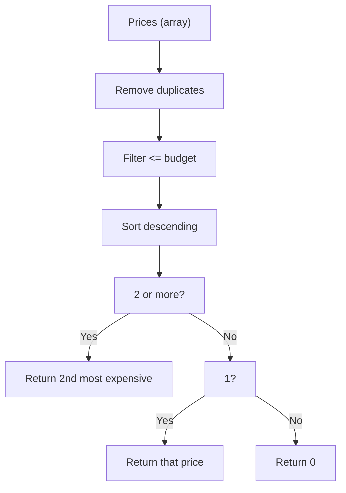

## Problem Statement

Given an array of integers representing laptop prices and an integer for your budget, implement a function that returns:

- The second most expensive laptop if it is within your budget, or
- The most expensive laptop within your budget, or
- 0 if no laptop is affordable.

Duplicate prices must be ignored.

## Initial Analysis

### Understanding the Problem

The function receives a list of prices and a maximum budget. The goal is to find the most expensive laptop you can buy, but if there are at least two options within budget, you must return the second most expensive. Duplicate prices are ignored: each laptop counts only once. If you can't afford any, the function returns 0.

### Key Test Cases

1. `[1500, 2000, 1800, 1400], 1900` → `1800` (most expensive within budget).
2. `[1500, 2000, 2000, 1800, 1400], 1900` → `1800` (ignores duplicates).
3. `[2099, 1599, 1899, 1499], 2200` → `1899` (most expensive within budget).
4. `[2099, 1599, 1899, 1499], 1000` → `0` (no laptop within budget).
5. `[1200, 1500, 1600, 1800, 1400, 2000], 1450` → `1400` (most expensive within budget).
6. `[1000, 1200, 1300, 1400], 1500` → `1300` (second most expensive within budget).

Case 6 checks that the function returns the second most expensive when there are at least two valid options.

## Visual: Flow Diagram



## Solution Development

### Strategy

1. Remove duplicates using a `Set`.
2. Filter prices within the budget.
3. Sort descending.
4. If there are at least two, return the second most expensive. If only one, return that. If none, return 0.

## Implementation

```javascript
/**
 * FreeCodeCamp Problem: Second Best
 * @param {number[]} laptops - Laptop prices
 * @param {number} budget - Budget
 * @returns {number} Second most expensive, most expensive, or 0
 */
function getLaptopCost(laptops, budget) {
  const uniquePrices = Array.from(new Set(laptops))
  uniquePrices.sort((a, b) => b - a)
  const affordable = uniquePrices.filter(price => price <= budget)
  if (affordable.length === 0)
    return 0
  if (affordable.length >= 2)
    return affordable[1]
  return affordable[0]
}
export default getLaptopCost
```

## Complexity Analysis

Time complexity:

$$O(n + k \log k)$$

- $n$: number of original prices
- $k$: number of unique prices

- Remove duplicates: $O(n)$
- Sort: $O(k \log k)$
- Filter: $O(k)$

Space complexity: $O(k)$ (for unique and filtered arrays).

## Edge Cases & Considerations

- All prices above budget → returns 0.
- Only one valid price → returns that value.
- Two or more valid → returns the second most expensive.
- Removing duplicates avoids counting repeated laptops.

## Reflections & Learnings

- `Set` efficiently removes duplicates.
- Filtering and sorting are key operations.
- If only the first and second most expensive are needed, selection algorithms or heaps can optimize further.

## Resources

- [JavaScript Set documentation](https://developer.mozilla.org/en-US/docs/Web/JavaScript/Reference/Global_Objects/Set)
- [Array.prototype.sort()](https://developer.mozilla.org/en-US/docs/Web/JavaScript/Reference/Global_Objects/Array/sort)
- [Selection algorithms](https://en.wikipedia.org/wiki/Selection_algorithm)
