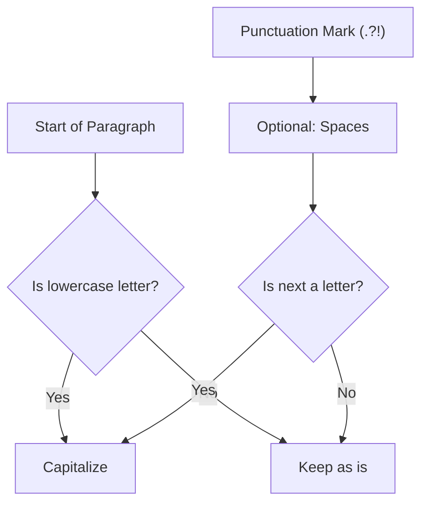

## Sentence Capitalizer - Analysis and Explanation

## Problem Statement

Given a paragraph, the goal is to return a new string where the first letter of each sentence is capitalized.

- All other characters must remain the same.
- Sentences can end with a period (`.`), one or more question marks (`?`), or one or more exclamation points (`!`).

## Initial Analysis

### Understanding the Problem

The challenge consists of identifying the start of each sentence within a block of text. A sentence begins in two possible situations:

1. At the beginning of the paragraph.
2. Immediately after a final punctuation mark (`.`, `?`, `!`), possibly with spaces in between.

We must transform only the first alphabetic character of each sentence to uppercase, keeping the rest of the text intact.

### Process Visualization



### Identified Test Cases

1. **Start of paragraph:** `this is...` $\rightarrow$ `This is...`
2. **Multiple sentences with spaces:** `hello world. how are you?` $\rightarrow$ `Hello world. How are you?`
3. **Repeated punctuation (ellipsis/exclamations):** `challenge... it was fun!!` $\rightarrow$ `challenge... It was fun!!`
4. **No spaces between sentences:** `crazy!!!strange` $\rightarrow$ `Crazy!!!Strange`
5. **Spaces before punctuation:** `. why` $\rightarrow$ `. Why`

## Solution Development

### Chosen Approach

The most efficient and readable way to solve this is using **Regular Expressions (RegExp)**. We will use JavaScript/TypeScript's `replace()` method with a callback function to transform only the captured letter.

The RegExp should look for:
- The start of the string (`^`).
- Or a sequence of final punctuation marks (`[.?!]+`) followed optionally by spaces (`\s*`).
- Followed by a lowercase letter (`[a-z]`).

### Implementation

```typescript
/**
 * Capitalizes the first letter of each sentence in a paragraph.
 * @param paragraph The input text.
 * @returns The text with capitalized sentences.
 */
function capitalizeSentences(paragraph: string): string {
  // RegExp Explanation:
  // (^|[.?!]+\s*) -> Group 1: Start of line OR final punctuation + optional spaces
  // ([a-z])       -> Group 2: The first lowercase letter that follows
  const regex = /(^|[.?!]+\s*)([a-z])/g

  return paragraph.replace(regex, (match, p1, p2) => {
    return p1 + p2.toUpperCase()
  })
}
```

## Complexity Analysis

### Time Complexity

$O(n)$, where $n$ is the length of the paragraph. The regular expression engine traverses the string once to identify and replace matches.

### Space Complexity

$O(n)$. A new string is created for the result, with a size proportional to the input string.

## Edge Cases and Considerations

- **Multiple punctuation:** Using `+` in `[.?!]+` correctly handles cases like `...` or `!!!`.
- **Absence of spaces:** The `\s*` expression allows sentences to be capitalized even if there is no space after the period.
- **Non-alphabetic characters:** If a sentence starts with a number or symbol, the RegExp will not match `[a-z]`, which is correct since they cannot be capitalized.

## Reflections and Learnings

### Applied Concepts

- **Capturing Groups:** Allow separating the "anchor" of the sentence (punctuation/start) from the character we actually want to modify.
- **Regex Alternation (`|`):** Fundamental for handling the special case of the start of the string along with sentence delimiters.

## Resources and References

- [MDN - String.prototype.replace()](https://developer.mozilla.org/en-US/docs/Web/JavaScript/Reference/Global_Objects/String/replace)
- [RegEx101](https://regex101.com/) - Tool for testing and explaining regular expression patterns.
