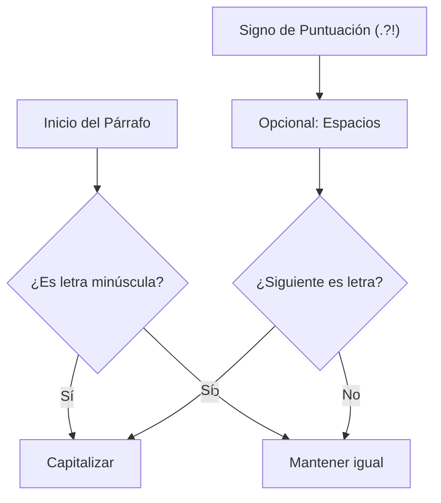

## Sentence Capitalizer - Análisis y Explicación

## Enunciado del Problema

Dado un párrafo, el objetivo es retornar un nuevo string donde la primera letra de cada oración esté en mayúscula.

- Todos los demás caracteres deben permanecer igual.
- Las oraciones pueden terminar con un punto (`.`), uno o más signos de interrogación (`?`), o uno o más signos de exclamación (`!`).

## Análisis Inicial

### Comprensión del Problema

El desafío consiste en identificar el inicio de cada oración dentro de un bloque de texto. Una oración comienza en dos situaciones posibles:

1. Al principio del párrafo.
2. Inmediatamente después de un signo de puntuación final (`.`, `?`, `!`), pudiendo haber espacios de por medio.

Debemos transformar únicamente el primer carácter alfabético de cada oración a mayúscula, manteniendo el resto del texto intacto.

### Visualización del Proceso



### Casos de Prueba Identificados

1. **Inicio de párrafo:** `this is...` $\rightarrow$ `This is...`
2. **Múltiples oraciones con espacios:** `hello world. how are you?` $\rightarrow$ `Hello world. How are you?`
3. **Puntuación repetida (elipsis/exclamaciones):** `challenge... it was fun!!` $\rightarrow$ `challenge... It was fun!!`
4. **Sin espacios entre oraciones:** `crazy!!!strange` $\rightarrow$ `Crazy!!!Strange`
5. **Espacios antes de la puntuación:** `. why` $\rightarrow$ `. Why`

## Desarrollo de la Solución

### Enfoque Elegido

La forma más eficiente y legible de resolver esto es mediante **Expresiones Regulares (RegExp)**. Utilizaremos el método `replace()` de JavaScript/TypeScript con una función de *callback* para transformar solo la letra capturada.

La RegExp debe buscar:
- El inicio del string (`^`).
- O una secuencia de signos de puntuación final (`[.?!]+`) seguida opcionalmente de espacios (`\s*`).
- Seguido de una letra minúscula (`[a-z]`).

### Implementación

```typescript
/**
 * Capitaliza la primera letra de cada oración en un párrafo.
 * @param paragraph El texto de entrada.
 * @returns El texto con las oraciones capitalizadas.
 */
function capitalizeSentences(paragraph: string): string {
  // Explicación de la RegExp:
  // (^|[.?!]+\s*) -> Grupo 1: Inicio de línea O puntuación final + espacios opcionales
  // ([a-z])       -> Grupo 2: La primera letra minúscula que sigue
  const regex = /(^|[.?!]+\s*)([a-z])/g

  return paragraph.replace(regex, (match, p1, p2) => {
    return p1 + p2.toUpperCase()
  })
}
```

## Análisis de Complejidad

### Complejidad Temporal

$O(n)$, donde $n$ es la longitud del párrafo. El motor de expresiones regulares recorre el string una sola vez para identificar y reemplazar las coincidencias.

### Complejidad Espacial

$O(n)$. Se crea un nuevo string para el resultado, cuyo tamaño es proporcional al string de entrada.

## Casos Edge y Consideraciones

- **Puntuación múltiple:** El uso de `+` en `[.?!]+` permite manejar correctamente casos como `...` o `!!!`.
- **Ausencia de espacios:** La expresión `\s*` permite que las oraciones se capitalicen incluso si no hay un espacio después del punto.
- **Caracteres no alfabéticos:** Si una oración comienza con un número o símbolo, la RegExp no coincidirá con `[a-z]`, lo cual es correcto ya que no se pueden capitalizar.

## Reflexiones y Aprendizajes

### Conceptos Aplicados

- **Capturing Groups:** Permiten separar el "ancla" de la oración (puntuación/inicio) del carácter que realmente queremos modificar.
- **Regex Alternation (`|`):** Fundamental para manejar el caso especial del inicio del string junto con los delimitadores de oración.

## Recursos y Referencias

- [MDN - String.prototype.replace()](https://developer.mozilla.org/es/docs/Web/JavaScript/Reference/Global_Objects/String/replace)
- [RegEx101](https://regex101.com/) - Herramienta para probar patrones de expresiones regulares.
