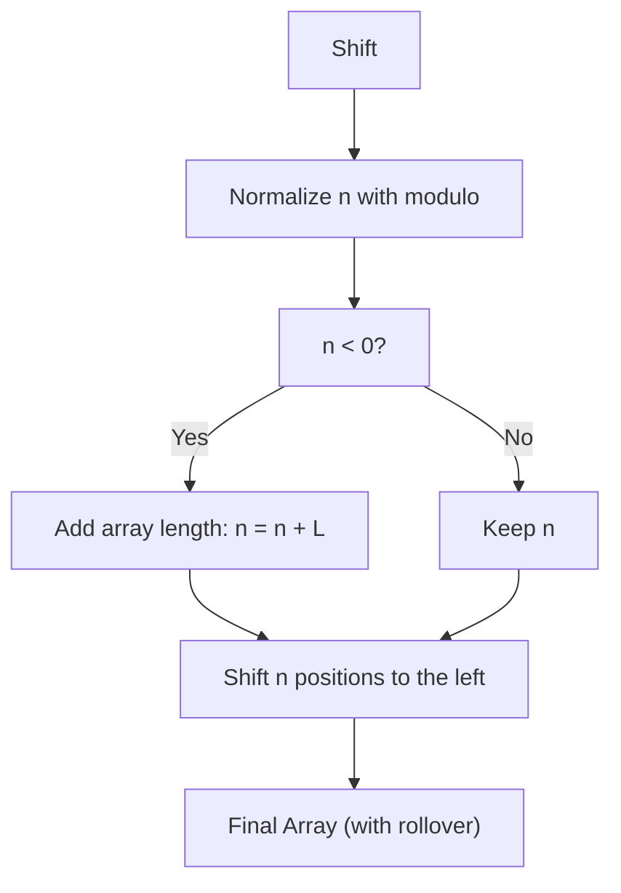

# Shift Array — FreeCodeCamp Daily Challenge

Programming is full of simple challenges that, once understood, become powerful and reusable tools. One of these is the **circular array shift**, also known in English as "shift array".

In this article, I show how I solved this classic problem, using key concepts like modular normalization and relying on methods like `slice()` and `concat()`.

---

## 📝 Problem Statement

> Given an array and an integer indicating how many positions to shift the array, return the shifted array.
>
> - A positive integer shifts the array to the **left**.
> - A negative integer shifts the array to the **right**.
> - The shift is circular (elements "reappear" at the other end).
>
> Example:
> If you have `[1, 2, 3]` and shift it 1 to the left, the result is `[2, 3, 1]`.

---

## 🔄 What does circular shift or rollover mean?

When we shift an array circularly, elements that "fall off" one end reappear on the other.
For example, if we shift `[1,2,3,4,5]` two places to the left, the first two elements `[1,2]` move to the end, resulting in `[3,4,5,1,2]`.
This behavior is also called "rollover", "circular rotation", or "wrap around".

---

## 🚩 Exploring Edge Cases

Before coding, let's think about cases that might cause errors:

- **Empty array:** What should we do if the array is empty?
- **Shift greater than the length:** What if we shift 12 positions in an array of length 5?
- **Negative shifts:** How do we interpret them correctly?

---

## ⚙️ Normalization: The modulo trick

Normalizing means translating any shift amount (even negative or very large numbers!) into a simple, equivalent step.

Imagine an array of length \( L \) and a shift \( n \):

\[
n_{\text{normalized}} = (n \% L + L) \% L
\]

This ensures that, whatever the value of \( n \), the shift stays "within" the array and goes in the correct direction.

**This is key!**
For example, shifting 8 positions in an array of length 5 is the same as shifting \( 8 \mod 5 = 3 \) positions.

---

## 🤔 Why convert negative shifts into equivalent positives?

When the shift number is negative, we're asking to move elements to the right, but it's easier to always work with positive shifts in code.
The trick is to add the array's length to the negative number and get the equivalent leftward shift.
For example, if we shift by `n = -2` in an array of length `5`, we do `-2 + 5 = 3`, so we move 3 positions to the left, which has the same result as moving 2 positions to the right.

This works because in a circular rotation, shifting X places to the right is the same as shifting N-X places to the left (where N is the array length).

---

## 📊 Process Visualization



---

## 🧪 Key Tests to Validate the Solution

Here are some tests that confirm whether the function works as expected:

```js
describe('shiftArray', () => {
  it('shifts 2 positions', () => {
    expect(shiftArray([1, 2, 3, 4, 5], 2)).toEqual([4, 5, 1, 2, 3])
  })
  it('shifts 5 positions (same as length)', () => {
    expect(shiftArray([1, 2, 3, 4, 5], 5)).toEqual([1, 2, 3, 4, 5])
  })
  it('shifts 0 positions', () => {
    expect(shiftArray([1, 2, 3, 4, 5], 0)).toEqual([1, 2, 3, 4, 5])
  })
  it('shifts 7 positions (greater than length)', () => {
    expect(shiftArray([1, 2, 3, 4, 5], 7)).toEqual([4, 5, 1, 2, 3])
  })
})
```

---

## 💻 Step-by-step JavaScript Implementation

The key is dividing the array and recombining it using `slice()` and `concat()`, two very useful methods, and normalizing the shift:

```js
function shiftArray(arr, n) {
  const length = arr.length
  if (length === 0)
    return arr

  // Normalize n
  n = n % length
  if (n < 0)
    n += length

  // Shift to the left (as required by the tests)
  // Split and recombine the array
  const part1 = arr.slice(n)
  const part2 = arr.slice(0, n)
  return part1.concat(part2)
}
```

---

### 🕵️‍♂️ Why does it work? Visual example of splitting with slice and concat

Suppose you have the array `[1, 2, 3, 4, 5]` and want to shift 2 positions:

```js
const arr = [1, 2, 3, 4, 5]
const n = 2

// Split the array into two parts
const part1 = arr.slice(n) // From position 2 to the end
const part2 = arr.slice(0, n) // From start to position 2 (not including 2)

console.log('part1:', part1) // [3, 4, 5]
console.log('part2:', part2) // [1, 2]

// Combine the parts for the shifted array
const result = part1.concat(part2)

console.log('result:', result) // [3, 4, 5, 1, 2]
```

**Output:**
```
part1: [3, 4, 5]
part2: [1, 2]
result: [3, 4, 5, 1, 2]
```

You can experiment with other values of n and arrays to see how splitting and recombining produces the circular shift.

---

## 📚 Useful Examples

| Input                       | n   | Output                      |
| --------------------------- | --- | --------------------------- |
| [1,2,3,4,5]                 | 2   | [4,5,1,2,3]                 |
| [1,2,3,4,5]                 | 5   | [1,2,3,4,5]                 |
| [1,2,3]                     | -1  | [3,1,2]                     |
| ["alpha","bravo","charlie"] | -11 | ["bravo","charlie","alpha"] |
| [0,1,2,3,4,5,6,7,8,9]       | 15  | [5,6,7,8,9,0,1,2,3,4]       |

---

## 📐 Complexity

- **Time:** \( O(n) \), we traverse the array once.
- **Space:** \( O(n) \), since we create new subarrays and a result.

---

## 🔎 Key Resources

- [MDN Array.prototype.slice](https://developer.mozilla.org/en-US/docs/Web/JavaScript/Reference/Global_Objects/Array/slice)
- [MDN Array.prototype.concat](https://developer.mozilla.org/en-US/docs/Web/JavaScript/Reference/Global_Objects/Array/concat)
- [Leetcode 189. Rotate Array](https://leetcode.com/problems/rotate-array/)

---
