## Array Shift: Circular Array Shifting

## 📋 Problem Description

Write a function that, given an array and a number $n$, returns the array **shifted** $n$ positions. The function must handle:

- **Positive shifts**: rotate the array to the right
- **Negative shifts**: rotate the array to the left
- **Shifts larger than length**: normalized using modulo
- **Circular behavior**: elements exiting one end enter from the other

### Examples

```javascript
shiftArray([1, 2, 3], 1); // → [2, 3, 1]
shiftArray([1, 2, 3], -1); // → [3, 1, 2]
shiftArray(["alpha", "bravo", "charlie"], 5); // → ["charlie", "alpha", "bravo"]
shiftArray(["alpha", "bravo", "charlie"], -11); // → ["bravo", "charlie", "alpha"]
shiftArray([0, 1, 2, 3, 4, 5, 6, 7, 8, 9], 15); // → [5, 6, 7, 8, 9, 0, 1, 2, 3, 4]
```

### Shift Visualization


## 🧠 Problem Analysis

### Understanding Rotation

For an array of length $L$ and shift $n$:

1. **Normalization**: $n_{norm} = n \bmod L$
2. **Division**: Split at index $n_{norm}$
3. **Reconstruction**: Concatenate in reverse order

### Mathematical Formula

For an element at position $i$ after rotating $n$ positions to the right:

$$
\text{new\_position}(i) = (i + n) \bmod L
$$

For left rotation (negative shift):

$$
\text{new\_position}(i) = (i - |n|) \bmod L = (i + L - |n|) \bmod L
$$

### Flow Diagram


## 💡 Step-by-Step Solution

### Step 1: Handle Base Cases

```javascript
function shiftArray(arr, n) {
  const length = arr.length;
  if (length === 0) return arr;
} // Empty array
```

### Step 2: Normalize the Shift

```javascript
// Normalize n to be within array bounds
n = n % length;

// Convert negative shifts to positive equivalent
if (n < 0) {
  n += length;
}
```

**Normalization Table**:

| Original $n$ | $L$ | $n \bmod L$ | $n < 0$ | Final $n$ | Interpretation                  |
| ------------ | --- | ----------- | ------- | --------- | ------------------------------- |
| 7            | 5   | 2           | No      | 2         | 2 to the right                  |
| -3           | 5   | -3          | Yes     | 2         | 3 to the left = 2 to the right  |
| 0            | 5   | 0           | No      | 0         | No change                       |
| 5            | 5   | 0           | No      | 0         | Full rotation                   |
| -11          | 3   | -2          | Yes     | 1         | 11 to the left = 1 to the right |
| 15           | 10  | 5           | No      | 5         | 5 to the right                  |

### Step 3: Split and Concatenate

```javascript
  // Split the array into two parts
  const part1 = arr.slice(n);     // From n to end
  const part2 = arr.slice(0, n);  // From start to n

  return part1.concat(part2);
}
```

### Division Visualization

For `shiftArray([1, 2, 3, 4, 5], 2)`:

```mermaid
graph TB
    subgraph "Original Array"
        A[Index 0: 1]
        B[Index 1: 2]
        C[Index 2: 3]
        D[Index 3: 4]
        E[Index 4: 5]
    end

    subgraph "Split at n=2"
        direction LR
        P2[part2: [1, 2]]
        P1[part1: [3, 4, 5]]
    end

    subgraph "Concatenated Result"
        R[3, 4, 5, 1, 2]
    end

    A --> P2
    B --> P2
    C --> P1
    D --> P1
    E --> P1

    P1 --> R
    P2 --> R
```

## 🎯 Complete Implementation

```javascript
/**
 * Rotates an array n positions to the right (positive) or left (negative)
 * @param {Array} arr - The array to shift
 * @param {number} n - Number of positions (+ right, - left)
 * @returns {Array} The shifted array
 */
function shiftArray(arr, n) {
  const length = arr.length;
  if (length === 0) return arr;

  // Normalize n within array bounds
  n = n % length;
  if (n < 0) {
    n += length; // Convert negative shifts to positive equivalent
  }

  // Split and concatenate the array
  const part1 = arr.slice(n);
  const part2 = arr.slice(0, n);
  return part1.concat(part2);
}

export default shiftArray;
```

## 📊 Complexity Analysis

### Time Complexity

$$
T(n) = O(L)
$$

Where $L$ is the array length. Both `slice()` and `concat()` operations are $O(L)$.

### Space Complexity

$$
S(n) = O(L)
$$

Two subarrays (`part1` and `part2`) plus the result array are created, all proportional to $L$.

### Performance Table

| Operation         | Complexity | Explanation          |
| ----------------- | ---------- | -------------------- |
| `arr.length`      | $O(1)$     | Property access      |
| `n % length`      | $O(1)$     | Arithmetic operation |
| `arr.slice(n)`    | $O(L - n)$ | Copy elements        |
| `arr.slice(0, n)` | $O(n)$     | Copy elements        |
| `concat()`        | $O(L)$     | Join arrays          |
| **Total**         | **$O(L)$** | Linear in length     |

## 🔍 Edge Cases and Validation

### Special Cases


### Test Cases

```javascript
describe("Shift Array - Edge Cases", () => {
  it("Empty array", () => {
    expect(shiftArray([], 5)).toEqual([]);
  });

  it("Zero shift", () => {
    expect(shiftArray([1, 2, 3], 0)).toEqual([1, 2, 3]);
  });

  it("Shift equal to length", () => {
    expect(shiftArray([1, 2, 3], 3)).toEqual([1, 2, 3]);
  });

  it("Shift larger than length", () => {
    expect(shiftArray([1, 2, 3], 7)).toEqual([2, 3, 1]); // 7 % 3 = 1
  });

  it("Large negative shift", () => {
    expect(shiftArray([1, 2, 3], -11)).toEqual([2, 3, 1]); // -11 % 3 = -2, -2 + 3 = 1
  });

  it("Single element array", () => {
    expect(shiftArray([42], 100)).toEqual([42]);
  });
});
```

## 🚀 Optimizations and Alternatives

### Method 1: In-Place Rotation with Reversals (Space $O(1)$)

For mutable arrays, we can use the **triple reversal** algorithm:

$$
\text{rotate}(arr, n) = \text{reverse}(\text{reverse}(arr[0:n]) + \text{reverse}(arr[n:L]))
$$

```javascript
function shiftArrayInPlace(arr, n) {
  const length = arr.length;
  if (length === 0) return arr;

  n = ((n % length) + length) % length;

  // Triple reversal
  reverse(arr, 0, n - 1); // Reverse first part
  reverse(arr, n, length - 1); // Reverse second part
  reverse(arr, 0, length - 1); // Reverse entire array

  return arr;
}

function reverse(arr, start, end) {
  while (start < end) {
    [arr[start], arr[end]] = [arr[end], arr[start]];
    start++;
    end--;
  }
}
```

**Complexity**: Time $O(L)$, Space $O(1)$

### Method 2: Using Deque (Double-ended Queue)

```javascript
function shiftArrayDeque(arr, n) {
  const length = arr.length;
  if (length === 0) return arr;

  n = ((n % length) + length) % length;

  const deque = [...arr];
  for (let i = 0; i < n; i++) {
    deque.unshift(deque.pop()); // Move last to first
  }

  return deque;
}
```

### Method Comparison

```mermaid
graph LR
    subgraph "Slice & Concat O(n) space"
        A[✅ Simple] --> B[✅ Immutable]
        B --> C[❌ Extra space]
    end

    subgraph "Triple Reversal O(1) space"
        D[✅ No extra space] --> E[⚠️ Mutates original]
        E --> F[✅ Efficient]
    end

    subgraph "Deque O(n²) worst case"
        G[⚠️ Simple] --> H[❌ Inefficient]
        H --> I[❌ Multiple operations]
    end
```



## 📚 Related Concepts

### Modular Arithmetic

The modulo operator $\bmod$ is fundamental for normalizing rotations:

$$
n \bmod L = \begin{cases}
n & \text{if } 0 \leq n < L \\
n - kL & \text{where } k = \lfloor n/L \rfloor
\end{cases}
$$

### Circular Arrays

Rotation implements a **circular buffer**:


## 🎓 Key Learnings

### Applied Techniques

1. **Modular Normalization**: Reduce large shifts
2. **Slice & Concat**: Efficient array division
3. **Negative→Positive Conversion**: $(n \bmod L + L) \bmod L$
4. **Immutability**: Don't modify the original array

### Design Patterns

- **Divide and Conquer**: Break problem into subparts
- **Coordinate Transformation**: Map old indices to new
- **Edge Case Handling**: Exhaustive validation

## 🔗 Related Problems

| Problem                                                            | Platform | Difficulty | Relation        |
| ------------------------------------------------------------------ | -------- | ---------- | --------------- |
| [189. Rotate Array](https://leetcode.com/problems/rotate-array/)   | LeetCode | Medium     | Same problem    |
| [796. Rotate String](https://leetcode.com/problems/rotate-string/) | LeetCode | Easy       | String rotation |
| [61. Rotate List](https://leetcode.com/problems/rotate-list/)      | LeetCode | Medium     | Linked lists    |

## 📖 References

- [MDN: Array.prototype.slice()](https://developer.mozilla.org/en-US/docs/Web/JavaScript/Reference/Global_Objects/Array/slice)
- [MDN: Array.prototype.concat()](https://developer.mozilla.org/en-US/docs/Web/JavaScript/Reference/Global_Objects/Array/concat)
- [Wikipedia: Circular Buffer](https://en.wikipedia.org/wiki/Circular_buffer)
- [GeeksforGeeks: Array Rotation](https://www.geeksforgeeks.org/array-rotation/)

---

**Tags**: `#algorithms` `#arrays` `#rotation` `#javascript` `#freecodecamp` `#modular-arithmetic`
