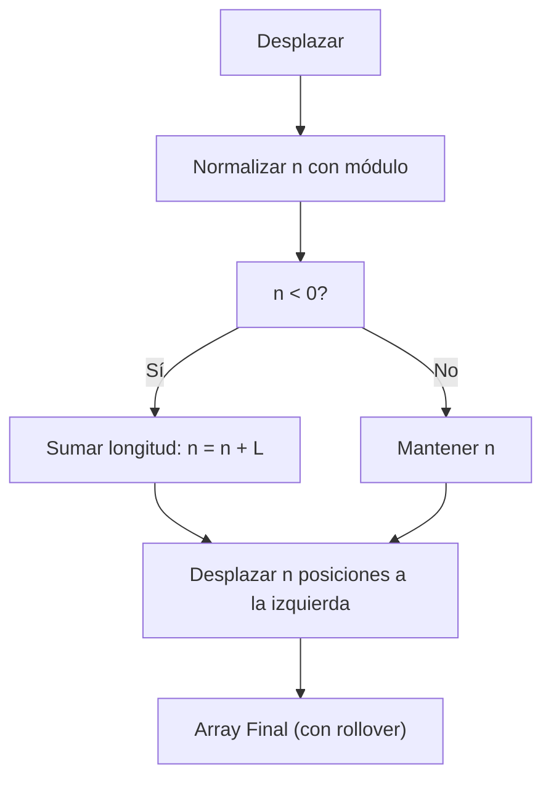

# Desplazar Array — FreeCodeCamp Daily Challenge

La programación está llena de desafíos sencillos que, una vez comprendidos, se transforman en herramientas poderosas y reutilizables. Uno de ellos es el **desplazamiento circular de arrays**, también conocido como “shift array” en inglés.

En este artículo muestro cómo resolví este clásico problema, utilizando conceptos clave como la normalización modular y empleando métodos como `slice()` y `concat()`.

---

## 📝 Enunciado del Problema

> Dado un array y un entero que indica cuántas posiciones desplazar el array, devuelve el array desplazado.
>
> - Un entero positivo desplaza el array hacia la **izquierda**.
> - Un entero negativo desplaza el array hacia la **derecha**.
> - El desplazamiento es circular (los elementos "reaparecen" por el otro extremo).
>
> Ejemplo:
> Si tienes `[1, 2, 3]` y lo desplazas 1 a la izquierda, el resultado es `[2, 3, 1]`.

---

## 🔄 ¿Qué significa desplazamiento circular o rollover?

Cuando desplazamos un array de manera circular, los elementos que “salen” por un extremo vuelven a aparecer por el otro.
Por ejemplo, al desplazar `[1,2,3,4,5]` dos lugares a la izquierda, los primeros dos elementos `[1,2]` pasan al final, quedando `[3,4,5,1,2]`.
Este comportamiento se llama también “rollover”, “rotación circular” o “wrap around”.

---

## 🚩 Explorando Casos Especiales

Antes de programar, pensemos en los casos que pueden causar errores:

- **Array vacío:** ¿Qué hacemos si el array no tiene elementos?
- **Desplazamiento mayor que la longitud:** ¿Qué pasa si desplazamos 12 posiciones un array de largo 5?
- **Desplazamientos negativos:** ¿Cómo los interpretamos correctamente?

---

## ⚙️ Normalización: El truco del módulo

Normalizar equivale a traducir cualquier cantidad de desplazamiento (¡incluso negativos o muy grandes!) en un paso equivalente sencillo.

Imagina un array de largo \( L \) y un desplazamiento \( n \):

\[
n_{\text{normalizado}} = (n \% L + L) \% L
\]

Esto asegura que, sea cual sea el valor de \( n \), el desplazamiento quede “dentro” del array y en el sentido correcto.

**¡Esto es clave!**
Así, desplazar 8 posiciones un array de largo 5 es lo mismo que desplazar \( 8 \mod 5 = 3 \) posiciones.

---

## 🤔 ¿Por qué convertir el desplazamiento negativo en positivo?

Cuando el número de desplazamiento es negativo, significa que queremos mover los elementos hacia la derecha, pero es más sencillo trabajar siempre con desplazamientos positivos.
Por eso, el truco es sumar la longitud del array al número negativo y obtener así el desplazamiento equivalente en sentido contrario.
Por ejemplo, si desplazamos `n = -2` en un array de longitud `5`, hacemos `-2 + 5 = 3`, y movemos 3 posiciones hacia la izquierda, lo cual es exactamente el mismo resultado que mover 2 posiciones a la derecha.

Este proceso aprovecha el hecho de que en una rotación circular da igual el sentido:
mover X a la derecha equivale a mover N-X a la izquierda (siendo N el largo).

---

## 📊 Visualización del Proceso



---

## 🧪 Tests clave para validar la solución

Veamos algunos tests que confirman si la función funciona como esperamos:

```js
describe('shiftArray', () => {
  it('desplaza 2 posiciones', () => {
    expect(shiftArray([1, 2, 3, 4, 5], 2)).toEqual([4, 5, 1, 2, 3])
  })
  it('desplaza 5 posiciones (igual al largo)', () => {
    expect(shiftArray([1, 2, 3, 4, 5], 5)).toEqual([1, 2, 3, 4, 5])
  })
  it('desplaza 0 posiciones', () => {
    expect(shiftArray([1, 2, 3, 4, 5], 0)).toEqual([1, 2, 3, 4, 5])
  })
  it('desplaza 7 posiciones (mayor al largo)', () => {
    expect(shiftArray([1, 2, 3, 4, 5], 7)).toEqual([4, 5, 1, 2, 3])
  })
})
```

---

## 💻 Implementación paso a paso en JavaScript

La clave está en dividir el array y recomponerlo usando `slice()` y `concat()`, dos métodos muy útiles, además de normalizar el desplazamiento:

```js
function shiftArray(arr, n) {
  const length = arr.length
  if (length === 0)
    return arr

  // Normalizamos n
  n = n % length
  if (n < 0)
    n += length

  // Desplazamos a la izquierda (como piden los tests)
  // Separamos y recomponemos el array
  const part1 = arr.slice(n)
  const part2 = arr.slice(0, n)
  return part1.concat(part2)
}
```

---

### 🕵️‍♂️ ¿Por qué funciona? Ejemplo visual del corte usando slice y concat

Imagina que tienes el array `[1, 2, 3, 4, 5]` y quieres desplazar 2 posiciones:

```js
const arr = [1, 2, 3, 4, 5]
const n = 2

// Cortamos el array en dos partes
const part1 = arr.slice(n) // Desde posición 2 hasta el final
const part2 = arr.slice(0, n) // Desde el inicio hasta posición 2 (sin incluirla)

console.log('part1:', part1) // [3, 4, 5]
console.log('part2:', part2) // [1, 2]

// Reunimos las partes para obtener el array desplazado
const result = part1.concat(part2)

console.log('result:', result) // [3, 4, 5, 1, 2]
```

**Salida:**
```
part1: [3, 4, 5]
part2: [1, 2]
result: [3, 4, 5, 1, 2]
```

Puedes probar con otros valores de n y distintos arrays para entender cómo el corte y el reordenamiento producen el desplazamiento circular.

---

## 📚 Ejemplos útiles

| Input                       | n   | Output                      |
| --------------------------- | --- | --------------------------- |
| [1,2,3,4,5]                 | 2   | [4,5,1,2,3]                 |
| [1,2,3,4,5]                 | 5   | [1,2,3,4,5]                 |
| [1,2,3]                     | -1  | [3,1,2]                     |
| ["alpha","bravo","charlie"] | -11 | ["bravo","charlie","alpha"] |
| [0,1,2,3,4,5,6,7,8,9]       | 15  | [5,6,7,8,9,0,1,2,3,4]       |

---

## 📐 Complejidad

- **Tiempo:** \( O(n) \), recorremos el array una vez.
- **Espacio:** \( O(n) \), porque creamos nuevos subarrays y el resultado.

---

## 🔎 Recursos clave

- [MDN Array.prototype.slice](https://developer.mozilla.org/en-US/docs/Web/JavaScript/Reference/Global_Objects/Array/slice)
- [MDN Array.prototype.concat](https://developer.mozilla.org/en-US/docs/Web/JavaScript/Reference/Global_Objects/Array/concat)

---
