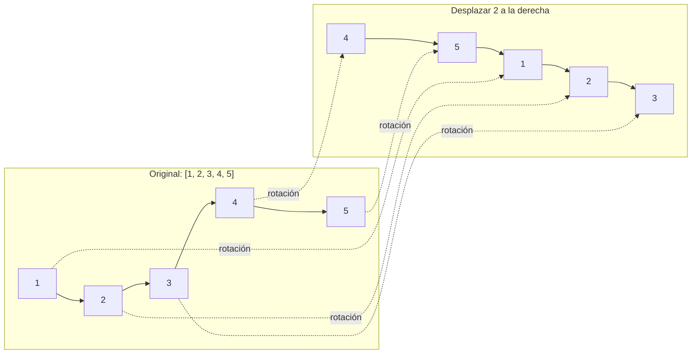
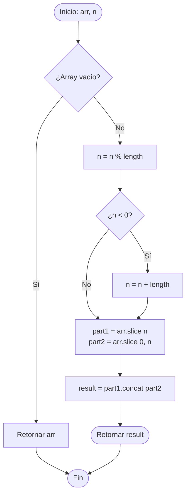
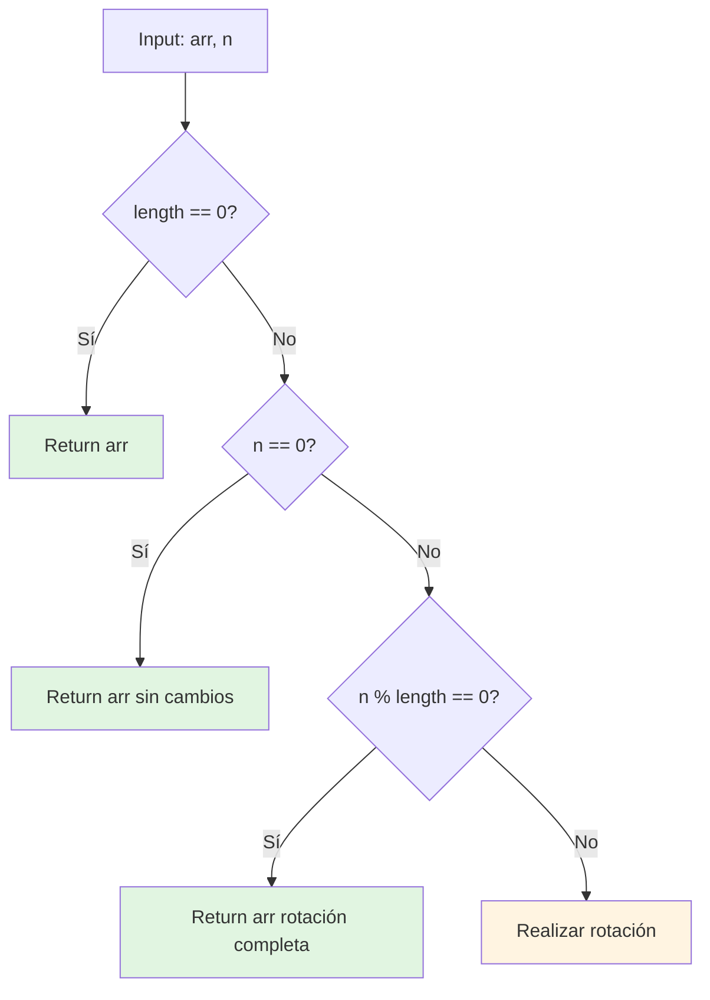
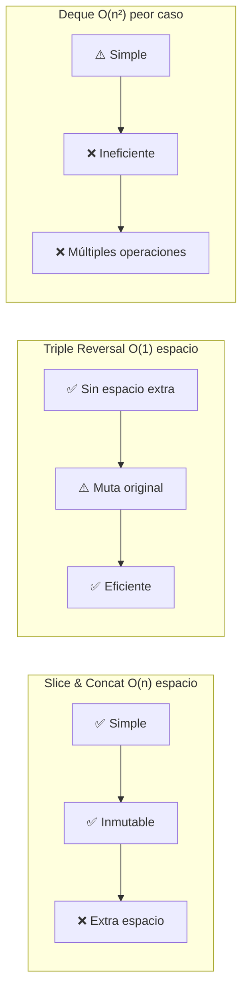
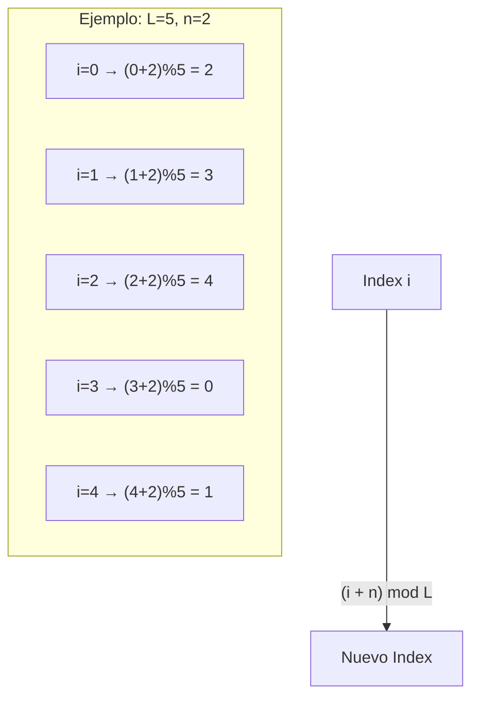

## Shift Array: Desplazamiento Circular de Arrays

## 📋 Descripción del Problema

Escribe una función que, dado un array y un número $n$, devuelva el array **desplazado** $n$ posiciones. La función debe manejar:

- **Desplazamientos positivos**: rotan el array hacia la derecha
- **Desplazamientos negativos**: rotan el array hacia la izquierda
- **Desplazamientos mayores que la longitud**: se normalizan usando módulo
- **Comportamiento circular**: los elementos que salen por un extremo entran por el otro

### Ejemplos

```javascript
shiftArray([1, 2, 3], 1) // → [2, 3, 1]
shiftArray([1, 2, 3], -1) // → [3, 1, 2]
shiftArray(['alpha', 'bravo', 'charlie'], 5) // → ["charlie", "alpha", "bravo"]
shiftArray(['alpha', 'bravo', 'charlie'], -11) // → ["bravo", "charlie", "alpha"]
shiftArray([0, 1, 2, 3, 4, 5, 6, 7, 8, 9], 15) // → [5, 6, 7, 8, 9, 0, 1, 2, 3, 4]
```

### Visualización del Desplazamiento



## 🧠 Análisis del Problema

### Comprendiendo la Rotación

Para un array de longitud $L$ y desplazamiento $n$:

1. **Normalización**: $n_{norm} = n \bmod L$
2. **División**: Split en índice $n_{norm}$
3. **Reconstrucción**: Concatenar en orden invertido

### Fórmula Matemática

Para un elemento en posición $i$ después de rotar $n$ posiciones a la derecha:

$$
\text{nueva\_posición}(i) = (i + n) \bmod L
$$

Para rotación a la izquierda (desplazamiento negativo):

$$
\text{nueva\_posición}(i) = (i - |n|) \bmod L = (i + L - |n|) \bmod L
$$

### Diagrama de Flujo



## 💡 Solución Paso a Paso

### Paso 1: Manejar Casos Base

```javascript
function shiftArray(arr, n) {
  const length = arr.length;
  if (length === 0) return arr; // Array vacío
```

### Paso 2: Normalizar el Desplazamiento

```javascript
// Normalizar n para estar dentro de los límites
n = n % length

// Convertir desplazamientos negativos a equivalente positivo
if (n < 0) {
  n += length
}
```

**Tabla de Normalización**:

| $n$ original | $L$ | $n \bmod L$ | $n < 0$ | $n$ final | Interpretación |
|--------------|-----|-------------|---------|-----------|----------------|
| 7 | 5 | 2 | No | 2 | 2 a la derecha |
| -3 | 5 | -3 | Sí | 2 | 3 a la izquierda = 2 a la derecha |
| 0 | 5 | 0 | No | 0 | Sin cambios |
| 5 | 5 | 0 | No | 0 | Rotación completa |
| -11 | 3 | -2 | Sí | 1 | 11 a la izquierda = 1 a la derecha |
| 15 | 10 | 5 | No | 5 | 5 a la derecha |

### Paso 3: Dividir y Concatenar

```javascript
  // Dividir el array en dos partes
  const part1 = arr.slice(n);     // Desde n hasta el final
  const part2 = arr.slice(0, n);  // Desde inicio hasta n

  return part1.concat(part2);
}
```

### Visualización de la División

Para `shiftArray([1, 2, 3, 4, 5], 2)`:

```mermaid
graph TB
    subgraph "Array Original"
        A[Index 0: 1]
        B[Index 1: 2]
        C[Index 2: 3]
        D[Index 3: 4]
        E[Index 4: 5]
    end

    subgraph "División en n=2"
        direction LR
        P2[part2: [1, 2]]
        P1[part1: [3, 4, 5]]
    end

    subgraph "Resultado Concatenado"
        R[3, 4, 5, 1, 2]
    end

    A --> P2
    B --> P2
    C --> P1
    D --> P1
    E --> P1

    P1 --> R
    P2 --> R
```

## 🎯 Implementación Completa

```javascript
/**
 * Rota un array n posiciones a la derecha (positivo) o izquierda (negativo)
 * @param {Array} arr - El array a desplazar
 * @param {number} n - Número de posiciones (+ derecha, - izquierda)
 * @returns {Array} El array desplazado
 */
function shiftArray(arr, n) {
  const length = arr.length
  if (length === 0)
    return arr

  // Normalizar n dentro de los límites del array
  n = n % length
  if (n < 0) {
    n += length // Convertir desplazamientos negativos a equivalente positivo
  }

  // Dividir y concatenar el array
  const part1 = arr.slice(n)
  const part2 = arr.slice(0, n)
  return part1.concat(part2)
}

export default shiftArray
```

## 📊 Análisis de Complejidad

### Complejidad Temporal

$$
T(n) = O(L)
$$

Donde $L$ es la longitud del array. Ambas operaciones `slice()` y `concat()` son $O(L)$.

### Complejidad Espacial

$$
S(n) = O(L)
$$

Se crean dos subarrays (`part1` y `part2`) más el array resultado, todos de tamaño proporcional a $L$.

### Tabla de Performance

| Operación | Complejidad | Explicación |
|-----------|-------------|-------------|
| `arr.length` | $O(1)$ | Acceso a propiedad |
| `n % length` | $O(1)$ | Operación aritmética |
| `arr.slice(n)` | $O(L - n)$ | Copia elementos |
| `arr.slice(0, n)` | $O(n)$ | Copia elementos |
| `concat()` | $O(L)$ | Une arrays |
| **Total** | **$O(L)$** | Lineal en longitud |

## 🔍 Casos Edge y Validación

### Casos Especiales



### Test Cases

```javascript
describe('Shift Array - Casos Edge', () => {
  it('Array vacío', () => {
    expect(shiftArray([], 5)).toEqual([])
  })

  it('Desplazamiento cero', () => {
    expect(shiftArray([1, 2, 3], 0)).toEqual([1, 2, 3])
  })

  it('Desplazamiento igual a longitud', () => {
    expect(shiftArray([1, 2, 3], 3)).toEqual([1, 2, 3])
  })

  it('Desplazamiento mayor que longitud', () => {
    expect(shiftArray([1, 2, 3], 7)).toEqual([2, 3, 1]) // 7 % 3 = 1
  })

  it('Desplazamiento negativo grande', () => {
    expect(shiftArray([1, 2, 3], -11)).toEqual([2, 3, 1]) // -11 % 3 = -2, -2 + 3 = 1
  })

  it('Array de un elemento', () => {
    expect(shiftArray([42], 100)).toEqual([42])
  })
})
```

## 🚀 Optimizaciones y Alternativas

### Método 1: Rotación In-Place con Reversals (Espacio $O(1)$)

Para arrays mutables, podemos usar el algoritmo de **triple reversión**:

$$
\text{rotate}(arr, n) = \text{reverse}(\text{reverse}(arr[0:n]) + \text{reverse}(arr[n:L]))
$$

```javascript
function shiftArrayInPlace(arr, n) {
  const length = arr.length
  if (length === 0)
    return arr

  n = ((n % length) + length) % length

  // Triple reversión
  reverse(arr, 0, n - 1) // Reversa primera parte
  reverse(arr, n, length - 1) // Reversa segunda parte
  reverse(arr, 0, length - 1) // Reversa todo

  return arr
}

function reverse(arr, start, end) {
  while (start < end) {
    [arr[start], arr[end]] = [arr[end], arr[start]]
    start++
    end--
  }
}
```

**Complejidad**: Tiempo $O(L)$, Espacio $O(1)$

### Método 2: Usando Deque (Double-ended Queue)

```javascript
function shiftArrayDeque(arr, n) {
  const length = arr.length
  if (length === 0)
    return arr

  n = ((n % length) + length) % length

  const deque = [...arr]
  for (let i = 0; i < n; i++) {
    deque.unshift(deque.pop()) // Mover último al inicio
  }

  return deque
}
```

### Comparación de Métodos



## 📚 Conceptos Relacionados

### Aritmética Modular

El operador módulo $\bmod$ es fundamental para normalizar rotaciones:

$$
n \bmod L = \begin{cases}
n & \text{si } 0 \leq n < L \\
n - kL & \text{donde } k = \lfloor n/L \rfloor
\end{cases}
$$

### Arrays Circulares

La rotación implementa un **buffer circular**:



## 🎓 Aprendizajes Clave

### Técnicas Aplicadas

1. **Normalización Modular**: Reducir desplazamientos grandes
2. **Slice & Concat**: División eficiente de arrays
3. **Conversión Negativo→Positivo**: $(n \bmod L + L) \bmod L$
4. **Inmutabilidad**: No modificar el array original

### Patrones de Diseño

- **Divide y Conquistarás**: Dividir el problema en subpartes
- **Transformación de Coordenadas**: Mapear índices viejos a nuevos
- **Manejo de Casos Edge**: Validación exhaustiva

## 🔗 Problemas Relacionados

| Problema | Plataforma | Dificultad | Relación |
|----------|-----------|------------|----------|
| [189. Rotate Array](https://leetcode.com/problems/rotate-array/) | LeetCode | Medium | Mismo problema |
| [796. Rotate String](https://leetcode.com/problems/rotate-string/) | LeetCode | Easy | Rotación de strings |
| [61. Rotate List](https://leetcode.com/problems/rotate-list/) | LeetCode | Medium | Linked lists |

## 📖 Referencias

- [MDN: Array.prototype.slice()](https://developer.mozilla.org/en-US/docs/Web/JavaScript/Reference/Global_Objects/Array/slice)
- [MDN: Array.prototype.concat()](https://developer.mozilla.org/en-US/docs/Web/JavaScript/Reference/Global_Objects/Array/concat)
- [Wikipedia: Circular Buffer](https://en.wikipedia.org/wiki/Circular_buffer)
- [GeeksforGeeks: Array Rotation](https://www.geeksforgeeks.org/array-rotation/)

---

**Tags**: `#algoritmos` `#arrays` `#rotation` `#javascript` `#freecodecamp` `#modular-arithmetic`
