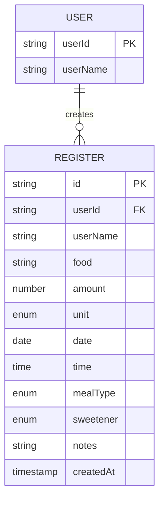

## Part 1: Data Model Design — Nutrition Tracker

## Motivation: Why Build a Nutritional Tracker?

Making healthy choices starts with **self-awareness**. This tracker aims to record the nutrition habits of family members, helping everyone make better decisions. For me, it's the perfect technical challenge to apply modern React and frontend best practices.

---

## 1. Project Setup

Creating the project with Vite is fast and simple:

```bash
npm create vite@latest nutritional-tracker -- --template react-ts
```

---

## 2. Defining the Data Model: Theory & Practice

### 2.1. Entity Formula

Each "consumption event" records:

$$
\text{Register} = (id, userId, userName, food, amount, unit, date, time, mealType, sweetener, notes, createdAt)
$$

Below you’ll find an explanation for each variable.

### 2.2. Visual Model Schema



---

## 3. Flexible Unit System

| Unit                              | Use Case            | Example               |
| --------------------------------- | ------------------- | --------------------- |
| `gr`, `ml`                        | Measured (grams/ml) | 150 ml juice          |
| `unit`                            | Countable items     | 3 eggs                |
| `portion`                         | Standard serving    | 1 portion rice        |
| `small-portion` / `large-portion` | Subjective sizes    | 1 large-portion pizza |

---

## 4. Sweetener Field: Ternary Logic

Instead of using a boolean, we choose:

$$
sweetener \in \{ null, "sugar", "sweetener" \}
$$

This supports more detailed tracking (sugar-free days, sweetener consumption, etc.).

---

## 5. Required vs Optional Fields

All fields except for `notes` and `sweetener` are **required** for solid analysis.

$$
Register = \text{Required fields} \cup \{ notes, sweetener \}
$$

---

## 6. Time Fields: Why Both `date` and `createdAt`?

- `date` and `time`: domain info (when the food was consumed).
- `createdAt`: technical metadata (when it was logged in the system).

> $ T*{\text{real}} \neq T*{\text{logged}} $

---

## 7. What’s Next?

- Set up testing with Vitest + Testing Library.
- Create robust validation with Zod.
- Implement a localStorage wrapper with tolerant parsing and error handling.

**Continue reading:**
_Part 2: Testing Setup_ → Vitest, localStorage mocks, and tests to ensure confidence with every change.
