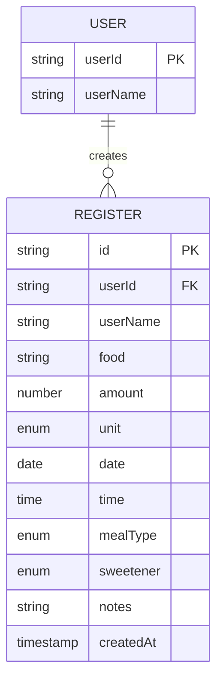

## Part 1: Data Model Design — Nutrition Tracker

## Motivation: Why build a Nutritional Tracker?

The first step to acquiring healthy habits is **self-awareness**. The idea behind this tracker is to keep a record of the family's food intake to encourage better decisions. It also represents an ideal technical challenge to apply modern React and frontend best practices.

---

## 1. Project Setup

Creating the project with Vite is straightforward and fast:

```bash
npm create vite@latest nutritional-tracker -- --template react-ts
```

---

## 2. Defining the Data Model: Theory and Practice

### 2.1. Entity Formula

Each "consumption event" records:

$$
\text{Record} = (id, userId, userName, food, amount, unit, date, time, mealType, sweetener, notes, createdAt)
$$

Below is an explanation of each variable.

### 2.2. Visual Model Schema



---

## 3. Flexible Unit System

| Unit                             | Use Case           | Example                |
| --------------------------------- | ------------------ | ---------------------- |
| `gr`, `ml`                       | Measured (grams/ml)| 150 ml juice           |
| `unit`                           | Countable items    | 3 eggs                 |
| `portion`                        | Standard portion   | 1 portion rice         |
| `small-portion` / `large-portion`| Subjective sizes   | 1 large slice of pizza |

---

## 4. Sweetener Field: Ternary Logic

Instead of a boolean, we use:

$$
sweetener \in \{ null, "sugar", "sweetener" \}
$$

This allows for more detailed tracking (sugar-free days, sweetener consumption, etc.).

---

## 5. Required vs Optional Fields

All fields except `notes` and `sweetener` are **required** for solid analysis.

$$
Record = \text{Required fields} \cup \{ notes, sweetener \}
$$

---

## 6. Temporal Fields: Why `date` and `createdAt`?

- `date` and `time`: domain data (when it was consumed).
- `createdAt`: technical metadata (when it was recorded in the system).

> $ T*{\text{real}} \neq T*{\text{record}} $

---

## 7. What's next?

- Testing environment setup with Vitest + Testing Library.
- Robust validation with Zod.
- LocalStorage wrapper with tolerant parsing and error handling.

---

## Series Navigation

- [Part 2: Testing Environment Setup →](/posts/nutritional-tracker-part2/)

### Additional Resources

- [Vite Documentation](https://vitejs.dev/)
- [React with TypeScript](https://reactjs.org/docs/static-type-checking.html#typescript)
- [Mermaid.js for diagrams](https://mermaid-js.github.io/mermaid/#/)
