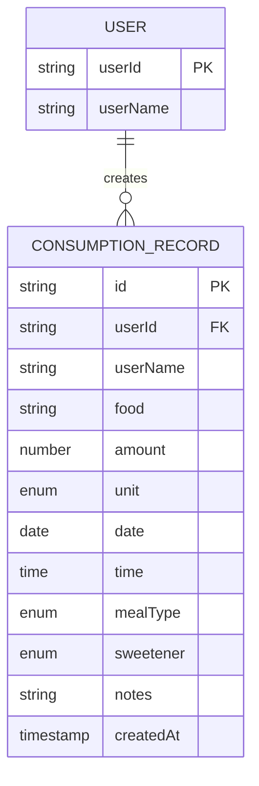
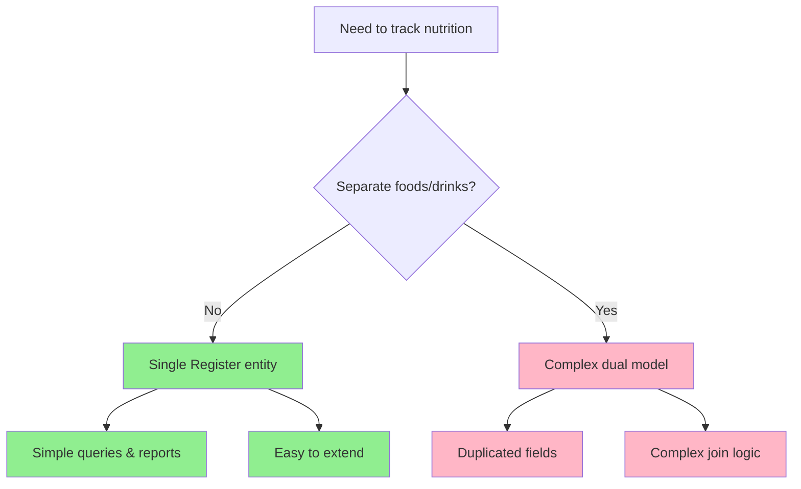

## Introduction

I started this side project to track nutritional intake and improve daily food choices. Instead of reaching for a full framework like Next.js or Remix, I chose React with Vite as the bundler. This approach allows for rapid iteration, minimal configuration overhead, and the flexibility to reuse components in other projects.

This first article documents the data model design process—the foundation that will drive the entire application's architecture.

## Project Setup

The initial setup was straightforward using Vite's scaffolding tool:

```bash
npm create vite@latest playground -- --template react
```

With the development environment ready, the logical first step was defining the data model. This would inform the input form structure and establish clear boundaries for what data we need to capture. For the MVP, I decided to use `localStorage` for persistence—simple, fast, and requiring no backend infrastructure.

## Data Model Design

### Core Structure

The data model centers around a single `Register` entity that captures each consumption event. Here's the complete structure:

```javascript
const consumptionRecord = {
  // Unique identifiers
  id: 'generated-uuid',
  userId: 'user123',
  userName: 'UserName',

  // What was consumed
  food: 'Red apple',
  amount: 2,
  unit: 'unit', // Options: "g", "ml", "portion", "unit", "small-portion", "large-portion"

  // When it was consumed
  date: '2025-11-05', // ISO YYYY-MM-DD
  time: '09:30', // 24h HH:MM
  mealType: 'breakfast', // Options: "breakfast", "lunch", "snack", "dinner", "between-meals"

  // Additional characteristics
  sweetener: null, // Options: "sugar", "sweetener", null
  notes: '',

  // Metadata
  createdAt: '2025-11-05T09:35:00Z'
}
```

### Design Decisions

Every data modeling choice affects the application's usability, extensibility, and maintainability. Here's the reasoning behind each key decision.

#### Why Unify Foods and Beverages?

**Decision:** Use a single "consumption record" concept instead of separate entities for food and drinks.

**Reasoning:**

- Simplifies the model significantly
- The main difference is the unit (g vs ml)—easily handled with an enum
- Avoids duplicating common fields (date, time, user, meal type)
- Makes queries and future reports much simpler
- Users don't think in terms of "food vs drink"—they think "I consumed X"

**Alternative considered:** Separate `FoodRecord` and `BeverageRecord` entities
**Why rejected:** Added complexity with minimal benefit; most fields would be identical

#### Why Free-text Food Field?

**Decision:** Keep the food field unstructured (free text) without predefined categories.

**Reasoning:**

- Enables fast iteration without over-engineering
- Real usage patterns will guide future categorization
- More flexible for users in the MVP stage
- Avoids the "your food isn't in our list" frustration
- Categories can be added later based on actual data analysis

**Future path:** Once we have real data, we can:

- Identify common patterns
- Implement autocomplete suggestions
- Add optional tags or categories
- Maintain backward compatibility

#### Meal Type + Time: Both Required

**Decision:** Keep both fields independent and mandatory.

**Reasoning:**

- Allows analysis by meal type: "At what times do I typically have breakfast?"
- Doesn't assume fixed schedules (breakfast at 2 PM is perfectly valid)
- Added "between-meals" category for snacks that don't fit main meals
- Provides richer data for time distribution charts
- Meal type is semantic, time is factual—both add value

**Example use case:** A user who works night shifts can track "dinner" at 6 AM without the system fighting their input.

#### Flexible Unit System

**Decision:** Support units: g, ml, unit, portion, small-portion, large-portion.

**Unit Types and Use Cases:**

| Unit Type | Use Case | Example |
|-----------|----------|---------|
| g / ml | Precise measurements | 150ml milk, 80g cheese |
| unit | Countable items | 2 apples, 1 cookie |
| portion | Standard serving | 1 portion rice |
| small-portion / large-portion | Subjective sizes | 1 large-portion pasta |

**Reasoning:**

- Covers real-world scenarios: weighed items, liquids, countable objects, and subjective portions
- Portions are inherently subjective—acknowledging this is better than forcing precision
- Lets users choose their preferred level of granularity
- Supports both careful trackers and casual users

**Caveat:** Portions can't be directly compared across users, but that's acceptable for personal tracking.

#### Sweetener as Ternary Field

**Decision:** Use `null | "sugar" | "sweetener"` instead of a boolean.

**Reasoning:**

- `null` represents "not applicable" or "unsweetened"
- Explicitly distinguishes natural sugar from artificial sweeteners
- Enables tracking sugar intake trends over time
- Not mandatory because most foods aren't sweetened
- Supports future features like "sugar-free days" tracking

**Why not boolean:** A boolean can't represent three distinct states without awkward naming.

### Entity-Relationship Diagram



This diagram illustrates the one-to-many relationship between users and their consumption records, with all key attributes labeled.

### Decision Flow Diagram

This flowchart shows the thought process behind the unified model:



## Metadata and Technical Fields

### Identifiers

- **`id`:** Unique identifier (UUID) for each record. Enables future edit/delete operations and ensures no collisions.
- **`userId`:** User identifier for multi-user support from day one. Even though the MVP might be single-user, building this in early avoids painful migrations later.

### Timestamps

- **`date + time`:** When the consumption actually happened (domain data). This is what users care about and what we'll analyze.
- **`createdAt`:** When the record was logged in the system (technical metadata). Useful for auditing, debugging sync issues, and detecting late entries.

**Why both?** You might eat breakfast at 8 AM but log it at 10 AM. Both timestamps tell different, valuable stories.

## Future Considerations

These features are deliberately excluded from the MVP but inform the current design:

### Categorization

- Identify patterns from real usage data
- Migrate to suggested list with autocomplete
- Implement tags or multiple categories (fruits, vegetables, proteins, etc.)
- Maintain free-text as fallback option

### Validations

- Time range validation (0:00-23:59)
- Positive amount constraints
- Logical unit combinations (ml restricted to liquids)
- Date reasonableness checks

### Planned Reports

- Distribution by meal type
- Consumption time heatmaps
- Sugar vs sweetener tracking
- Food frequency analysis
- Dietary variety over time periods
- Per-user comparative analysis

## Technology Stack

For the MVP, we're using `localStorage` as the persistence layer. This choice offers:

**Advantages:**

- Zero backend infrastructure needed
- Instant reads/writes
- Works offline by default
- Perfect for prototyping

**Limitations:**

- ~5-10MB storage limit (sufficient for thousands of records)
- No cross-device sync
- Vulnerable to browser data clearing

**Migration path:** The abstracted storage layer makes future migration to IndexedDB or a backend API straightforward.

## What's Next?

With the data model defined, the immediate next steps are:

1. **Set up the testing environment** (Vitest + Testing Library)
2. **Configure development tools** (linters, formatters, automation)
3. **Implement the validation layer** (Zod schemas)
4. **Build the persistence layer** (localStorage wrapper)

These foundations will enable confident, test-driven development of the core features.

## Continue Reading

In [Part 2: Testing Setup](/posts/nutritional-tracker-part-2), we configure Vitest, implement mocks for localStorage, and establish a robust testing workflow.

**Coming in this series:**

- Part 2: Testing Environment Setup ✓
- Part 3: Data Validation with Zod ✓
- Part 4: Persistence Layer Implementation ✓

---

*Have questions or suggestions about the data model? The design is intentionally flexible—feedback welcome as we build this out.*
