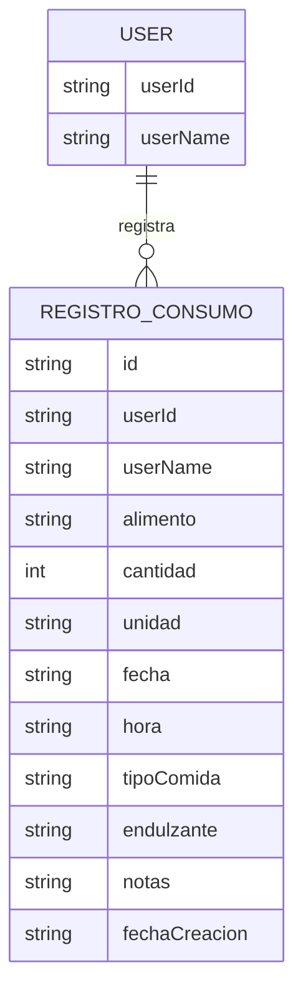

## Introduction

In this post I'll document the step-by-step process of a side project I started to keep nutritional records and help make better daily food choices. I chose to start from a blank React project using Vite as the bundler because I wanted to try some new tools and avoid a full framework like Next.js or Remix. I also wanted fast, simple development without worrying about server configuration or routing, and the ability to reuse pieces in other projects.

## Initial setup

The first step was to create the project with the following command:

```bash
npm create vite@latest playground -- --template react
```

Once the environment was set up, I decided the first practical step would be defining the data model to drive the input form. For the initial stage I chose to use `localStorage` for persistence.

## Initial data model

The initial data model I designed looks like this:

```javascript
const consumptionRecord = {
  id: 'generated-uuid', // unique record ID
  userId: 'user123', // ID of the user who logs the record
  userName: 'UserName', // user's display name

  // What was consumed
  food: 'Red apple', // free text
  amount: 2, // numeric
  unit: 'unit', // options: "g", "ml", "portion", "unit", "small-portion", "large-portion"

  // When it was consumed
  date: '2025-11-05', // ISO YYYY-MM-DD
  time: '09:30', // 24h HH:MM
  mealType: 'breakfast', // options: "breakfast", "lunch", "snack", "dinner", "between-meals"

  // Additional characteristics
  sweetener: null, // options: "sugar", "sweetener", null (unsweetened)
  notes: '', // optional free text

  // Metadata
  createdAt: '2025-11-05T09:35:00Z' // ISO timestamp when the record was created
}
```

### Entity-Relationship diagram

The following ER diagram illustrates the data model:



This diagram shows how each consumption record is linked to a user via `userId` and lists the main attributes of the model.

## Design process documentation

### Initial need

Build an app to log food consumption with the ability to analyze the data later using charts.

### Identified requirements

#### Mandatory

- User (ID and name)
- Food consumed
- Amount and unit
- Date and time
- Meal type

#### Optional

- Sweetener (sugar/sweetener/none)
- Additional notes

### Key design decisions

#### Unifying foods and beverages

**Decision**: Use a single "consumption record" concept instead of separate entities for food and drinks.

**Reasoning**:

- Simplifies the model.
- The difference is mainly the unit (g vs ml).
- Avoids duplicating common fields.
- Makes queries and reports simpler.

#### Food as free text

**Decision**: Keep the food field unstructured initially (free text).

**Reasoning**:

- Enables fast iteration without over-engineering.
- Real usage patterns will guide future categorization.
- More flexible for users in the MVP.
- Categories can be added later based on real data.

#### Meal type + time (both required)

**Decision**: Keep both fields independent and required.

**Reasoning**:

- Allows analysis by meal type (for example: "at what times do we have breakfast?").
- Does not assume fixed times (breakfast at 2 PM is allowed).
- Added "between-meals" for consumptions that don't fit main meals.
- Provides richer data for time distribution charts.

#### Flexible unit system

**Decision**: Units: g, ml, unit, portion (with size variants).

**Reasoning**:

- Covers real cases: weighed items, liquids, countable items, subjective portions.
- Portions are inherently subjective and kept as a concept.
- Lets the user choose the granularity they prefer.

#### Sweetener as a ternary field

**Decision**: `null | "sugar" | "sweetener"`

**Reasoning**:

- `null` represents "not applicable" or "unsweetened".
- Explicitly distinguishes sugar from artificial sweeteners.
- Enables tracking sugar intake over time.
- Not mandatory because not all foods are sweetened.

## Metadata fields

### IDs

- `id`: Unique identifier for the record (enables future edit/delete).
- `userId`: User identifier (multi-user support from the start).

### Timestamps

- `date + time`: When the consumption happened (domain data).
- `createdAt`: When the record was logged (technical metadata useful for auditing).

## Future considerations (not implemented in MVP)

### Categorization

- Once real data is collected, patterns can be identified.
- Possible migration to a suggested list with autocomplete.
- Tags or multiple categories (fruits, vegetables, proteins, etc.).

### Validations

- Valid time ranges.
- Positive amounts.
- Logical unit combinations (`ml` only for liquids).

### Planned reports

- Distribution by meal type.
- Heatmap of consumption times.
- Sugar/sweetener tracking.
- Food frequency.
- Dietary variety over periods.
- Per-user analysis (if multi-user).

## Technology

For the MVP we use `localStorage`, allowing quick development without a backend and keeping data in the user's browser.

## Next step

The immediate next step in development is to define the base architecture and prepare the development environment. This includes:

- Establishing the project structure (scaffolding) to organize code efficiently.
- Installing required dependencies such as state management or validation libraries.
- Configuring development tools like linters, formatters and automation scripts.

With these foundations, the project will be ready to move into implementing key features.

---

<!-- Author notes:
1. Do you want to add example charts or diagrams to illustrate future reports?
2. Consider adding a "Next steps" checklist that details subsequent development phases.
3. Would you like to include a table with sample consumption records for clarity? -->
