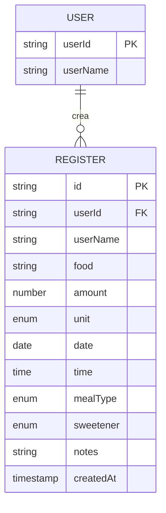

## Parte 1: Diseño del Modelo de Datos — Nutrition Tracker

## Motivación: ¿Por qué crear un Nutritional Tracker?

El primer paso para adquirir hábitos saludables es el **autoconocimiento**. La idea de este tracker es tener un registro de la alimentación de los miembros de la familia para fomentar mejores decisiones. Además, representa un desafío técnico ideal para aplicar React moderno y buenas prácticas de frontend.

---

## 1. Setup del Proyecto

La creación con Vite es directa y veloz:

```bash
npm create vite@latest nutritional-tracker -- --template react-ts
```

---

## 2. Definición del Modelo de Datos: Teoría y Práctica

### 2.1. Fórmula de la entidad

Cada "evento de consumo" registra:

$$
\text{Registro} = (id, userId, userName, food, amount, unit, date, time, mealType, sweetener, notes, createdAt)
$$

A continuación se explica cada variable.

### 2.2. Esquema visual del modelo



---

## 3. Sistema de Unidades Flexible

| Unidad                            | Caso de uso         | Ejemplo                |
| --------------------------------- | ------------------- | ---------------------- |
| `gr`, `ml`                        | Medidos (gramos/ml) | 150 ml jugo            |
| `unit`                            | Ítems contables     | 3 huevos               |
| `portion`                         | Porción estándar    | 1 porción arroz        |
| `small-portion` / `large-portion` | Tamaños subjetivos  | 1 porción grande pizza |

---

## 4. Campo Endulzante: Lógica ternaria

En lugar de un booleano, utilizamos:

$$
sweetener \in \{ null, "sugar", "sweetener" \}
$$

Esto permite un seguimiento más detallado (días sin azúcar, consumo de edulcorante, etc.).

---

## 5. Campos requeridos vs opcionales

Todos los campos excepto `notes` y `sweetener` son **requeridos** para lograr un análisis sólido.

$$
Registro = \text{Campos requeridos} \cup \{ notes, sweetener \}
$$

---

## 6. Campos temporales: ¿Por qué `date` y `createdAt`?

- `date` y `time`: dato de dominio (cuándo se consumió).
- `createdAt`: metadato técnico (cuándo fue registrado en el sistema).

> $ T*{\text{real}} \neq T*{\text{registro}} $

---

## 7. ¿Qué sigue?

- Setup del entorno de testing con Vitest + Testing Library.
- Validación robusta con Zod.
- Wrapper de localStorage con parsing tolerante y manejo de errores.

**Continúa leyendo:**
_Parte 2: Configuración de Testing_ → Vitest, localStorage mock y tests para garantizar confianza en cada cambio.
