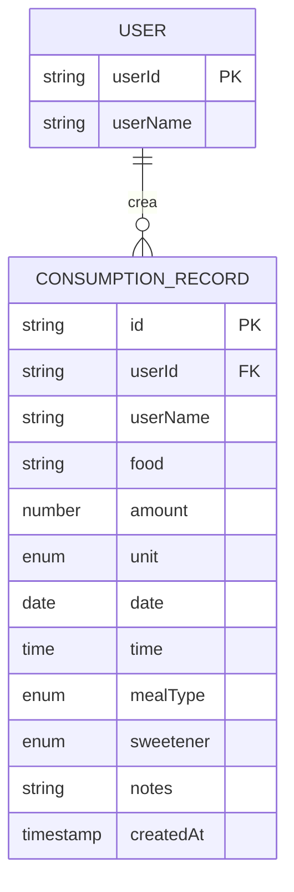
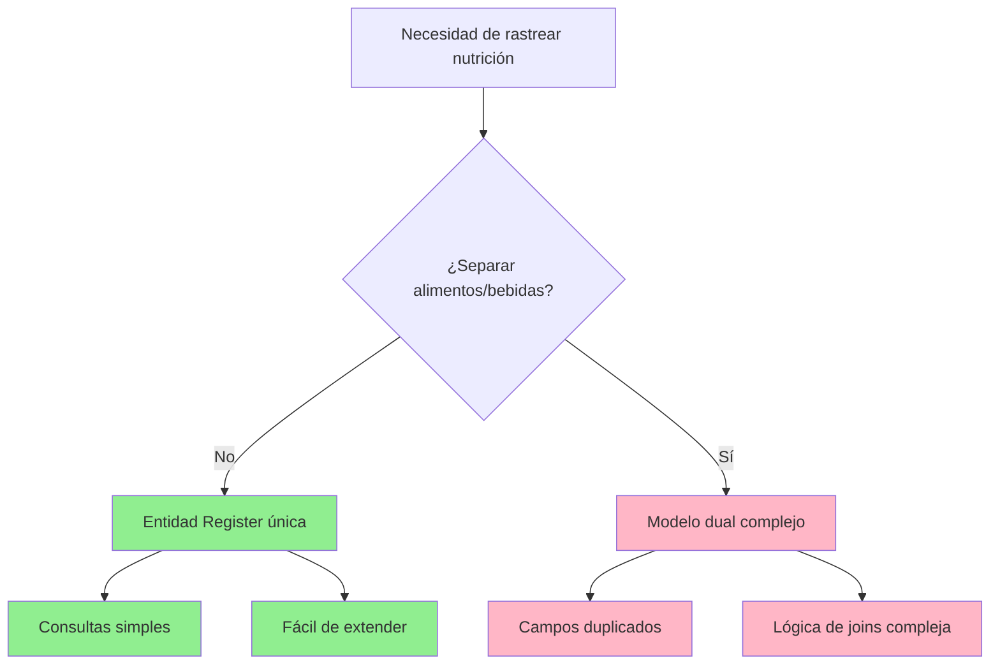

## Introducción

Inicié este proyecto para llevar un registro nutricional y mejorar las decisiones alimenticias diarias. En lugar de usar un framework completo como Next.js o Remix, elegí React con Vite como bundler. Este enfoque permite iteración rápida, configuración mínima y la flexibilidad de reutilizar componentes en otros proyectos.

Este primer artículo documenta el proceso de diseño del modelo de datos, la base que impulsará toda la arquitectura de la aplicación.

## Configuración del Proyecto

La configuración inicial fue sencilla usando la herramienta de scaffolding de Vite:

```bash
npm create vite@latest playground -- --template react
```

Con el entorno de desarrollo listo, el primer paso lógico fue definir el modelo de datos. Esto informaría la estructura del formulario de entrada y establecería límites claros sobre qué datos necesitamos capturar. Para el MVP, decidí usar `localStorage` para la persistencia: simple, rápido y sin necesidad de infraestructura backend.

## Diseño del Modelo de Datos

### Estructura Central

El modelo de datos se centra en una única entidad `Register` que captura cada evento de consumo. Aquí está la estructura completa:

```javascript
const consumptionRecord = {
  // Identificadores únicos
  id: 'generated-uuid',
  userId: 'user123',
  userName: 'UserName',

  // Qué se consumió
  food: 'Manzana roja',
  amount: 2,
  unit: 'unit', // Opciones: "g", "ml", "portion", "unit", "small-portion", "large-portion"

  // Cuándo se consumió
  date: '2025-11-05', // ISO YYYY-MM-DD
  time: '09:30', // 24h HH:MM
  mealType: 'breakfast', // Opciones: "breakfast", "lunch", "snack", "dinner", "between-meals"

  // Características adicionales
  sweetener: null, // Opciones: "sugar", "sweetener", null
  notes: '',

  // Metadata
  createdAt: '2025-11-05T09:35:00Z'
}
```

### Decisiones de Diseño

Cada decisión de modelado de datos afecta la usabilidad, extensibilidad y mantenibilidad de la aplicación. Aquí está el razonamiento detrás de cada decisión clave.

#### ¿Por Qué Unificar Alimentos y Bebidas?

**Decisión:** Usar un solo concepto de "registro de consumo" en lugar de entidades separadas para alimentos y bebidas.

**Razonamiento:**

- Simplifica significativamente el modelo
- La diferencia principal es la unidad (g vs ml), fácilmente manejable con un enum
- Evita duplicar campos comunes (fecha, hora, usuario, tipo de comida)
- Hace las consultas y reportes futuros mucho más simples
- Los usuarios no piensan en términos de "comida vs bebida", piensan "consumí X"

**Alternativa considerada:** Entidades separadas `FoodRecord` y `BeverageRecord`
**Por qué se rechazó:** Complejidad añadida con beneficio mínimo; la mayoría de los campos serían idénticos

#### ¿Por Qué Campo de Alimento en Texto Libre?

**Decisión:** Mantener el campo de alimento sin estructura (texto libre) sin categorías predefinidas.

**Razonamiento:**

- Permite iteración rápida sin sobre-ingeniería
- Los patrones de uso reales guiarán la futura categorización
- Más flexible para los usuarios en la etapa MVP
- Evita la frustración de "tu alimento no está en nuestra lista"
- Las categorías se pueden añadir después basándose en análisis de datos reales

**Camino futuro:** Una vez que tengamos datos reales, podemos:

- Identificar patrones comunes
- Implementar sugerencias de autocompletado
- Añadir etiquetas o categorías opcionales
- Mantener compatibilidad hacia atrás

#### Tipo de Comida + Hora: Ambos Requeridos

**Decisión:** Mantener ambos campos independientes y obligatorios.

**Razonamiento:**

- Permite análisis por tipo de comida: "¿A qué horas suelo desayunar?"
- No asume horarios fijos (desayunar a las 2 PM es perfectamente válido)
- Se añadió la categoría "between-meals" para consumos que no encajan en comidas principales
- Proporciona datos más ricos para gráficos de distribución temporal
- El tipo de comida es semántico, la hora es factual: ambos añaden valor

**Caso de uso ejemplo:** Un usuario que trabaja de noche puede registrar "cena" a las 6 AM sin que el sistema rechace su entrada.

#### Sistema de Unidades Flexible

**Decisión:** Soportar unidades: g, ml, unit, portion, small-portion, large-portion.

**Tipos de Unidades y Casos de Uso:**

| Tipo de Unidad | Caso de Uso | Ejemplo |
|----------------|-------------|---------|
| g / ml | Mediciones precisas | 150ml leche, 80g queso |
| unit | Ítems contables | 2 manzanas, 1 galleta |
| portion | Porción estándar | 1 porción arroz |
| small-portion / large-portion | Tamaños subjetivos | 1 porción grande pasta |

**Razonamiento:**

- Cubre escenarios del mundo real: items pesados, líquidos, objetos contables y porciones subjetivas
- Las porciones son inherentemente subjetivas: reconocer esto es mejor que forzar precisión
- Permite a los usuarios elegir su nivel preferido de granularidad
- Soporta tanto trackers cuidadosos como usuarios casuales

**Advertencia:** Las porciones no pueden compararse directamente entre usuarios, pero eso es aceptable para tracking personal.

#### Endulzante como Campo Ternario

**Decisión:** Usar `null | "sugar" | "sweetener"` en lugar de un booleano.

**Razonamiento:**

- `null` representa "no aplica" o "sin endulzar"
- Distingue explícitamente azúcar natural de endulzantes artificiales
- Permite rastrear tendencias de consumo de azúcar a lo largo del tiempo
- No es obligatorio porque la mayoría de los alimentos no están endulzados
- Soporta funcionalidades futuras como tracking de "días sin azúcar"

**Por qué no booleano:** Un booleano no puede representar tres estados distintos sin nombres confusos.

### Diagrama Entidad-Relación



Este diagrama ilustra la relación uno-a-muchos entre usuarios y sus registros de consumo, con todos los atributos clave etiquetados.

### Diagrama de Flujo de Decisión

Este diagrama muestra el proceso de pensamiento detrás del modelo unificado:



## Metadata y Campos Técnicos

### Identificadores

- **`id`:** Identificador único (UUID) para cada registro. Permite futuras operaciones de edición/eliminación y asegura que no haya colisiones.
- **`userId`:** Identificador de usuario para soporte multi-usuario desde el día uno. Aunque el MVP podría ser mono-usuario, construir esto temprano evita migraciones dolorosas después.

### Timestamps

- **`date + time`:** Cuándo ocurrió realmente el consumo (datos del dominio). Esto es lo que les importa a los usuarios y lo que analizaremos.
- **`createdAt`:** Cuándo se registró en el sistema (metadata técnica). Útil para auditoría, debugging de problemas de sincronización y detección de entradas tardías.

**¿Por qué ambos?** Podrías desayunar a las 8 AM pero registrarlo a las 10 AM. Ambos timestamps cuentan historias diferentes y valiosas.

## Consideraciones Futuras

Estas funcionalidades se excluyen deliberadamente del MVP pero informan el diseño actual:

### Categorización

- Identificar patrones de datos de uso real
- Migrar a lista sugerida con autocompletado
- Implementar etiquetas o categorías múltiples (frutas, verduras, proteínas, etc.)
- Mantener texto libre como opción de respaldo

### Validaciones

- Validación de rango de tiempo (0:00-23:59)
- Restricciones de cantidad positiva
- Combinaciones lógicas de unidades (ml restringido a líquidos)
- Verificaciones de razonabilidad de fechas

### Reportes Planificados

- Distribución por tipo de comida
- Mapas de calor de horarios de consumo
- Tracking de azúcar vs endulzante
- Análisis de frecuencia de alimentos
- Variedad dietética en períodos de tiempo
- Análisis comparativo por usuario

## Stack Tecnológico

Para el MVP, estamos usando `localStorage` como capa de persistencia. Esta elección ofrece:

**Ventajas:**

- Cero infraestructura backend necesaria
- Lecturas/escrituras instantáneas
- Funciona offline por defecto
- Perfecto para prototipos

**Limitaciones:**

- Límite de almacenamiento ~5-10MB (suficiente para miles de registros)
- Sin sincronización entre dispositivos
- Vulnerable a la limpieza de datos del navegador

**Camino de migración:** La capa de almacenamiento abstraída hace que la futura migración a IndexedDB o una API backend sea sencilla.

## ¿Qué Sigue?

Con el modelo de datos definido, los próximos pasos inmediatos son:

1. **Configurar el entorno de testing** (Vitest + Testing Library)
2. **Configurar herramientas de desarrollo** (linters, formatters, automatización)
3. **Implementar la capa de validación** (esquemas Zod)
4. **Construir la capa de persistencia** (wrapper de localStorage)

Estas bases permitirán un desarrollo confiado y guiado por tests de las funcionalidades centrales.

## Continuar Leyendo

En [Parte 2: Configuración de Testing](/posts/nutritional-tracker-part-2), configuramos Vitest, implementamos mocks para localStorage y establecemos un flujo de trabajo robusto de testing.

**Próximamente en esta serie:**

- Parte 2: Configuración del Entorno de Testing ✓
- Parte 3: Validación de Datos con Zod ✓
- Parte 4: Implementación de la Capa de Persistencia ✓

---

*¿Tienes preguntas o sugerencias sobre el modelo de datos? El diseño es intencionalmente flexible: feedback bienvenido mientras construimos esto.*
