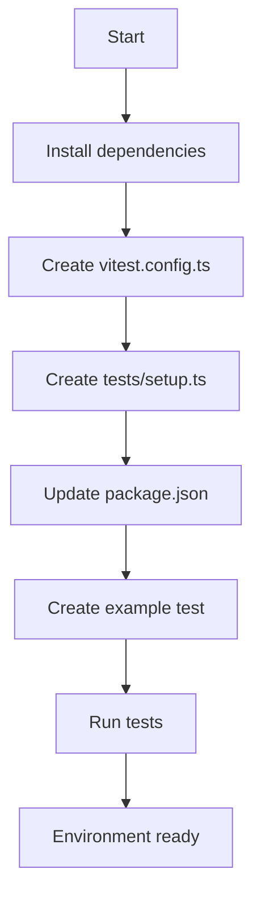

## Introduction

In this second part of the project, we will get our hands dirty and start building the foundations. We will prepare the development environment, configure the testing tools, and leave everything ready to move forward with confidence.

In the previous article, we defined the project's goal, the main functionalities, and the general structure we will follow. Now, with a React project using Vite and a defined data structure, it's time to take the next step: setting up the testing environment.

## Why is testing important?

Testing not only helps us detect errors but also gives us the confidence that our code works as expected. Additionally, writing tests from the beginning forces us to think about how to structure the code in a cleaner and more modular way.

## Tools we will use

For our testing environment, we chose the following tools:

| Package                  | Purpose                                           |
|--------------------------|---------------------------------------------------|
| `vitest`                | Fast and modern test runner (alternative to Jest). |
| `@vitejs/plugin-react`  | Allows Vitest to understand JSX/TSX.              |
| `@testing-library/react`| Facilitates testing React components.             |
| `@testing-library/jest-dom` | Adds additional matchers like `toBeInTheDocument`. |
| `@testing-library/user-event` | Simulates user interactions.                     |
| `jsdom`                 | Simulates the browser DOM in Node.js.             |

These tools will allow us to write unit and integration tests efficiently.

## Installing dependencies

Open your terminal at the project's root and run:

```bash
npm install -D vitest @vitejs/plugin-react
npm install -D @testing-library/react @testing-library/jest-dom @testing-library/user-event
npm install -D jsdom
```

## Configuring Vitest

With the dependencies ready, we will configure Vitest to integrate it correctly into the project. This step is key to ensuring our tests run smoothly.

### Create the configuration file

Create a file named `vitest.config.ts` at the project's root with this content:

```typescript
import path from 'node:path'
import react from '@vitejs/plugin-react'
import { defineConfig } from 'vitest/config'

export default defineConfig({
  plugins: [react()],
  test: {
    environment: 'jsdom', // Simulates the browser
    globals: true, // Allows using describe/it/expect without importing them
    setupFiles: './tests/setup.ts',
    coverage: {
      provider: 'v8',
      reporter: ['text', 'json', 'html'],
      exclude: [
        'node_modules/',
        'tests/',
        '*.config.ts',
        '*.config.js',
      ],
    },
  },
  resolve: {
    alias: {
      '@': path.resolve(__dirname, './src'),
    },
  },
})
```

### Why this configuration?

- `globals: true` → Avoids importing `describe`, `it`, `expect` in every file.
- `setupFiles` → Centralizes common configuration.
- `coverage` → Enables coverage reports.
- `alias` → Facilitates absolute imports like `@/components/X`.

## Configuring the setup file

Now we will create a configuration file to prepare the testing environment. It will extend the matchers, clean the DOM between tests, and mock `localStorage`.

### Create the setup file

Create the folder `tests/` at the project's root and inside, a file `setup.ts` with this content:

```typescript
// tests/setup.ts
import * as matchers from '@testing-library/jest-dom/matchers'
import { cleanup } from '@testing-library/react'
import { afterEach, expect } from 'vitest'

// Extends jest-dom matchers
expect.extend(matchers)

// Cleans the DOM after each test
afterEach(() => {
  cleanup()
})

// Mock localStorage
const localStorageMock = (() => {
  let store: Record<string, string> = {}

  return {
    getItem: (key: string) => store[key] || null,
    setItem: (key: string, value: string) => {
      store[key] = value.toString()
    },
    removeItem: (key: string) => {
      delete store[key]
    },
    clear: () => {
      store = {}
    },
  }
})()

globalThis.localStorage = localStorageMock as Storage

// Clears localStorage before each test
beforeEach(() => {
  localStorage.clear()
})
```

### What does this file do?

- Extends `expect` with matchers like `toBeInTheDocument()` and `toHaveValue()`.
- Cleans the DOM after each test to avoid side effects.
- Mocks `localStorage` to work in Node.js.
- Restores its state before each test.

## Update `package.json` with testing scripts

Add these scripts to your `package.json`:

```json
{
  "scripts": {
    "test": "vitest",
    "test:ui": "vitest --ui",
    "test:coverage": "vitest run --coverage",
    "test:watch": "vitest --watch"
  }
}
```

### What does each script do?

- `test` → Runs the tests in interactive mode (reruns on save).
- `test:ui` → Opens Vitest's visual interface in the browser.
- `test:coverage` → Generates the coverage report.
- `test:watch` → Explicitly forces watch mode.

## Verify the testing environment works correctly

To confirm everything is well configured, create an example test in `tests/example.test.ts`:

```typescript
// tests/example.test.ts
import { describe, expect, it } from 'vitest'

describe('Testing setup', () => {
  it('should pass this basic test', () => {
    expect(1 + 1).toBe(2)
  })

  it('should have access to jest-dom matchers', () => {
    const element = document.createElement('div')
    element.textContent = 'Hello'
    document.body.appendChild(element)

    expect(element).toBeInTheDocument()
  })

  it('should have mocked localStorage', () => {
    localStorage.setItem('test', 'value')
    expect(localStorage.getItem('test')).toBe('value')
  })
})
```

Then, run the tests:

```bash
npm run test
```

If everything is working, you should see a result like this:

```bash
✓ tests/example.test.ts (3)
  ✓ Testing setup (3)
    ✓ should pass this basic test
    ✓ should have access to jest-dom matchers
    ✓ should have mocked localStorage

Test Files  1 passed (1)
Tests       3 passed (3)
```

✅ With this confirmed, the testing environment is officially ready. The next step will be to install libraries for form handling and validations, and prepare the initial scaffolding.

## Configuration Flow Diagram

To better visualize the testing environment setup process, here is a flow diagram:


