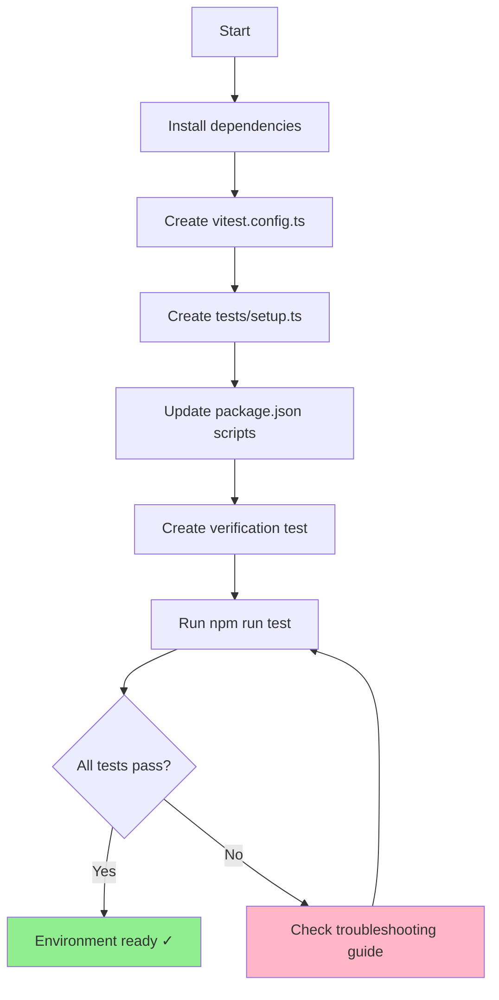
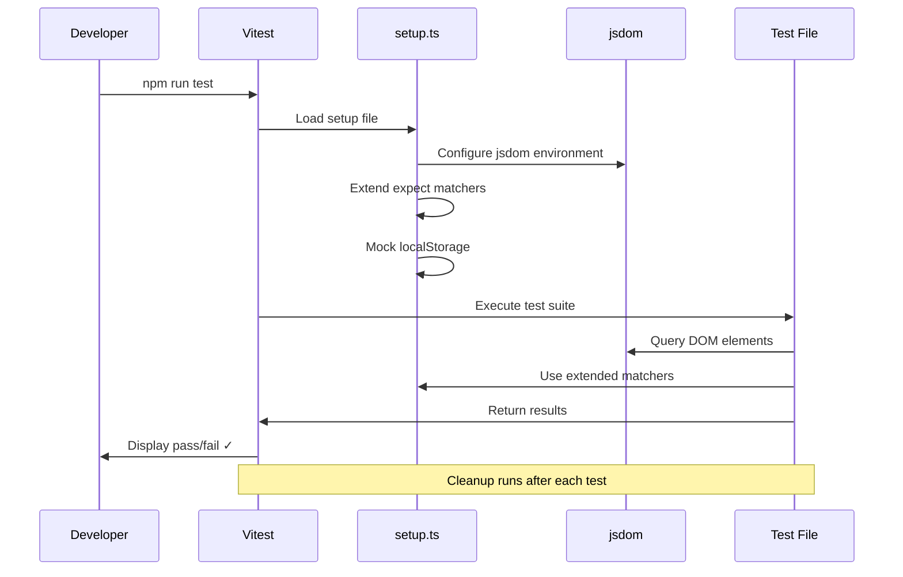

## Introduction

**Previous:** [Part 1: Data Model Design](/posts/nutritional-tracker-part-1)

### Recap: Part 1

In the previous installment, we designed the core data model for our nutrition tracker. We defined the `Register` entity structure, made key architectural decisions (unified foods/beverages, flexible units, ternary sweetener field), and established the technical foundation using React + Vite with localStorage persistence.

### Goals for Part 2

In this installment, we'll build the testing foundation that will ensure code quality throughout development. Specifically, we'll:

- Configure Vitest as our test runner
- Set up Testing Library for React component testing
- Implement mocks for browser APIs (localStorage)
- Establish automated test cleanup patterns
- Create verification tests to confirm everything works

By the end, we'll have a robust testing environment ready for test-driven development.

## Why Testing Matters

Testing provides three critical benefits:

1. **Confidence**: Know your code works before deploying
2. **Documentation**: Tests serve as living examples of how code should behave
3. **Refactoring safety**: Change code fearlessly knowing tests will catch breaks

Without tests, every change becomes risky. With tests, development accelerates.

Additionally, writing tests from the start forces us to structure code in cleaner, more modular ways. Components become easier to reason about and maintain.

## Testing Stack Overview

We'll use modern, fast testing tools optimized for Vite projects:

| Package | Purpose | Why This Tool? |
|---------|---------|----------------|
| `vitest` | Test runner | Fast, modern, Vite-native (no config conflicts) |
| `@vitejs/plugin-react` | JSX support | Allows Vitest to parse React components |
| `@testing-library/react` | Component testing | Best practices for user-centric tests |
| `@testing-library/jest-dom` | Enhanced matchers | Readable assertions like `toBeInTheDocument()` |
| `@testing-library/user-event` | User simulation | Realistic interaction testing |
| `jsdom` | DOM simulation | Run browser tests in Node.js |

## Installation and Setup

### Installing Dependencies

Open your terminal at the project root and install the testing stack:

```bash
npm install -D vitest @vitejs/plugin-react
npm install -D @testing-library/react @testing-library/jest-dom @testing-library/user-event
npm install -D jsdom
```

### Understanding Development Dependencies

Notice we use the `-D` (or `--save-dev`) flag. This marks these packages as **development dependencies**—required only during development, not in production.

**Benefits:**

- Keeps production bundle smaller
- Separates concerns (dev tools vs app code)
- Makes dependencies easier to manage

This is a best practice: testing tools, linters, and build tools should always be dev dependencies.

## Vitest Configuration

### Creating the Config File

This configuration tells Vitest how to run tests in a React environment. Create `vitest.config.ts` at the project root:

```typescript
// vitest.config.ts
// Configures Vitest to work with React and simulate browser environment
import path from 'node:path'
import { fileURLToPath } from 'node:url'
import react from '@vitejs/plugin-react'
import { defineConfig } from 'vitest/config'

const __dirname = path.dirname(fileURLToPath(import.meta.url))

export default defineConfig({
  plugins: [react()],
  test: {
    environment: 'jsdom', // Simulates browser DOM
    globals: true, // No need to import describe/it/expect
    setupFiles: './tests/setup.ts', // Runs before each test file
    coverage: {
      provider: 'v8',
      reporter: ['text', 'json', 'html'],
      exclude: [
        'node_modules/',
        'tests/',
        '*.config.ts',
        '*.config.js',
      ],
    },
  },
  resolve: {
    alias: {
      '@': path.resolve(__dirname, './src'),
    },
  },
})
```

### Configuration Breakdown

**Each option explained:**

- `plugins: [react()]` → Enables JSX/TSX parsing in test files
- `environment: 'jsdom'` → Simulates browser APIs (document, window, localStorage)
- `globals: true` → Use `describe`, `it`, `expect` without importing them
- `setupFiles` → Runs setup code before each test file (matchers, mocks)
- `coverage` → Tracks which lines of code are tested
  - `provider: 'v8'` → Fast native coverage tool
  - `reporter` → Output formats (terminal, JSON, HTML report)
  - `exclude` → Ignore these paths in coverage
- `alias: { '@': './src' }` → Import like `@/components/Button` instead of `../../components/Button`

## Test Setup File

### Creating the Setup File

The setup file prepares the testing environment. Create `tests/setup.ts`:

```typescript
// tests/setup.ts
// Runs before each test file to prepare the environment
import { cleanup } from '@testing-library/react'
import { afterEach, beforeEach } from 'vitest'
import '@testing-library/jest-dom'

// Clean up DOM after each test to prevent side effects
afterEach(() => {
  cleanup()
})

// Mock localStorage for Node.js environment
const localStorageMock = (() => {
  let store: Record<string, string> = {}

  return {
    getItem: (key: string) => store[key] || null,
    setItem: (key: string, value: string) => {
      store[key] = value.toString()
    },
    removeItem: (key: string) => {
      delete store[key]
    },
    clear: () => {
      store = {}
    },
  }
})()

globalThis.localStorage = localStorageMock as Storage

// Reset localStorage before each test
beforeEach(() => {
  localStorage.clear()
})
```

### Setup Components Explained

### 1. Automatic Cleanup

```typescript
afterEach(() => {
  cleanup()
})
```

Removes all rendered components from the DOM after each test. Prevents tests from affecting each other.

### 2. Extended Matchers

```typescript
import '@testing-library/jest-dom'
```

Adds readable assertions like:

- `expect(element).toBeInTheDocument()`
- `expect(input).toHaveValue('text')`
- `expect(button).toBeDisabled()`

### 3. localStorage Mock

```typescript
const localStorageMock = (() => {
  let store: Record<string, string> = {}
  return { getItem, setItem, removeItem, clear }
})()
```

Node.js doesn't have `localStorage` (it's a browser API). This mock simulates it with an in-memory object.

### 4. Storage Reset

```typescript
beforeEach(() => {
  localStorage.clear()
})
```

Each test starts with empty storage. Ensures tests are isolated and repeatable.

## Package Scripts

Add these scripts to `package.json` for convenient test execution:

```json
{
  "scripts": {
    "test": "vitest",
    "test:ui": "vitest --ui",
    "test:coverage": "vitest run --coverage",
    "test:watch": "vitest --watch"
  }
}
```

### Script Reference

| Script | Behavior | Use Case |
|--------|----------|----------|
| `test` | Interactive mode (reruns on save) | Primary development workflow |
| `test:ui` | Opens visual interface in browser | Debugging, exploring test results |
| `test:coverage` | Generates coverage report | CI/CD, checking test completeness |
| `test:watch` | Explicit watch mode | Alternative to `test` |

## Verification

### Creating a Test Suite

Let's verify everything works. Create `tests/example.test.ts`:

```typescript
// tests/example.test.ts
// Verification tests to confirm setup is working correctly
import { describe, expect, it } from 'vitest'

describe('Testing setup verification', () => {
  it('should pass basic arithmetic test', () => {
    expect(1 + 1).toBe(2)
  })

  it('should have access to jest-dom matchers', () => {
    const element = document.createElement('div')
    element.textContent = 'Hello'
    document.body.appendChild(element)

    expect(element).toBeInTheDocument()
  })

  it('should have mocked localStorage', () => {
    localStorage.setItem('test', 'value')
    expect(localStorage.getItem('test')).toBe('value')

    localStorage.clear()
    expect(localStorage.getItem('test')).toBeNull()
  })
})
```

### Running Tests

Execute the test suite:

```bash
npm run test
```

### Expected Output

You should see:

```bash
✓ tests/example.test.ts (3) 450ms
  ✓ Testing setup verification (3)
    ✓ should pass basic arithmetic test
    ✓ should have access to jest-dom matchers
    ✓ should have mocked localStorage

Test Files  1 passed (1)
Tests       3 passed (3)
Start at    10:30:15
Duration    892ms

PASS  Waiting for file changes...
```

**What each line means:**

- `✓ tests/example.test.ts (3)` → Test file with 3 passing tests
- `450ms` → Execution time for this file
- `Duration 892ms` → Total test suite duration
- `PASS  Waiting...` → Watch mode active, will rerun on file changes

**If tests fail**, Vitest shows:

- Expected vs actual values
- Stack traces pointing to the failure
- Code snippets with context

✅ **Success!** The testing environment is fully operational.

## Configuration Flow

This diagram visualizes the complete setup process:



## Troubleshooting Guide

During setup, several challenges may emerge. Here's how to solve them:

### Problem 1: ES Modules Compatibility

**Symptom:**

```text
ReferenceError: __dirname is not defined
```

**Cause:** Project uses `"type": "module"` in `package.json`, which disables CommonJS globals like `__dirname`.

**Solution:**

```typescript
import path from 'node:path'
import { fileURLToPath } from 'node:url'

const __dirname = path.dirname(fileURLToPath(import.meta.url))
```

**Why it works:** `import.meta.url` provides the current file's URL in ES modules. We convert it to a path and extract the directory.

---

### Problem 2: jest-dom Matcher Types

**Symptom:**

```typescript
Property 'toBeInTheDocument' does not exist on type 'Assertion'
```

**Cause:** Breaking changes in `@testing-library/jest-dom` v6+ modified how matchers are extended.

**Solution:**

```typescript
// ❌ Don't use this (old API)
import * as matchers from '@testing-library/jest-dom/matchers'

// ✅ Use automatic import instead
import '@testing-library/jest-dom'

expect.extend(matchers)
```

**Why it works:** The automatic import handles type declarations correctly and is the recommended approach.

---

### Problem 3: TypeScript Type Conflicts

**Symptom:**

```text
Type 'Assertion' is not assignable to type 'Matchers'
```

**Cause:** Vitest has subtle differences from Jest in global types.

**Solution:**
Create `tests/vitest.d.ts`:

```typescript
// tests/vitest.d.ts
// Extends Vitest types to include jest-dom matchers
declare global {
  namespace Vi {
    interface Assertion extends jest.Matchers<void> {}
    interface AsymmetricMatchers extends jest.Matchers<void> {}
  }
}

export {}
```

**Why it works:** This declaration file merges jest-dom types into Vitest's assertion interface.

---

### Problem 4: localStorage Mock Issues

**Symptom:**

```text
localStorage is not defined
```

or warnings about `global.localStorage`.

**Cause:** Node.js doesn't have browser APIs. Mock must be attached correctly.

**Solution:**

```typescript
// ❌ Don't use this
global.localStorage = localStorageMock

// ✅ Use this for better compatibility
globalThis.localStorage = localStorageMock as Storage
```

**Why it works:** `globalThis` is the standardized way to access the global object in all JavaScript environments (browser, Node, workers).

---

### Problem 5: Tests Not Running

**Symptom:**

```text
No test files found
```

**Cause:** Vitest can't find your test files.

**Solution:**

- Verify test files match the pattern: `*.test.ts`, `*.test.tsx`, `*.spec.ts`
- Check they're in the correct location (`tests/` or `src/`)
- Ensure file extensions are included in `include` pattern (default covers most cases)

---

## Test Execution Flow

This diagram shows what happens when you run tests:



## Key Takeaways

At this point, you have:

✅ A fully configured Vitest environment
✅ Mock implementation for localStorage
✅ Extended matchers from jest-dom
✅ Automated test cleanup between runs
✅ Multiple test execution modes (watch, UI, coverage)

**Best practices established:**

- Always clean up after tests to avoid side effects
- Mock browser APIs that aren't available in Node
- Use descriptive test names that explain behavior
- Separate test setup from test execution
- Keep tests isolated and repeatable

The testing foundation is now solid enough to support **Test-Driven Development (TDD)** for the rest of the project.

## What's Next?

With a robust testing environment in place, we're ready to implement the core data layer.

## Continue Reading

In [Part 3: Data Validation with Zod](/posts/nutritional-tracker-part-3), we implement robust validation schemas, define TypeScript types, and write comprehensive unit tests for the data model.

**Series Progress:**

- Part 1: Data Model Design ✓
- Part 2: Testing Environment Setup ✓ ← You are here
- Part 3: Data Validation with Zod →
- Part 4: Persistence Layer Implementation
