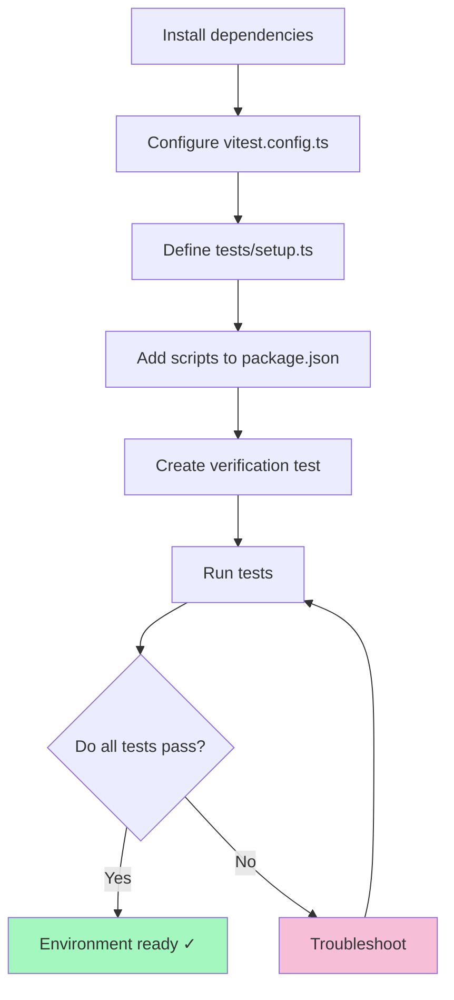

## Part 2: Testing Environment Setup — Nutrition Tracker

## Introduction

In the first part, we defined the data model and the architectural foundation. Now it's time to prepare the testing environment to develop with confidence and agility.

## Why Testing from the Start?

Automated tests give you:

1. **Confidence:** Every code change can be instantly tested.
2. **Living documentation:** Tests show how the system should behave.
3. **Safe refactoring:** You can improve code without fear of breaking anything.

---

## 1. Selected Tools

| Package                        | Purpose                        | What does it do?                                                      |
| ------------------------------ | ------------------------------ | --------------------------------------------------------------------- |
| `vitest`                       | Fast, modern test runner       | Runs and organizes your tests automatically; very fast and easy.      |
| `@testing-library/react`       | User-focused testing           | Simulates how a user interacts with your components.                  |
| `@testing-library/jest-dom`    | Readable extra matchers        | Provides clearer assertions (e.g., "is in the DOM").                  |
| `@testing-library/user-event`  | Real interaction simulation    | Lets you "type" in inputs and "click" buttons with code.              |
| `jsdom`                        | DOM simulation in Node         | Emulates the browser so tests run outside the browser.                |

**Why are these useful?**

- They automate frontend testing and ensure your components behave as expected, without needing a real browser.

---

## 2. Installation and Setup

Install the dependencies with:

```bash
npm install -D vitest @vitejs/plugin-react
npm install -D @testing-library/react @testing-library/jest-dom @testing-library/user-event
npm install -D jsdom
```

---

## 3. Vitest Configuration

Create the file `vitest.config.ts` at the project root:

```typescript
import path from 'node:path'
import { fileURLToPath } from 'node:url'
import react from '@vitejs/plugin-react'
import { defineConfig } from 'vitest/config'

const __dirname = path.dirname(fileURLToPath(import.meta.url))

export default defineConfig({
  plugins: [react()], // Enables JSX and TSX files
  test: {
    environment: 'jsdom', // Simulates browser DOM in tests
    globals: true, // Lets you use "describe", "it", "expect" without importing
    setupFiles: './tests/setup.ts', // Runs setup code before tests (mocks, cleanup, etc.)
    coverage: {
      provider: 'v8', // Tracks which lines are tested (coverage percentage)
      reporter: ['text', 'json', 'html'],
      exclude: ['node_modules/', 'tests/', '*.config.ts', '*.config.js'],
    },
  },
  resolve: {
    alias: {
      '@': path.resolve(__dirname, './src'), // Allows absolute imports with "@"
    },
  },
})
```

**Why each line?**

- _plugins_: So Vitest understands modern React code.
- _environment_: Emulates browser features.
- _globals and setupFiles_: Makes writing and organizing tests easier.
- _coverage_: Lets you see what code is well tested.
- _alias_: Saves time on imports and avoids long/complex paths.

---

## 4. Test Setup File (What are localStorage mocks?)

Create `tests/setup.ts` to prepare the environment and necessary mocks:

```typescript
import { cleanup } from '@testing-library/react'
import { afterEach, beforeEach } from 'vitest'
import '@testing-library/jest-dom'

// Clean up the DOM after each test
afterEach(() => {
  cleanup()
})

// Mock localStorage for Node
const localStorageMock = (() => {
  let store: Record<string, string> = {}
  return {
    getItem: (key: string) => store[key] || null,
    setItem: (key: string, value: string) => {
      store[key] = value.toString()
    },
    removeItem: (key: string) => {
      delete store[key]
    },
    clear: () => {
      store = {}
    },
  }
})()

globalThis.localStorage = localStorageMock as Storage

beforeEach(() => {
  localStorage.clear()
})
```

### What is a "mock" and why use it?

A **mock** is a function or variable that "pretends" to behave like the real thing. In tests, Node doesn't have `localStorage` like a browser, so we create a "mock" that imitates this functionality in memory.

**Why mock?**

- Tests can work as if there were a browser, storing and reading data in localStorage, but without affecting the real browser or disk.
- Lets you verify your storage logic works and is cleaned between tests (avoiding leftover data).

**Why clean the DOM and storage before/after each test?**

- Ensures each test starts fresh, without interference from previous tests.
- Prevents false results and fragile automated tests.

---

## 5. Automation Scripts

Add these scripts to your `package.json`:

```json
{
  "scripts": {
    "test": "vitest", // Runs tests interactively (updates on save)
    "test:ui": "vitest --ui", // Opens a visual interface for tests and coverage
    "test:coverage": "vitest run --coverage", // Shows code coverage report
    "test:watch": "vitest --watch" // Runs tests automatically on file save
  }
}
```

---

## 6. Verification Test

Create the file `tests/example.test.ts` to check the setup:

```typescript
import { describe, expect, it } from 'vitest'

describe('Basic Testing', () => {
  it('simple arithmetic', () => {
    expect(1 + 1).toBe(2)
  })
  it('jest-dom matcher active', () => {
    const el = document.createElement('span')
    document.body.appendChild(el)
    expect(el).toBeInTheDocument()
  })
  it('mocked localStorage', () => {
    localStorage.setItem('test', 'value')
    expect(localStorage.getItem('test')).toBe('value')
    localStorage.clear()
    expect(localStorage.getItem('test')).toBeNull()
  })
})
```

Run the test:

```bash
npm run test
```

---

### Expected Result

```bash
✓ tests/example.test.ts (3)
  ✓ Basic Testing (3)
    ✓ simple arithmetic
    ✓ jest-dom matcher active
    ✓ mocked localStorage
PASS  Waiting for file changes...
```

---

## 7. Diagram: Setup and Execution Flow



---

## 8. Common Troubleshooting

- **`__dirname` undefined:** Use import.meta.url and fileURLToPath as in the example.
- **jest-dom matchers not available:** Check the import in setup.ts.
- **localStorage not defined:** Make sure the mock adds it to `globalThis`.
- **Tests not detected:** Check name and location (`tests/`, `.test.ts` extension).

---

## 9. What's Next?

You now have a robust base for TDD! Next step: define validation schemas with Zod and write unit tests for the data model.

**Continue reading:**  
_Part 3: Data Validation with Zod_ → Implementation of type-safe types, rules, and validation tests.

---

## Series Navigation

- [← Part 1: Data Model Design](/posts/nutritional-tracker-part1/)
- [Part 3: Data Validation with Zod →](/posts/nutritional-tracker-part3/)

### Additional Resources

- [Vitest Documentation](https://vitest.dev/)
- [Testing Library Docs](https://testing-library.com/docs/)
- [Jest-DOM Matchers](https://github.com/testing-library/jest-dom)
- [Mocking localStorage in tests](https://developer.mozilla.org/en-US/docs/Web/API/Window/localStorage#mocking_localstorage_in_tests)