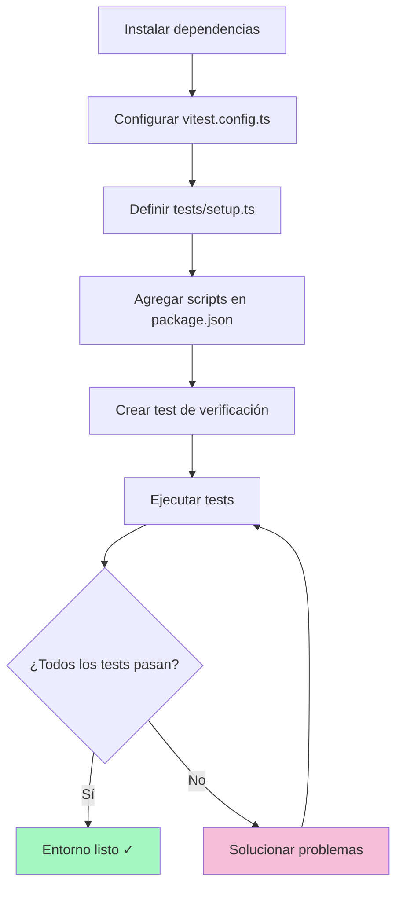

## Parte 2: Configuración del Entorno de Testing — Nutrition Tracker

## Introducción

En la primera parte, definimos el modelo de datos y la base arquitectónica. Ahora toca preparar el entorno de testing para desarrollar con confianza y agilidad.

## ¿Por qué Testing desde el principio?

Las pruebas automáticas te dan:

1. **Confianza:** Cada cambio en el código puede ser probado al instante.
2. **Documentación viva:** Los tests muestran cómo debe comportarse el sistema.
3. **Seguridad al refactorizar:** Puedes mejorar el código sin miedo a romper nada.

---

## 1. Herramientas seleccionadas

| Paquete                       | Propósito                        | ¿Qué hace?                                                           |
| ----------------------------- | -------------------------------- | -------------------------------------------------------------------- |
| `vitest`                      | Test runner rápido y moderno     | Ejecuta y organiza tus tests automáticamente; muy veloz y fácil.     |
| `@testing-library/react`      | Pruebas centradas en usuario     | Permite simular cómo un usuario interactúa con tus componentes.      |
| `@testing-library/jest-dom`   | Matchers extra legibles          | Aporta comparaciones/validaciones más claras (ej: "está en el DOM"). |
| `@testing-library/user-event` | Simulación real de interacciones | Puedes "escribir" en inputs y "hacer click" en botones con código.   |
| `jsdom`                       | Simulación de DOM en Node        | Emula el navegador para que los tests corran fuera del browser.      |

**¿Por qué son útiles?**

- Permiten automatizar las pruebas del frontend y asegurarse que tus componentes responden como esperas, sin usar un navegador real.

---

## 2. Instalación y setup

Instala las dependencias con:

```bash
npm install -D vitest @vitejs/plugin-react
npm install -D @testing-library/react @testing-library/jest-dom @testing-library/user-event
npm install -D jsdom
```

---

## 3. Configuración de Vitest

Crea el archivo `vitest.config.ts` en la raíz del proyecto:

```typescript
import path from 'node:path'
import { fileURLToPath } from 'node:url'
import react from '@vitejs/plugin-react'
import { defineConfig } from 'vitest/config'

const __dirname = path.dirname(fileURLToPath(import.meta.url))

export default defineConfig({
  plugins: [react()], // Permite leer archivos con JSX y TSX
  test: {
    environment: 'jsdom', // Simula el DOM del navegador en los tests
    globals: true, // Hace que puedas usar "describe", "it", "expect" sin importarlos
    setupFiles: './tests/setup.ts', // Ejecuta código de setup antes de los tests (mock, limpiezas, etc.)
    coverage: {
      provider: 'v8', // Rastrea qué líneas de código están probadas (porcentaje de cobertura)
      reporter: ['text', 'json', 'html'],
      exclude: ['node_modules/', 'tests/', '*.config.ts', '*.config.js'],
    },
  },
  resolve: {
    alias: {
      '@': path.resolve(__dirname, './src'), // Permite imports absolutos con "@"
    },
  },
})
```

**¿Por qué cada línea?**

- _plugins_: Para que Vitest entienda código React moderno.
- _environment_: Emula características del navegador.
- _globals y setupFiles_: Facilitan la escritura y organización de los tests.
- _coverage_: Permite visualizar qué porción del código está bien probada.
- _alias_: Ahorra tiempo en imports y evita rutas largas/complicadas.

---

## 4. Archivo de setup de tests (¿Qué son los mocks de localStorage?)

Crea `tests/setup.ts` para preparar el ambiente y mocks necesarios:

```typescript
import { cleanup } from '@testing-library/react'
import { afterEach, beforeEach } from 'vitest'
import '@testing-library/jest-dom'

// Limpia el DOM después de cada test
afterEach(() => {
  cleanup()
})

// Mock de localStorage para Node
const localStorageMock = (() => {
  let store: Record<string, string> = {}
  return {
    getItem: (key: string) => store[key] || null,
    setItem: (key: string, value: string) => {
      store[key] = value.toString()
    },
    removeItem: (key: string) => {
      delete store[key]
    },
    clear: () => {
      store = {}
    },
  }
})()

globalThis.localStorage = localStorageMock as Storage

beforeEach(() => {
  localStorage.clear()
})
```

### ¿Qué es un "mock" y para qué sirve?

Un **mock** es una función o variable que "finge" comportarse como la real. En los tests, Node no tiene `localStorage` como un navegador, entonces creamos un "mock" que imita esa funcionalidad en memoria.

**Por qué hacer mocks:**

- Los tests pueden trabajar como si hubiera un navegador, guardando y leyendo datos en localStorage, pero sin afectar el navegador real ni el disco.
- Permite verificar que tu lógica de almacenamiento funciona y se limpia entre tests (evitando datos residuales).

**¿Por qué limpiar el DOM y el almacenamiento antes/después de cada test?**

- Garantiza que cada test arranca desde cero, sin interferencias de lo que pasó antes.
- Evita resultados falsos y fragilidad en las pruebas automáticas.

---

## 5. Scripts de automatización

Agrega estos scripts a tu `package.json`:

```json
{
  "scripts": {
    "test": "vitest", // Corre tests de manera interactiva (actualiza al guardar)
    "test:ui": "vitest --ui", // Abre una interfaz visual para analizar tests y cobertura
    "test:coverage": "vitest run --coverage", // Muestra reporte de cobertura de código
    "test:watch": "vitest --watch" // Corre tests automáticamente al guardar archivos
  }
}
```

---

## 6. Prueba de verificación

Crea el archivo `tests/example.test.ts` para probar la configuración:

```typescript
import { describe, expect, it } from 'vitest'

describe('Testing básico', () => {
  it('aritmética simple', () => {
    expect(1 + 1).toBe(2)
  })
  it('jest-dom matcher activo', () => {
    const el = document.createElement('span')
    document.body.appendChild(el)
    expect(el).toBeInTheDocument()
  })
  it('localStorage mockeado', () => {
    localStorage.setItem('prueba', 'valor')
    expect(localStorage.getItem('prueba')).toBe('valor')
    localStorage.clear()
    expect(localStorage.getItem('prueba')).toBeNull()
  })
})
```

Ejecuta la prueba:

```bash
npm run test
```

---

### Resultado esperado

```bash
✓ tests/example.test.ts (3)
  ✓ Testing básico (3)
    ✓ aritmética simple
    ✓ jest-dom matcher activo
    ✓ localStorage mockeado
PASS  Waiting for file changes...
```

---

## 7. Diagrama: Flujo de setup y ejecución



---

## 8. Troubleshooting frecuente

- **`__dirname` undefined:** Usa import.meta.url y fileURLToPath como en el ejemplo.
- **Matchers de jest-dom no disponibles:** Verifica el import en setup.ts.
- **localStorage no definido:** Asegúrate que el mock lo añada a `globalThis`.
- **Tests no se detectan:** Chequea nombre y ubicación (`tests/`, extensión `.test.ts`).

---

## 9. ¿Qué sigue?

¡Ya tienes una base robusta para hacer TDD! Próximo paso: definir los esquemas de validación con Zod y escribir tests unitarios sobre el modelo de datos.

**Continúa leyendo:**
_Parte 3: Validación de Datos con Zod_ → Implementación de tipos type-safe, reglas y tests de validación.

---

## Navegación de la serie

- [← Parte 1: Diseño del Modelo de Datos](./side-project%20nutritional%20tracker.md)
- [Parte 3: Validación de Datos con Zod →](./side-project-nutritional-tracker-3.md)
