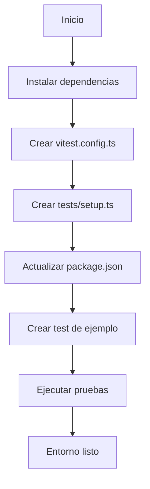

## Introducción

En esta segunda parte del proyecto, vamos a ensuciarnos las manos y empezar a construir las bases. Prepararemos el entorno de desarrollo, configuraremos las herramientas de testing y dejaremos todo listo para avanzar con confianza.

En el artículo anterior, definimos el objetivo del proyecto, las funcionalidades principales y la estructura general que seguiremos. Ahora, con un proyecto en React utilizando Vite y una estructura de datos definida, es momento de dar el siguiente paso: configurar el entorno de pruebas.

## ¿Por qué es importante el testing?

El testing no solo nos ayuda a detectar errores, sino que también nos da la tranquilidad de que nuestro código funciona como esperamos. Además, escribir pruebas desde el principio nos obliga a pensar cómo estructurar el código de forma más limpia y modular.

## Herramientas que usaremos

Para nuestro entorno de pruebas, elegimos las siguientes herramientas:

| Paquete                  | Propósito                                           |
|--------------------------|---------------------------------------------------|
| `vitest`                | Test runner rápido y moderno (alternativa a Jest). |
| `@vitejs/plugin-react`  | Permite a Vitest entender JSX/TSX.                 |
| `@testing-library/react`| Facilita el testing de componentes React.          |
| `@testing-library/jest-dom` | Agrega matchers adicionales como `toBeInTheDocument`. |
| `@testing-library/user-event` | Permite simular interacciones de usuario.         |
| `jsdom`                 | Simula el DOM del navegador en Node.js.            |

Estas herramientas nos permitirán escribir pruebas unitarias y de integración de manera eficiente.

## Instalación de dependencias

Abre tu terminal en la raíz del proyecto y ejecuta:

```bash
npm install -D vitest @vitejs/plugin-react
npm install -D @testing-library/react @testing-library/jest-dom @testing-library/user-event
npm install -D jsdom
```

## Nota sobre la instalación de dependencias

Cuando instalamos las dependencias de testing, usamos la bandera `-D` (o `--save-dev`). Esto indica que estas dependencias son necesarias solo para el entorno de desarrollo y no para la aplicación en producción. Es una buena práctica separar las dependencias de desarrollo de las de producción para mantener el proyecto organizado y optimizar el tamaño del paquete final.

## Configuración de Vitest

Con las dependencias listas, configuraremos Vitest para integrarlo correctamente en el proyecto. Este paso es clave para que nuestras pruebas se ejecuten sin problemas.

### Crear el archivo de configuración

Crea un archivo llamado `vitest.config.ts` en la raíz del proyecto con este contenido:

```typescript
import path from 'node:path'
import { fileURLToPath } from 'node:url'
import react from '@vitejs/plugin-react'
import { defineConfig } from 'vitest/config'

const __dirname = path.dirname(fileURLToPath(import.meta.url))

export default defineConfig({
  plugins: [react()],
  test: {
    environment: 'jsdom', // Simula el navegador
    globals: true, // Permite usar describe/it/expect sin importarlos
    setupFiles: './tests/setup.ts',
    coverage: {
      provider: 'v8',
      reporter: ['text', 'json', 'html'],
      exclude: [
        'node_modules/',
        'tests/',
        '*.config.ts',
        '*.config.js',
      ],
    },
  },
  resolve: {
    alias: {
      '@': path.resolve(__dirname, './src'),
    },
  },
})
```

### ¿Por qué esta configuración?

- `globals: true` → Evita importar `describe`, `it`, `expect` en cada archivo.
- `setupFiles` → Permite centralizar configuración común.
- `coverage` → Activa reportes de cobertura.
- `alias` → Facilita imports absolutos como `@/components/X`.

## Configuración del archivo de setup

Ahora crearemos un archivo de configuración para preparar el entorno de pruebas. Extenderá los matchers, limpiará el DOM entre tests y mockeará `localStorage`.

### Crear el archivo de setup

Crea la carpeta `tests/` en la raíz del proyecto y dentro, un archivo `setup.ts` con este contenido:

```typescript
import { cleanup } from '@testing-library/react'
import { afterEach, expect } from 'vitest'
// tests/setup.ts
import '@testing-library/jest-dom'

// Limpia el DOM después de cada test
afterEach(() => {
  cleanup()
})

// Mock de localStorage
const localStorageMock = (() => {
  let store: Record<string, string> = {}

  return {
    getItem: (key: string) => store[key] || null,
    setItem: (key: string, value: string) => {
      store[key] = value.toString()
    },
    removeItem: (key: string) => {
      delete store[key]
    },
    clear: () => {
      store = {}
    },
  }
})()

globalThis.localStorage = localStorageMock as Storage

// Limpia localStorage antes de cada test
beforeEach(() => {
  localStorage.clear()
})
```

### ¿Qué hace este archivo?

- Extiende `expect` con matchers como `toBeInTheDocument()` y `toHaveValue()`.
- Limpia el DOM después de cada test para evitar efectos colaterales.
- Mockea `localStorage` para que funcione en Node.js.
- Restaura su estado antes de cada prueba.

## Actualizar `package.json` con los scripts de testing

Agrega estos scripts en tu `package.json`:

```json
{
  "scripts": {
    "test": "vitest",
    "test:ui": "vitest --ui",
    "test:coverage": "vitest run --coverage",
    "test:watch": "vitest --watch"
  }
}
```

### ¿Qué hace cada script?

- `test` → Ejecuta los tests en modo interactivo (se vuelven a correr al guardar).
- `test:ui` → Abre la interfaz visual de Vitest en el navegador.
- `test:coverage` → Genera el reporte de cobertura.
- `test:watch` → Fuerza el modo watch de forma explícita.

## Verificar que el entorno de testing funciona correctamente

Para confirmar que todo está bien configurado, crea un test de ejemplo en `tests/example.test.ts`:

```typescript
// tests/example.test.ts
import { describe, expect, it } from 'vitest'

describe('Setup de testing', () => {
  it('debe pasar este test básico', () => {
    expect(1 + 1).toBe(2)
  })

  it('debe tener acceso a los matchers de jest-dom', () => {
    const element = document.createElement('div')
    element.textContent = 'Hola'
    document.body.appendChild(element)

    expect(element).toBeInTheDocument()
  })

  it('debe tener localStorage mockeado', () => {
    localStorage.setItem('test', 'value')
    expect(localStorage.getItem('test')).toBe('value')
  })
})
```

Luego, ejecuta los tests:

```bash
npm run test
```

Si todo está funcionando, deberías ver un resultado como este:

```bash
✓ tests/example.test.ts (3)
  ✓ Setup de testing (3)
    ✓ debe pasar este test básico
    ✓ debe tener acceso a los matchers de jest-dom
    ✓ debe tener localStorage mockeado

Test Files  1 passed (1)
Tests       3 passed (3)
```

✅ Con esto confirmado, el entorno de testing queda oficialmente listo. El próximo paso será instalar las librerías para el manejo de formularios y validaciones, y preparar el scaffolding inicial.

## Diagrama del flujo de configuración

Para visualizar mejor el proceso de configuración del entorno de pruebas, aquí tienes un diagrama de flujo:



Este diagrama resume los pasos clave para configurar el entorno de pruebas de manera clara y visual.

## Lecciones Aprendidas y Resolución de Problemas

Durante la configuración del entorno de pruebas, surgieron varios desafíos que requirieron ajustes y soluciones. Aquí se documenta el proceso, los errores encontrados y cómo se resolvieron.

### Problema 1: Compatibilidad con ES Modules

#### Contexto del Problema (ES Modules)

El proyecto utiliza `"type": "module"` en `package.json`, lo que desactiva el uso de variables como `__dirname`.

#### Error Encontrado (ES Modules)

Al intentar configurar `vitest.config.ts`, el uso de `__dirname` generaba errores porque no está disponible en entornos ES Modules.

#### Solución Implementada (ES Modules)

Se utilizó `import.meta.url` junto con `fileURLToPath` para obtener rutas absolutas:

```typescript
import path from 'node:path'
import { fileURLToPath } from 'node:url'

const __dirname = path.dirname(fileURLToPath(import.meta.url))
```

### Problema 2: Cambios en la API de `@testing-library/jest-dom`

#### Contexto del Problema (jest-dom)

La librería `@testing-library/jest-dom` actualizó su API, lo que causó incompatibilidades al extender los matchers.

#### Error Encontrado (jest-dom)

El uso de `expect.extend(matchers)` directo no funcionaba como se esperaba.

#### Solución Implementada (jest-dom)

Se optó por una importación automática más consistente:

```typescript
import '@testing-library/jest-dom'
```

### Problema 3: Conflictos de Tipos con Vitest y TypeScript

#### Contexto del Problema (TypeScript)

Vitest tiene diferencias sutiles con Jest en los tipos globales, lo que generó conflictos al usar matchers de `jest-dom`.

#### Error Encontrado (TypeScript)

Errores de tipo al compilar el proyecto con TypeScript.

#### Solución Implementada (TypeScript)

Se creó un archivo de declaración de tipos personalizado:

```typescript
// tests/vitest.d.ts
declare global {
  namespace Vi {
    interface Assertion extends jest.Matchers<string> {}
    interface AsymmetricMatchers extends jest.Matchers<string> {}
  }
}
export {}
```

### Problema 4: Mock de `localStorage`

#### Contexto del Problema (localStorage)

El mock de `localStorage` no funcionaba correctamente en algunos entornos modernos.

#### Error Encontrado (localStorage)

El uso de `global.localStorage` generaba advertencias.

#### Solución Implementada (localStorage)

Se utilizó `globalThis.localStorage` para mayor compatibilidad:

```typescript
const localStorageMock = (() => {
  let store: Record<string, string> = {}

  return {
    getItem: (key: string) => store[key] || null,
    setItem: (key: string, value: string) => {
      store[key] = value.toString()
    },
    removeItem: (key: string) => {
      delete store[key]
    },
    clear: () => {
      store = {}
    },
  }
})()

globalThis.localStorage = localStorageMock as Storage
```

### Lecciones Aprendidas

1. **Verificar Compatibilidad de Librerías**:
   - Revisar changelogs y breaking changes antes de implementar.
2. **Configuración Incremental**:
   - Implementar y verificar cada paso antes de avanzar.
3. **Documentar Problemas**:
   - Mantener un registro de los errores encontrados y sus soluciones.
4. **Testing del Testing**:
   - Verificar que el entorno de pruebas funciona correctamente antes de usarlo.

### Estado Actual

El entorno de desarrollo está completamente funcional y listo para la siguiente fase: **Modelo de Datos y Validaciones**.
