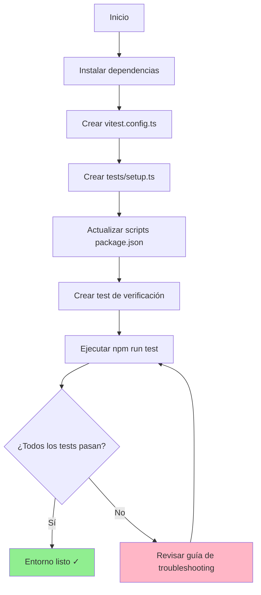
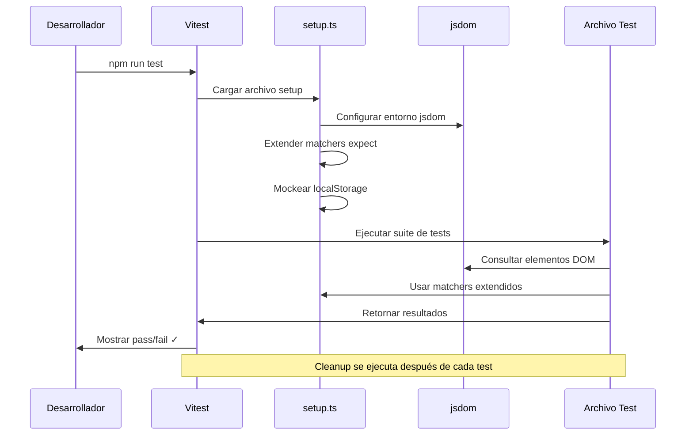

## Introducción

**Anterior:** [Parte 1: Diseño del Modelo de Datos](/posts/nutritional-tracker-part-1)

### Repaso: Parte 1

En la entrega anterior, diseñamos el modelo de datos central para nuestro tracker nutricional. Definimos la estructura de la entidad `Register`, tomamos decisiones arquitectónicas clave (unificación de alimentos/bebidas, unidades flexibles, campo ternario para endulzantes) y establecimos la base técnica usando React + Vite con persistencia en localStorage.

### Objetivos para la Parte 2

En esta entrega, construiremos la base de testing que asegurará la calidad del código durante todo el desarrollo. Específicamente, vamos a:

- Configurar Vitest como nuestro test runner
- Configurar Testing Library para testing de componentes React
- Implementar mocks para APIs del navegador (localStorage)
- Establecer patrones de limpieza automática de tests
- Crear tests de verificación para confirmar que todo funciona

Al finalizar, tendremos un entorno de testing robusto listo para desarrollo guiado por tests.

## Por Qué el Testing es Importante

El testing proporciona tres beneficios críticos:

1. **Confianza**: Saber que el código funciona antes de deployar
2. **Documentación**: Los tests sirven como ejemplos vivos de cómo debe comportarse el código
3. **Seguridad en refactoring**: Cambiar código sin miedo sabiendo que los tests detectarán problemas

Sin tests, cada cambio se vuelve riesgoso. Con tests, el desarrollo se acelera.

Además, escribir tests desde el principio nos obliga a estructurar el código de formas más limpias y modulares. Los componentes se vuelven más fáciles de razonar y mantener.

## Resumen del Stack de Testing

Usaremos herramientas modernas y rápidas optimizadas para proyectos Vite:

| Paquete | Propósito | ¿Por Qué Esta Herramienta? |
|---------|-----------|----------------------------|
| `vitest` | Test runner | Rápido, moderno, nativo de Vite (sin conflictos de config) |
| `@vitejs/plugin-react` | Soporte JSX | Permite a Vitest parsear componentes React |
| `@testing-library/react` | Testing de componentes | Mejores prácticas para tests centrados en el usuario |
| `@testing-library/jest-dom` | Matchers mejorados | Assertions legibles como `toBeInTheDocument()` |
| `@testing-library/user-event` | Simulación de usuario | Testing realista de interacciones |
| `jsdom` | Simulación de DOM | Ejecutar tests de navegador en Node.js |

## Instalación y Configuración

### Instalando Dependencias

Abre tu terminal en la raíz del proyecto e instala el stack de testing:

```bash
npm install -D vitest @vitejs/plugin-react
npm install -D @testing-library/react @testing-library/jest-dom @testing-library/user-event
npm install -D jsdom
```

### Entendiendo las Dependencias de Desarrollo

Nota que usamos la bandera `-D` (o `--save-dev`). Esto marca estos paquetes como **dependencias de desarrollo**—requeridas solo durante el desarrollo, no en producción.

**Beneficios:**

- Mantiene el bundle de producción más pequeño
- Separa preocupaciones (herramientas dev vs código app)
- Hace las dependencias más fáciles de manejar

Esta es una buena práctica: herramientas de testing, linters y build tools siempre deben ser dependencias de desarrollo.

## Configuración de Vitest

### Creando el Archivo de Configuración

Esta configuración le dice a Vitest cómo ejecutar tests en un entorno React. Crea `vitest.config.ts` en la raíz del proyecto:

```typescript
// vitest.config.ts
// Configura Vitest para trabajar con React y simular el entorno del navegador
import path from 'node:path'
import { fileURLToPath } from 'node:url'
import react from '@vitejs/plugin-react'
import { defineConfig } from 'vitest/config'

const __dirname = path.dirname(fileURLToPath(import.meta.url))

export default defineConfig({
  plugins: [react()],
  test: {
    environment: 'jsdom', // Simula el DOM del navegador
    globals: true, // No necesita importar describe/it/expect
    setupFiles: './tests/setup.ts', // Se ejecuta antes de cada archivo de test
    coverage: {
      provider: 'v8',
      reporter: ['text', 'json', 'html'],
      exclude: [
        'node_modules/',
        'tests/',
        '*.config.ts',
        '*.config.js',
      ],
    },
  },
  resolve: {
    alias: {
      '@': path.resolve(__dirname, './src'),
    },
  },
})
```

### Desglose de la Configuración

**Cada opción explicada:**

- `plugins: [react()]` → Habilita el parsing de JSX/TSX en archivos de test
- `environment: 'jsdom'` → Simula APIs del navegador (document, window, localStorage)
- `globals: true` → Usa `describe`, `it`, `expect` sin importarlos
- `setupFiles` → Ejecuta código de setup antes de cada archivo de test (matchers, mocks)
- `coverage` → Rastrea qué líneas de código están testeadas
  - `provider: 'v8'` → Herramienta de cobertura nativa rápida
  - `reporter` → Formatos de salida (terminal, JSON, reporte HTML)
  - `exclude` → Ignorar estos paths en cobertura
- `alias: { '@': './src' }` → Importar como `@/components/Button` en lugar de `../../components/Button`

## Archivo de Setup de Tests

### Creando el Archivo de Setup

El archivo de setup prepara el entorno de testing. Crea `tests/setup.ts`:

```typescript
// tests/setup.ts
// Se ejecuta antes de cada archivo de test para preparar el entorno
import { cleanup } from '@testing-library/react'
import { afterEach, beforeEach } from 'vitest'
import '@testing-library/jest-dom'

// Limpiar el DOM después de cada test para prevenir efectos secundarios
afterEach(() => {
  cleanup()
})

// Mock de localStorage para entorno Node.js
const localStorageMock = (() => {
  let store: Record<string, string> = {}

  return {
    getItem: (key: string) => store[key] || null,
    setItem: (key: string, value: string) => {
      store[key] = value.toString()
    },
    removeItem: (key: string) => {
      delete store[key]
    },
    clear: () => {
      store = {}
    },
  }
})()

globalThis.localStorage = localStorageMock as Storage

// Resetear localStorage antes de cada test
beforeEach(() => {
  localStorage.clear()
})
```

### Componentes del Setup Explicados

#### 1. Limpieza Automática

```typescript
afterEach(() => {
  cleanup()
})
```

Remueve todos los componentes renderizados del DOM después de cada test. Previene que los tests se afecten entre sí.

### 2. Matchers Extendidos

```typescript
import '@testing-library/jest-dom'
```

Añade assertions legibles como:

- `expect(element).toBeInTheDocument()`
- `expect(input).toHaveValue('text')`
- `expect(button).toBeDisabled()`

## 3. Mock de localStorage

```typescript
const localStorageMock = (() => {
  let store: Record<string, string> = {}
  return { getItem, setItem, removeItem, clear }
})()
```

Node.js no tiene `localStorage` (es una API del navegador). Este mock lo simula con un objeto en memoria.

### 4. Reset de Storage

```typescript
beforeEach(() => {
  localStorage.clear()
})
```

Cada test comienza con storage vacío. Asegura que los tests sean aislados y repetibles.

## Scripts de Package

Añade estos scripts a `package.json` para ejecución conveniente de tests:

```json
{
  "scripts": {
    "test": "vitest",
    "test:ui": "vitest --ui",
    "test:coverage": "vitest run --coverage",
    "test:watch": "vitest --watch"
  }
}
```

### Referencia de Scripts

| Script | Comportamiento | Caso de Uso |
|--------|----------------|-------------|
| `test` | Modo interactivo (re-ejecuta al guardar) | Flujo primario de desarrollo |
| `test:ui` | Abre interfaz visual en navegador | Debugging, explorar resultados de tests |
| `test:coverage` | Genera reporte de cobertura | CI/CD, verificar completitud de tests |
| `test:watch` | Modo watch explícito | Alternativa a `test` |

## Verificación

### Creando una Suite de Tests

Verifiquemos que todo funciona. Crea `tests/example.test.ts`:

```typescript
// tests/example.test.ts
// Tests de verificación para confirmar que el setup funciona correctamente
import { describe, expect, it } from 'vitest'

describe('Verificación del setup de testing', () => {
  it('debe pasar test aritmético básico', () => {
    expect(1 + 1).toBe(2)
  })

  it('debe tener acceso a matchers de jest-dom', () => {
    const element = document.createElement('div')
    element.textContent = 'Hola'
    document.body.appendChild(element)

    expect(element).toBeInTheDocument()
  })

  it('debe tener localStorage mockeado', () => {
    localStorage.setItem('test', 'value')
    expect(localStorage.getItem('test')).toBe('value')

    localStorage.clear()
    expect(localStorage.getItem('test')).toBeNull()
  })
})
```

### Ejecutando Tests

Ejecuta la suite de tests:

```bash
npm run test
```

### Salida Esperada

Deberías ver:

```bash
✓ tests/example.test.ts (3) 450ms
  ✓ Verificación del setup de testing (3)
    ✓ debe pasar test aritmético básico
    ✓ debe tener acceso a matchers de jest-dom
    ✓ debe tener localStorage mockeado

Test Files  1 passed (1)
Tests       3 passed (3)
Start at    10:30:15
Duration    892ms

PASS  Waiting for file changes...
```

**Qué significa cada línea:**

- `✓ tests/example.test.ts (3)` → Archivo de test con 3 tests pasando
- `450ms` → Tiempo de ejecución para este archivo
- `Duration 892ms` → Duración total de la suite de tests
- `PASS  Waiting...` → Modo watch activo, re-ejecutará en cambios de archivo

**Si los tests fallan**, Vitest muestra:

- Valores esperados vs actuales
- Stack traces apuntando al fallo
- Fragmentos de código con contexto

✅ **¡Éxito!** El entorno de testing está completamente operacional.

## Flujo de Configuración

Este diagrama visualiza el proceso completo de setup:



## Guía de Troubleshooting

Durante el setup, pueden surgir varios desafíos. Aquí está cómo resolverlos:

### Problema 1: Compatibilidad con ES Modules

**Síntoma:**

```
ReferenceError: __dirname is not defined
```

**Causa:** El proyecto usa `"type": "module"` en `package.json`, lo cual desactiva globals de CommonJS como `__dirname`.

**Solución:**

```typescript
import path from 'node:path'
import { fileURLToPath } from 'node:url'

const __dirname = path.dirname(fileURLToPath(import.meta.url))
```

**Por qué funciona:** `import.meta.url` proporciona la URL del archivo actual en ES modules. La convertimos a un path y extraemos el directorio.

---

### Problema 2: Tipos de Matchers de jest-dom

**Síntoma:**

```typescript
Property 'toBeInTheDocument' does not exist on type 'Assertion'
```

**Causa:** Cambios breaking en `@testing-library/jest-dom` v6+ modificaron cómo se extienden los matchers.

**Solución:**

```typescript
// ❌ No uses esto (API antigua)
import * as matchers from '@testing-library/jest-dom/matchers'

// ✅ Usa import automático en su lugar
import '@testing-library/jest-dom'

expect.extend(matchers)
```

**Por qué funciona:** El import automático maneja las declaraciones de tipo correctamente y es el enfoque recomendado.

---

### Problema 3: Conflictos de Tipos de TypeScript

**Síntoma:**

```text
Type 'Assertion' is not assignable to type 'Matchers'
```

**Causa:** Vitest tiene diferencias sutiles de Jest en tipos globales.

**Solución:**
Crea `tests/vitest.d.ts`:

```typescript
// tests/vitest.d.ts
// Extiende los tipos de Vitest para incluir matchers de jest-dom
declare global {
  namespace Vi {
    interface Assertion extends jest.Matchers<void> {}
    interface AsymmetricMatchers extends jest.Matchers<void> {}
  }
}

export {}
```

**Por qué funciona:** Este archivo de declaración fusiona los tipos de jest-dom en la interfaz de assertion de Vitest.

---

### Problema 4: Problemas con Mock de localStorage

**Síntoma:**

```text
localStorage is not defined
```

o advertencias sobre `global.localStorage`.

**Causa:** Node.js no tiene APIs del navegador. El mock debe adjuntarse correctamente.

**Solución:**

```typescript
// ❌ No uses esto
global.localStorage = localStorageMock

// ✅ Usa esto para mejor compatibilidad
globalThis.localStorage = localStorageMock as Storage
```

**Por qué funciona:** `globalThis` es la forma estandarizada de acceder al objeto global en todos los entornos JavaScript (navegador, Node, workers).

---

### Problema 5: Tests No Se Ejecutan

**Síntoma:**

```text
No test files found
```

**Causa:** Vitest no puede encontrar tus archivos de test.

**Solución:**

- Verifica que los archivos de test coincidan con el patrón: `*.test.ts`, `*.test.tsx`, `*.spec.ts`
- Verifica que estén en la ubicación correcta (`tests/` o `src/`)
- Asegura que las extensiones de archivo estén incluidas en el patrón `include` (por defecto cubre la mayoría)

---

## Flujo de Ejecución de Tests

Este diagrama muestra qué sucede cuando ejecutas tests:



## Conclusiones Clave

En este punto, tienes:

✅ Un entorno Vitest completamente configurado
✅ Implementación de mock para localStorage
✅ Matchers extendidos de jest-dom
✅ Limpieza automática de tests entre ejecuciones
✅ Múltiples modos de ejecución de tests (watch, UI, coverage)

**Mejores prácticas establecidas:**

- Siempre limpiar después de tests para evitar efectos secundarios
- Mockear APIs del navegador que no están disponibles en Node
- Usar nombres de tests descriptivos que expliquen el comportamiento
- Separar setup de test de ejecución de test
- Mantener tests aislados y repetibles

La base de testing ahora es lo suficientemente sólida para soportar **Desarrollo Guiado por Tests (TDD)** para el resto del proyecto.

## ¿Qué Sigue?

Con un entorno de testing robusto en su lugar, estamos listos para implementar la capa de datos central.

## Continuar Leyendo

En [Parte 3: Validación de Datos con Zod](/posts/nutritional-tracker-part-3), implementamos esquemas de validación robustos, definimos tipos de TypeScript y escribimos tests unitarios comprehensivos para el modelo de datos.

**Progreso de la Serie:**

- Parte 1: Diseño del Modelo de Datos ✓
- Parte 2: Configuración del Entorno de Testing ✓ ← Estás aquí
- Parte 3: Validación de Datos con Zod →
- Parte 4: Implementación de la Capa de Persistencia
