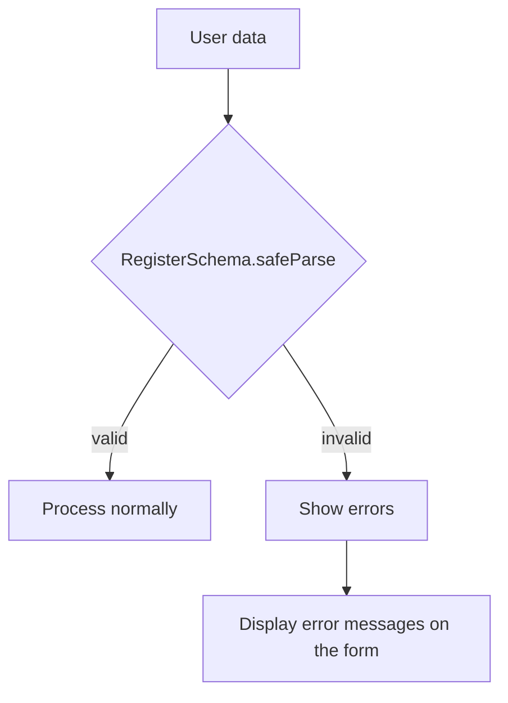

## Part 3: Data Validation with Zod — Nutrition Tracker

## Introduction

In the previous chapter, we set up the test environment. Now, it’s time to ensure our data is safe and correct: that is, _validate everything_ before saving or processing.

---

## Why use Zod for validation?

- You define rules and types in a single place.
- It catches incorrect data at runtime, before it causes errors.
- Automatically generates TypeScript types from schemas (no duplication).
- Validations and errors are clear and centralized.

---

## Model structure

Our core model:

$$
\text{Register} = (id, userId, userName, food, amount, unit, date, time, mealType, sweetener, notes, createdAt)
$$

Each field requires specific rules. For example:

- `amount` must be a **positive number**.
- `date` and `time` must follow the proper format.
- `unit`, `mealType`, and `sweetener` must be one of the values listed in their enum.

---

## Basic Zod schema

```typescript
import { z } from 'zod'

export const RegisterSchema = z.object({
  id: z.string().uuid(),
  userId: z.string().uuid(),
  userName: z.string().min(1),
  food: z.string().min(1),
  amount: z.number().positive(),
  unit: z.enum([
    'gr',
    'ml',
    'unit',
    'portion',
    'small-portion',
    'large-portion',
  ]),
  date: z.string().regex(/^\d{4}-\d{2}-\d{2}$/), // YYYY-MM-DD
  time: z.string().regex(/^\d{2}:\d{2}$/), // HH:MM
  mealType: z.enum(['breakfast', 'lunch', 'snack', 'dinner', 'collation']),
  createdAt: z.string().regex(/^\d{4}-\d{2}-\d{2}T\d{2}:\d{2}:\d{2}Z$/),
  sweetener: z.enum(['sugar', 'sweetener']).optional().nullable(),
  notes: z.string().optional(),
})
```

---

## Automatic type inference

```typescript
export type Register = z.infer<typeof RegisterSchema>
```

This means **TypeScript understands the types for your data** directly from the schema. If you change the schema, the type updates automatically.

---

## Example: Practical validation

Suppose you have user input:

```typescript
const data = {
  id: 'not-a-uuid',
  userId: '1234',
  userName: '',
  food: '',
  amount: -5,
  unit: 'liters',
  date: '11-2025-11',
  time: '8:30am',
  mealType: 'brunch',
  createdAt: '2025-11-11',
}
```

When validating with Zod (using `.safeParse()`):

```typescript
const result = RegisterSchema.safeParse(data)

if (!result.success) {
  // You can loop over the errors and show field messages
  result.error.issues.forEach((issue) => {
    console.log(`Field: ${issue.path[0]} - ${issue.message}`)
  })
}
```

---

## Validation flow diagram



---

## More advantages

- You can take advantage of **enum values** to keep drop-downs and selects consistent.
- Zod’s error messages are clear and easy to show in your UI.
- It’s simple to extend the schema for new fields in the future.

---

## Unit tests (practical example)

```typescript
import { describe, expect, it } from 'vitest'

describe('RegisterSchema', () => {
  it('accepts a valid record', () => {
    const valid = {
      id: 'a1b2c3d4-e5f6-7890-abcd-1234567890ab',
      userId: 'b2c3d4e5-f6a7-8901-bcde-2345678901bc',
      userName: 'John',
      food: 'Apple',
      amount: 1,
      unit: 'unit',
      date: '2025-11-11',
      time: '08:30',
      mealType: 'breakfast',
      createdAt: '2025-11-11T08:35:00Z',
      sweetener: null,
      notes: 'Fresh',
    }
    expect(() => RegisterSchema.parse(valid)).not.toThrow()
  })

  it('rejects negative amount', () => {
    const invalid = { ...valid, amount: -2 }
    expect(() => RegisterSchema.parse(invalid)).toThrow()
  })

  it('rejects wrong date format', () => {
    const invalid = { ...valid, date: '11-11-2025' }
    expect(() => RegisterSchema.parse(invalid)).toThrow()
  })
})
```

---

## Visualizing robustness

Using Zod and unit tests means that if you modify the data model, TypeScript and your tests will warn you **before** any mistake reaches production.

---

## What’s next?

You now have robust validation on your model. The next step is to build the persistence layer: save and retrieve validated records, handling errors and edge cases.

---

## Series Navigation

- [← Part 2: Testing Environment Setup](./side-project-nutritional-tracker-2.en.md)
- [Part 4: Persistence Layer Implementation →](./side-project-nutritional-tracker-4.en.md)
