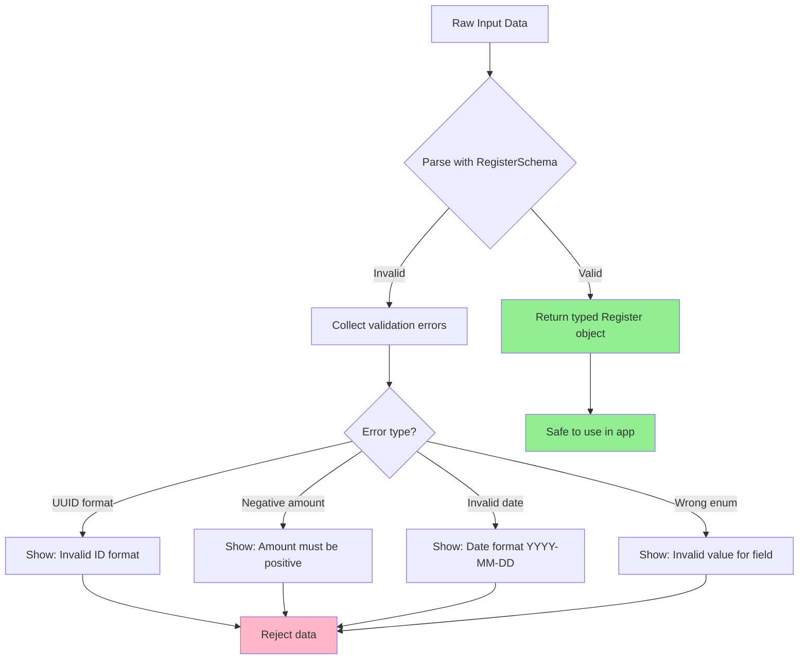

## Introduction

**Previous:** [Part 2: Testing Environment Setup](/posts/nutritional-tracker-part-2)

### Recap: Part 2

In the previous installment, we built a solid testing foundation. We configured Vitest, set up Testing Library, implemented localStorage mocks, and established automated cleanup patterns. The testing environment is now ready to support test-driven development.

### Goals for Part 3

In this phase, we'll implement robust data validation using Zod. Our objectives are:

- Define TypeScript types and enums for the data model
- Create a comprehensive Zod validation schema
- Implement type inference to avoid duplication
- Write unit tests covering valid and invalid scenarios
- Document validation rules and design decisions

By the end, we'll have a type-safe, validated data model ready for integration with forms and persistence.

## Why Zod for Validation?

Zod offers several advantages over alternatives:

**Benefits:**

- **Type inference**: Generate TypeScript types directly from schemas
- **Runtime validation**: Catch invalid data at runtime, not just compile time
- **Composable**: Build complex schemas from simple primitives
- **Error messages**: Detailed, actionable validation errors
- **Zero dependencies**: Lightweight and fast

**Comparison:**

| Feature | Zod | Yup | Joi |
|---------|-----|-----|-----|
| Type inference | ✅ Excellent | ⚠️ Limited | ❌ None |
| Bundle size | 🟢 Small (8kb) | 🟡 Medium (15kb) | 🔴 Large (145kb) |
| Runtime safety | ✅ Yes | ✅ Yes | ✅ Yes |
| TypeScript-first | ✅ Yes | ⚠️ Partial | ❌ No |

For a TypeScript React project, Zod is the optimal choice.

## Conventions and Design Decisions

To maintain consistency throughout the project:

### Naming Convention

- **All field names in English**: Even in Spanish code, use English field names (`food`, `mealType`, not `alimento`, `tipoComida`)
- **Reason**: Easier future integrations, standard API conventions, no translation layer needed

### File Organization

- **Schemas location**: `src/lib/schemas/`
- **Types location**: `src/types/`
- **Tests location**: `tests/`

### Type Inference Strategy

```typescript
// ✅ Do this: Derive types from schemas
export type Register = z.infer<typeof RegisterSchema>

// ❌ Don't do this: Define types separately
// type Register = { ... }
// const RegisterSchema = z.object({ ... })
```

**Why?** Keeps schema and type in sync automatically. Single source of truth.

## Data Model Structure

### Core Entity: Register

The `Register` entity captures each consumption event with the following structure:

```typescript
{
  // Identifiers
  id: string (UUID)
  userId: string (UUID)
  userName: string

  // Consumption details
  food: string
  amount: number (positive)
  unit: enum

  // Timing
  date: string (YYYY-MM-DD)
  time: string (HH:MM)
  mealType: enum

  // Optional fields
  sweetener?: 'sugar' | 'sweetener' | null
  notes?: string

  // Metadata
  createdAt: string (ISO timestamp)
}
```

### Enums Definition

Create `src/types/register.ts`:

```typescript
// src/types/register.ts
// TypeScript enums and types for the Register entity
import { z } from 'zod'
import { RegisterSchema } from '../lib/schemas/registerSchema'

// Infer type from schema (single source of truth)
export type Register = z.infer<typeof RegisterSchema>

// Unit of measurement for consumption amounts
export enum Unit {
  GR = 'gr', // Grams (solid foods)
  ML = 'ml', // Milliliters (liquids)
  UNIT = 'unit', // Countable items (1 apple, 2 cookies)
  PORTION = 'portion', // Standard portion
  SMALL_PORTION = 'small-portion',
  LARGE_PORTION = 'large-portion',
}

// Type of meal when consumption occurred
export enum MealType {
  BREAKFAST = 'breakfast',
  LUNCH = 'lunch',
  SNACK = 'snack', // Afternoon snack (Spanish: merienda)
  DINNER = 'dinner',
  COLLATION = 'collation', // Between-meals snack
}

// Sweetener type (ternary: sugar, artificial sweetener, or none)
export type Sweetener = null | 'sugar' | 'sweetener'
```

### Enum Usage Examples

```typescript
// Using enums in code
const apple: Register = {
  // ...
  unit: Unit.UNIT,
  mealType: MealType.BREAKFAST,
  sweetener: null,
}

// Type-safe comparisons
if (register.mealType === MealType.BREAKFAST) {
  // TypeScript knows this is valid
}
```

## Zod Schema Implementation

Create `src/lib/schemas/registerSchema.ts`:

```typescript
// src/lib/schemas/registerSchema.ts
// Zod validation schema for consumption registers
import { z } from 'zod'

export const RegisterSchema = z.object({
  // Unique identifiers (UUID format)
  id: z.string().uuid({
    message: 'Invalid ID format. Must be a valid UUID.',
  }),
  userId: z.string().uuid({
    message: 'Invalid user ID format. Must be a valid UUID.',
  }),

  // User information
  userName: z.string().min(1, {
    message: 'User name is required and cannot be empty.',
  }),

  // Consumption details
  food: z.string().min(1, {
    message: 'Food name is required and cannot be empty.',
  }),
  amount: z.number().positive({
    message: 'Amount must be a positive number greater than zero.',
  }),
  unit: z.enum(['gr', 'ml', 'unit', 'portion', 'small-portion', 'large-portion'], {
    errorMap: () => ({ message: 'Invalid unit. Must be one of: gr, ml, unit, portion, small-portion, large-portion.' }),
  }),

  // Timing (ISO format)
  date: z.string().regex(/^\d{4}-\d{2}-\d{2}$/, {
    message: 'Invalid date format. Must be YYYY-MM-DD.',
  }),
  time: z.string().regex(/^\d{2}:\d{2}$/, {
    message: 'Invalid time format. Must be HH:MM (24-hour format).',
  }),
  mealType: z.enum(['breakfast', 'lunch', 'snack', 'dinner', 'collation'], {
    errorMap: () => ({ message: 'Invalid meal type. Must be one of: breakfast, lunch, snack, dinner, collation.' }),
  }),

  // Metadata
  createdAt: z.string().regex(/^\d{4}-\d{2}-\d{2}T\d{2}:\d{2}:\d{2}Z$/, {
    message: 'Invalid timestamp format. Must be ISO 8601 format (YYYY-MM-DDTHH:MM:SSZ).',
  }),

  // Optional fields
  sweetener: z.enum(['sugar', 'sweetener']).nullable().optional(),
  notes: z.string().optional(),
})
```

### Schema Validation Rules

Each field has specific validation logic:

| Field | Validation | Reason |
|-------|------------|--------|
| `id`, `userId` | UUID format | Ensures uniqueness and proper format |
| `userName`, `food` | Non-empty string | Required fields cannot be blank |
| `amount` | Positive number | Negative amounts make no sense |
| `unit` | Enum (6 options) | Only valid units allowed |
| `date` | YYYY-MM-DD regex | ISO date format for consistency |
| `time` | HH:MM regex | 24-hour format (00:00-23:59) |
| `mealType` | Enum (5 options) | Only valid meal types |
| `createdAt` | ISO 8601 timestamp | Standard for timestamps |
| `sweetener` | Enum or null/undefined | Ternary state (sugar/sweetener/none) |
| `notes` | Optional string | Flexible additional info |

## Validation Flow Diagram



## Example: Valid and Invalid Records

### Valid Record

```typescript
const validRegister: Register = {
  id: 'a1b2c3d4-e5f6-7890-abcd-1234567890ab',
  userId: 'b2c3d4e5-f6a7-8901-bcde-2345678901bc',
  userName: 'John',
  food: 'Red apple',
  amount: 1,
  unit: 'unit',
  date: '2025-11-11',
  time: '08:30',
  mealType: 'breakfast',
  createdAt: '2025-11-11T08:35:00Z',
  sweetener: null,
  notes: 'Fresh from farmers market',
}

// Validation passes
RegisterSchema.parse(validRegister) // ✅ No errors
```

### Invalid Records

```typescript
// Example 1: Negative amount
const invalidAmount = {
  ...validRegister,
  amount: -2, // ❌ Must be positive
}

// RegisterSchema.parse(invalidAmount)
// Throws: "Amount must be a positive number greater than zero."

// Example 2: Wrong date format
const invalidDate = {
  ...validRegister,
  date: '11-11-2025', // ❌ Must be YYYY-MM-DD
}

// RegisterSchema.parse(invalidDate)
// Throws: "Invalid date format. Must be YYYY-MM-DD."

// Example 3: Invalid unit
const invalidUnit = {
  ...validRegister,
  unit: 'kilos', // ❌ Not in enum
}

// RegisterSchema.parse(invalidUnit)
// Throws: "Invalid unit. Must be one of: gr, ml, unit, portion, small-portion, large-portion."

// Example 4: Missing required field
const missingFood = {
  ...validRegister,
  food: '', // ❌ Cannot be empty
}

// RegisterSchema.parse(missingFood)
// Throws: "Food name is required and cannot be empty."
```

## Unit Testing the Schema

Create `tests/registerSchema.test.ts`:

```typescript
// tests/registerSchema.test.ts
// Comprehensive unit tests for Register validation schema
import { describe, expect, it } from 'vitest'
import { RegisterSchema } from '../src/lib/schemas/registerSchema'

// Valid baseline record for tests
const validRegister = {
  id: 'a1b2c3d4-e5f6-7890-abcd-1234567890ab',
  userId: 'b2c3d4e5-f6a7-8901-bcde-2345678901bc',
  userName: 'John',
  food: 'Apple',
  amount: 1,
  unit: 'unit',
  date: '2025-11-11',
  time: '08:30',
  mealType: 'breakfast',
  createdAt: '2025-11-11T08:35:00Z',
  sweetener: null,
  notes: 'Fresh',
}

describe('RegisterSchema - Valid Cases', () => {
  it('accepts a fully valid register', () => {
    expect(() => RegisterSchema.parse(validRegister)).not.toThrow()
  })

  it('accepts register without optional fields', () => {
    const noOptionals = { ...validRegister }
    delete noOptionals.sweetener
    delete noOptionals.notes

    expect(() => RegisterSchema.parse(noOptionals)).not.toThrow()
  })

  it('accepts all valid unit types', () => {
    const units = ['gr', 'ml', 'unit', 'portion', 'small-portion', 'large-portion']

    units.forEach((unit) => {
      const record = { ...validRegister, unit }
      expect(() => RegisterSchema.parse(record)).not.toThrow()
    })
  })

  it('accepts all valid meal types', () => {
    const mealTypes = ['breakfast', 'lunch', 'snack', 'dinner', 'collation']

    mealTypes.forEach((mealType) => {
      const record = { ...validRegister, mealType }
      expect(() => RegisterSchema.parse(record)).not.toThrow()
    })
  })

  it('accepts sweetener as "sugar"', () => {
    const record = { ...validRegister, sweetener: 'sugar' }
    expect(() => RegisterSchema.parse(record)).not.toThrow()
  })

  it('accepts sweetener as "sweetener"', () => {
    const record = { ...validRegister, sweetener: 'sweetener' }
    expect(() => RegisterSchema.parse(record)).not.toThrow()
  })

  it('accepts sweetener as null', () => {
    const record = { ...validRegister, sweetener: null }
    expect(() => RegisterSchema.parse(record)).not.toThrow()
  })
})

describe('RegisterSchema - Invalid Cases', () => {
  it('rejects negative amount', () => {
    const record = { ...validRegister, amount: -2 }
    expect(() => RegisterSchema.parse(record)).toThrow('Amount must be a positive number')
  })

  it('rejects zero amount', () => {
    const record = { ...validRegister, amount: 0 }
    expect(() => RegisterSchema.parse(record)).toThrow('Amount must be a positive number')
  })

  it('rejects invalid date format (DD-MM-YYYY)', () => {
    const record = { ...validRegister, date: '11-11-2025' }
    expect(() => RegisterSchema.parse(record)).toThrow('Invalid date format')
  })

  it('rejects invalid time format (12-hour)', () => {
    const record = { ...validRegister, time: '8:30 AM' }
    expect(() => RegisterSchema.parse(record)).toThrow('Invalid time format')
  })

  it('rejects invalid UUID for id', () => {
    const record = { ...validRegister, id: 'not-a-uuid' }
    expect(() => RegisterSchema.parse(record)).toThrow('Invalid ID format')
  })

  it('rejects invalid UUID for userId', () => {
    const record = { ...validRegister, userId: '12345' }
    expect(() => RegisterSchema.parse(record)).toThrow('Invalid user ID format')
  })

  it('rejects empty food name', () => {
    const record = { ...validRegister, food: '' }
    expect(() => RegisterSchema.parse(record)).toThrow('Food name is required')
  })

  it('rejects empty user name', () => {
    const record = { ...validRegister, userName: '' }
    expect(() => RegisterSchema.parse(record)).toThrow('User name is required')
  })

  it('rejects invalid unit', () => {
    const record = { ...validRegister, unit: 'kilos' }
    expect(() => RegisterSchema.parse(record)).toThrow('Invalid unit')
  })

  it('rejects invalid meal type', () => {
    const record = { ...validRegister, mealType: 'brunch' }
    expect(() => RegisterSchema.parse(record)).toThrow('Invalid meal type')
  })

  it('rejects invalid createdAt timestamp', () => {
    const record = { ...validRegister, createdAt: '2025-11-11' }
    expect(() => RegisterSchema.parse(record)).toThrow('Invalid timestamp format')
  })

  it('rejects invalid sweetener value', () => {
    const record = { ...validRegister, sweetener: 'honey' }
    expect(() => RegisterSchema.parse(record)).toThrow()
  })
})

describe('RegisterSchema - Edge Cases', () => {
  it('accepts very small positive amounts', () => {
    const record = { ...validRegister, amount: 0.001 }
    expect(() => RegisterSchema.parse(record)).not.toThrow()
  })

  it('accepts very large amounts', () => {
    const record = { ...validRegister, amount: 999999 }
    expect(() => RegisterSchema.parse(record)).not.toThrow()
  })

  it('accepts long food names', () => {
    const record = { ...validRegister, food: 'A'.repeat(500) }
    expect(() => RegisterSchema.parse(record)).not.toThrow()
  })

  it('accepts long notes', () => {
    const record = { ...validRegister, notes: 'Note '.repeat(100) }
    expect(() => RegisterSchema.parse(record)).not.toThrow()
  })

  it('accepts edge time values (00:00)', () => {
    const record = { ...validRegister, time: '00:00' }
    expect(() => RegisterSchema.parse(record)).not.toThrow()
  })

  it('accepts edge time values (23:59)', () => {
    const record = { ...validRegister, time: '23:59' }
    expect(() => RegisterSchema.parse(record)).not.toThrow()
  })
})
```

### Running the Tests

```bash
npm run test registerSchema
```

**Expected output:**

```bash
✓ tests/registerSchema.test.ts (34)
  ✓ RegisterSchema - Valid Cases (8)
  ✓ RegisterSchema - Invalid Cases (12)
  ✓ RegisterSchema - Edge Cases (6)

Test Files  1 passed (1)
Tests       34 passed (34)
```

## Safe Parsing Pattern

For user input validation, use `.safeParse()` instead of `.parse()`:

```typescript
// ❌ Don't use .parse() for user input (throws errors)
try {
  const data = RegisterSchema.parse(userInput)
}
catch (error) {
  // Hard to handle typed errors
}

// ✅ Use .safeParse() for graceful error handling
const result = RegisterSchema.safeParse(userInput)

if (result.success) {
  // result.data is typed as Register
  console.log(result.data.food)
}
else {
  // result.error contains detailed validation errors
  result.error.issues.forEach((issue) => {
    console.log(`${issue.path}: ${issue.message}`)
  })
}
```

### Example: Form Validation

```typescript
function validateRegisterForm(formData: unknown) {
  const result = RegisterSchema.safeParse(formData)

  if (!result.success) {
    // Map errors to form fields
    const fieldErrors = result.error.issues.reduce((acc, issue) => {
      const field = issue.path[0] as string
      acc[field] = issue.message
      return acc
    }, {} as Record<string, string>)

    return { valid: false, errors: fieldErrors }
  }

  return { valid: true, data: result.data }
}
```

## Type Safety Benefits

With Zod schemas, we get:

**1. Compile-time type checking:**

```typescript
const register: Register = { /* ... */ }

// ✅ TypeScript knows all fields
register.food // string
register.amount // number
register.sweetener // 'sugar' | 'sweetener' | null | undefined

// ❌ TypeScript catches typos
register.fod // Error: Property 'fod' does not exist
```

**2. Runtime validation:**

```typescript
// Input from API/form (unknown type)
const input = await fetchUserInput()

// Validate at runtime
const result = RegisterSchema.safeParse(input)

if (result.success) {
  // Now TypeScript knows the shape
  const register: Register = result.data
}
```

**3. Refactoring safety:**

```typescript
// Change schema
export const RegisterSchema = z.object({
  // ... add new required field
  category: z.string(),
})

// TypeScript immediately shows all places that need updating
// No silent runtime failures!
```

## Key Takeaways

At this point, we have:

✅ Comprehensive Zod validation schema
✅ Type-safe TypeScript enums and types
✅ Type inference preventing duplication
✅ 34+ unit tests covering valid, invalid, and edge cases
✅ Clear, actionable error messages for users
✅ Safe parsing pattern for user input

**Best practices established:**

- Single source of truth (schema generates types)
- Descriptive error messages for UI display
- Comprehensive test coverage (valid + invalid + edge)
- Enum usage for fixed value sets
- Optional fields handled correctly

The data model is now robust, validated, and ready for integration with the persistence layer.

## What's Next?

With validation in place, we're ready to implement the persistence layer that will save and retrieve validated data.

## Continue Reading

In [Part 4: Persistence Layer Implementation](/posts/nutritional-tracker-part-4), we build a localStorage wrapper with error handling, best-effort parsing for corrupted data, and comprehensive CRUD operations.

**Series Progress:**

- Part 1: Data Model Design ✓
- Part 2: Testing Environment Setup ✓
- Part 3: Data Validation with Zod ✓ ← You are here
- Part 4: Persistence Layer Implementation →
