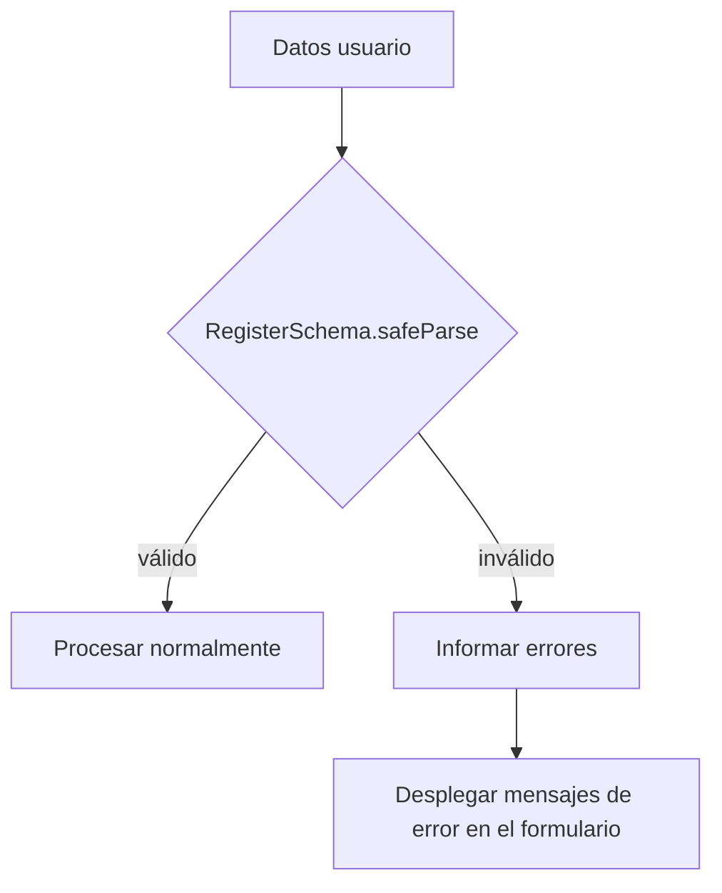

## Parte 3: Validación de Datos con Zod — Nutrition Tracker

## Introducción

En el capítulo anterior, configuramos el entorno de testing. Ahora toca asegurar que nuestros datos sean seguros y correctos: es decir, _validar todo_ antes de guardarlo o procesarlo.

---

## ¿Por qué usar Zod para validación?

- Te permite definir reglas y tipos en un solo lugar.
- Detecta datos incorrectos en tiempo de ejecución, antes de que causen errores.
- Genera automáticamente los tipos TypeScript a partir de los esquemas (no duplicas información).
- Las validaciones y errores son claros y están centralizados.

---

## Estructura del modelo

Partimos de nuestro modelo central:

$$
\text{Registro} = (id, userId, userName, food, amount, unit, date, time, mealType, sweetener, notes, createdAt)
$$

Cada campo requiere reglas específicas. Por ejemplo:

- `amount` debe ser un número **mayor a cero**.
- `date` y `time` deben seguir el formato correcto.
- `unit`, `mealType` y `sweetener` deben ser uno de los valores listados en su enum.

---

## Esquema Zod básico

```typescript
import { z } from 'zod'

export const RegisterSchema = z.object({
  id: z.string().uuid(),
  userId: z.string().uuid(),
  userName: z.string().min(1),
  food: z.string().min(1),
  amount: z.number().positive(),
  unit: z.enum([
    'gr',
    'ml',
    'unit',
    'portion',
    'small-portion',
    'large-portion',
  ]),
  date: z.string().regex(/^\d{4}-\d{2}-\d{2}$/), // YYYY-MM-DD
  time: z.string().regex(/^\d{2}:\d{2}$/), // HH:MM
  mealType: z.enum(['breakfast', 'lunch', 'snack', 'dinner', 'collation']),
  createdAt: z.string().regex(/^\d{4}-\d{2}-\d{2}T\d{2}:\d{2}:\d{2}Z$/),
  sweetener: z.enum(['sugar', 'sweetener']).optional().nullable(),
  notes: z.string().optional(),
})
```

---

## Inferencia de tipos automática

```typescript
export type Register = z.infer<typeof RegisterSchema>
```

Esto significa que **TypeScript entiende los tipos de tus datos** directamente del esquema. Si cambias el esquema, el tipo se actualiza sin esfuerzo extra.

---

## Ejemplo: Validación práctica

Supón un dato de entrada del usuario:

```typescript
const data = {
  id: 'not-a-uuid',
  userId: '1234',
  userName: '',
  food: '',
  amount: -5,
  unit: 'litros',
  date: '11-2025-11',
  time: '8:30am',
  mealType: 'brunch',
  createdAt: '2025-11-11',
}
```

Al validar con Zod (usando `.safeParse()`):

```typescript
const result = RegisterSchema.safeParse(data)

if (!result.success) {
  // Puedes recorrer los errores para mostrar mensajes en cada campo
  result.error.issues.forEach((issue) => {
    console.log(`Campo: ${issue.path[0]} - ${issue.message}`)
  })
}
```

---

## Diagrama de flujo de validación



---

## Ventajas adicionales

- Puedes aprovechar las **enum** para mantener consistencia en menús y selects.
- Los mensajes de error generados por Zod son claros y fáciles de mostrar en la interfaz.
- Es sencillo extender el esquema para nuevos campos en el futuro.

---

## Tests unitarios (ejemplo práctico)

```typescript
import { describe, expect, it } from 'vitest'

describe('RegisterSchema', () => {
  it('acepta registro válido', () => {
    const valid = {
      id: 'a1b2c3d4-e5f6-7890-abcd-1234567890ab',
      userId: 'b2c3d4e5-f6a7-8901-bcde-2345678901bc',
      userName: 'Juan',
      food: 'Manzana',
      amount: 1,
      unit: 'unit',
      date: '2025-11-11',
      time: '08:30',
      mealType: 'breakfast',
      createdAt: '2025-11-11T08:35:00Z',
      sweetener: null,
      notes: 'Fresca',
    }
    expect(() => RegisterSchema.parse(valid)).not.toThrow()
  })

  it('rechaza cantidad negativa', () => {
    const invalid = { ...valid, amount: -2 }
    expect(() => RegisterSchema.parse(invalid)).toThrow()
  })

  it('rechaza formato de fecha incorrecto', () => {
    const invalid = { ...valid, date: '11-11-2025' }
    expect(() => RegisterSchema.parse(invalid)).toThrow()
  })
})
```

---

## ¿Qué sigue?

Ya tienes validación robusta en tu modelo. El próximo paso es crear la capa de persistencia: guardar y recuperar registros validados, gestionando errores y casos extremos.

**Continúa leyendo:**
_Parte 4: Implementación de la Capa de Persistencia_ → Cómo guardar en localStorage, recuperar datos y mantener tolerancia a errores.
