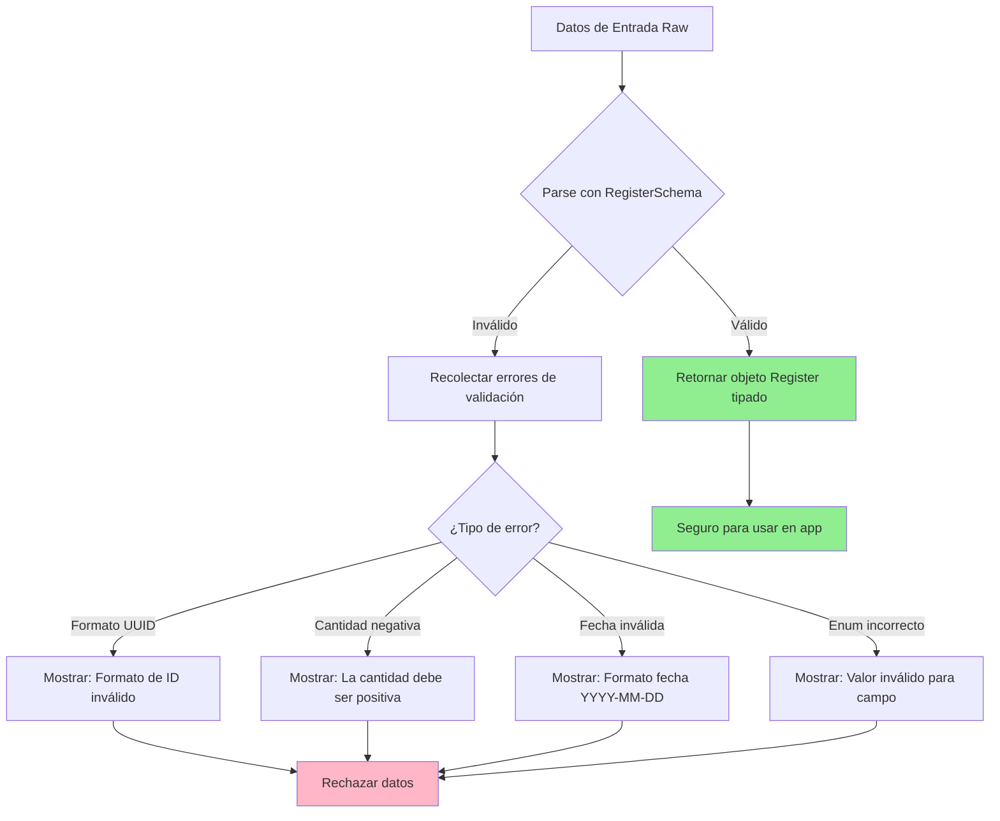

## Introducción

**Anterior:** [Parte 2: Configuración del Entorno de Testing](/posts/nutritional-tracker-part-2)

### Repaso: Parte 2

En la entrega anterior, construimos una base sólida de testing. Configuramos Vitest, establecimos Testing Library, implementamos mocks de localStorage y establecimos patrones de limpieza automática. El entorno de testing ahora está listo para soportar desarrollo guiado por tests.

### Objetivos para la Parte 3

En esta fase, implementaremos validación robusta de datos usando Zod. Nuestros objetivos son:

- Definir tipos TypeScript y enums para el modelo de datos
- Crear un esquema de validación comprehensivo con Zod
- Implementar inferencia de tipos para evitar duplicación
- Escribir tests unitarios cubriendo escenarios válidos e inválidos
- Documentar reglas de validación y decisiones de diseño

Al finalizar, tendremos un modelo de datos type-safe y validado, listo para integración con formularios y persistencia.

## ¿Por Qué Zod para Validación?

Zod ofrece varias ventajas sobre las alternativas:

**Beneficios:**

- **Inferencia de tipos**: Genera tipos TypeScript directamente de los esquemas
- **Validación en runtime**: Detecta datos inválidos en tiempo de ejecución, no solo en compilación
- **Composable**: Construye esquemas complejos desde primitivas simples
- **Mensajes de error**: Errores de validación detallados y accionables
- **Zero dependencies**: Ligero y rápido

**Comparación:**

| Característica | Zod | Yup | Joi |
|----------------|-----|-----|-----|
| Inferencia de tipos | ✅ Excelente | ⚠️ Limitada | ❌ Ninguna |
| Tamaño bundle | 🟢 Pequeño (8kb) | 🟡 Medio (15kb) | 🔴 Grande (145kb) |
| Seguridad runtime | ✅ Sí | ✅ Sí | ✅ Sí |
| TypeScript-first | ✅ Sí | ⚠️ Parcial | ❌ No |

Para un proyecto React con TypeScript, Zod es la elección óptima.

## Convenciones y Decisiones de Diseño

Para mantener consistencia en todo el proyecto:

### Convención de Nombres

- **Todos los nombres de campos en inglés**: Incluso en código español, usar nombres de campos en inglés (`food`, `mealType`, no `alimento`, `tipoComida`)
- **Razón**: Facilita futuras integraciones, convenciones estándar de API, no necesita capa de traducción

### Organización de Archivos

- **Ubicación de esquemas**: `src/lib/schemas/`
- **Ubicación de tipos**: `src/types/`
- **Ubicación de tests**: `tests/`

### Estrategia de Inferencia de Tipos

```typescript
// ✅ Hacer esto: Derivar tipos de esquemas
export type Register = z.infer<typeof RegisterSchema>

// ❌ No hacer esto: Definir tipos separadamente
// type Register = { ... }
// const RegisterSchema = z.object({ ... })
```

**¿Por qué?** Mantiene esquema y tipo sincronizados automáticamente. Única fuente de verdad.

## Estructura del Modelo de Datos

### Entidad Central: Register

La entidad `Register` captura cada evento de consumo con la siguiente estructura:

```typescript
{
  // Identificadores
  id: string (UUID)
  userId: string (UUID)
  userName: string

  // Detalles del consumo
  food: string
  amount: number (positivo)
  unit: enum

  // Timing
  date: string (YYYY-MM-DD)
  time: string (HH:MM)
  mealType: enum

  // Campos opcionales
  sweetener?: 'sugar' | 'sweetener' | null
  notes?: string

  // Metadata
  createdAt: string (timestamp ISO)
}
```

### Definición de Enums

Crear `src/types/register.ts`:

```typescript
// src/types/register.ts
// Enums y tipos TypeScript para la entidad Register
import { z } from 'zod'
import { RegisterSchema } from '../lib/schemas/registerSchema'

// Inferir tipo del esquema (única fuente de verdad)
export type Register = z.infer<typeof RegisterSchema>

// Unidad de medida para cantidades de consumo
export enum Unit {
  GR = 'gr', // Gramos (alimentos sólidos)
  ML = 'ml', // Mililitros (líquidos)
  UNIT = 'unit', // Items contables (1 manzana, 2 galletas)
  PORTION = 'portion', // Porción estándar
  SMALL_PORTION = 'small-portion',
  LARGE_PORTION = 'large-portion',
}

// Tipo de comida cuando ocurrió el consumo
export enum MealType {
  BREAKFAST = 'breakfast',
  LUNCH = 'lunch',
  SNACK = 'snack', // Merienda de la tarde
  DINNER = 'dinner',
  COLLATION = 'collation', // Colación entre comidas
}

// Tipo de endulzante (ternario: azúcar, endulzante artificial, o ninguno)
export type Sweetener = null | 'sugar' | 'sweetener'
```

### Ejemplos de Uso de Enums

```typescript
// Usando enums en código
const apple: Register = {
  // ...
  unit: Unit.UNIT,
  mealType: MealType.BREAKFAST,
  sweetener: null,
}

// Comparaciones type-safe
if (register.mealType === MealType.BREAKFAST) {
  // TypeScript sabe que esto es válido
}
```

## Implementación del Esquema Zod

Crear `src/lib/schemas/registerSchema.ts`:

```typescript
// src/lib/schemas/registerSchema.ts
// Esquema de validación Zod para registros de consumo
import { z } from 'zod'

export const RegisterSchema = z.object({
  // Identificadores únicos (formato UUID)
  id: z.string().uuid({
    message: 'Formato de ID inválido. Debe ser un UUID válido.',
  }),
  userId: z.string().uuid({
    message: 'Formato de ID de usuario inválido. Debe ser un UUID válido.',
  }),

  // Información del usuario
  userName: z.string().min(1, {
    message: 'El nombre de usuario es requerido y no puede estar vacío.',
  }),

  // Detalles del consumo
  food: z.string().min(1, {
    message: 'El nombre del alimento es requerido y no puede estar vacío.',
  }),
  amount: z.number().positive({
    message: 'La cantidad debe ser un número positivo mayor que cero.',
  }),
  unit: z.enum(['gr', 'ml', 'unit', 'portion', 'small-portion', 'large-portion'], {
    errorMap: () => ({ message: 'Unidad inválida. Debe ser una de: gr, ml, unit, portion, small-portion, large-portion.' }),
  }),

  // Timing (formato ISO)
  date: z.string().regex(/^\d{4}-\d{2}-\d{2}$/, {
    message: 'Formato de fecha inválido. Debe ser YYYY-MM-DD.',
  }),
  time: z.string().regex(/^\d{2}:\d{2}$/, {
    message: 'Formato de hora inválido. Debe ser HH:MM (formato 24 horas).',
  }),
  mealType: z.enum(['breakfast', 'lunch', 'snack', 'dinner', 'collation'], {
    errorMap: () => ({ message: 'Tipo de comida inválido. Debe ser uno de: breakfast, lunch, snack, dinner, collation.' }),
  }),

  // Metadata
  createdAt: z.string().regex(/^\d{4}-\d{2}-\d{2}T\d{2}:\d{2}:\d{2}Z$/, {
    message: 'Formato de timestamp inválido. Debe ser formato ISO 8601 (YYYY-MM-DDTHH:MM:SSZ).',
  }),

  // Campos opcionales
  sweetener: z.enum(['sugar', 'sweetener']).nullable().optional(),
  notes: z.string().optional(),
})
```

### Reglas de Validación del Esquema

Cada campo tiene lógica de validación específica:

| Campo | Validación | Razón |
|-------|------------|-------|
| `id`, `userId` | Formato UUID | Asegura unicidad y formato adecuado |
| `userName`, `food` | String no vacío | Campos requeridos no pueden estar en blanco |
| `amount` | Número positivo | Cantidades negativas no tienen sentido |
| `unit` | Enum (6 opciones) | Solo unidades válidas permitidas |
| `date` | Regex YYYY-MM-DD | Formato ISO de fecha para consistencia |
| `time` | Regex HH:MM | Formato 24 horas (00:00-23:59) |
| `mealType` | Enum (5 opciones) | Solo tipos de comida válidos |
| `createdAt` | Timestamp ISO 8601 | Estándar para timestamps |
| `sweetener` | Enum o null/undefined | Estado ternario (azúcar/endulzante/ninguno) |
| `notes` | String opcional | Info adicional flexible |

## Diagrama de Flujo de Validación



## Ejemplo: Registros Válidos e Inválidos

### Registro Válido

```typescript
const validRegister: Register = {
  id: 'a1b2c3d4-e5f6-7890-abcd-1234567890ab',
  userId: 'b2c3d4e5-f6a7-8901-bcde-2345678901bc',
  userName: 'Juan',
  food: 'Manzana roja',
  amount: 1,
  unit: 'unit',
  date: '2025-11-11',
  time: '08:30',
  mealType: 'breakfast',
  createdAt: '2025-11-11T08:35:00Z',
  sweetener: null,
  notes: 'Fresca del mercado',
}

// La validación pasa
RegisterSchema.parse(validRegister) // ✅ Sin errores
```

### Registros Inválidos

```typescript
// Ejemplo 1: Cantidad negativa
const invalidAmount = {
  ...validRegister,
  amount: -2, // ❌ Debe ser positivo
}

// RegisterSchema.parse(invalidAmount)
// Lanza: "La cantidad debe ser un número positivo mayor que cero."

// Ejemplo 2: Formato de fecha incorrecto
const invalidDate = {
  ...validRegister,
  date: '11-11-2025', // ❌ Debe ser YYYY-MM-DD
}

// RegisterSchema.parse(invalidDate)
// Lanza: "Formato de fecha inválido. Debe ser YYYY-MM-DD."

// Ejemplo 3: Unidad inválida
const invalidUnit = {
  ...validRegister,
  unit: 'kilos', // ❌ No está en enum
}

// RegisterSchema.parse(invalidUnit)
// Lanza: "Unidad inválida. Debe ser una de: gr, ml, unit, portion, small-portion, large-portion."

// Ejemplo 4: Campo requerido faltante
const missingFood = {
  ...validRegister,
  food: '', // ❌ No puede estar vacío
}

// RegisterSchema.parse(missingFood)
// Lanza: "El nombre del alimento es requerido y no puede estar vacío."
```

## Testing Unitario del Esquema

Crear `tests/registerSchema.test.ts`:

```typescript
// tests/registerSchema.test.ts
// Tests unitarios comprehensivos para esquema de validación de Register
import { describe, expect, it } from 'vitest'
import { RegisterSchema } from '../src/lib/schemas/registerSchema'

// Registro baseline válido para tests
const validRegister = {
  id: 'a1b2c3d4-e5f6-7890-abcd-1234567890ab',
  userId: 'b2c3d4e5-f6a7-8901-bcde-2345678901bc',
  userName: 'Juan',
  food: 'Manzana',
  amount: 1,
  unit: 'unit',
  date: '2025-11-11',
  time: '08:30',
  mealType: 'breakfast',
  createdAt: '2025-11-11T08:35:00Z',
  sweetener: null,
  notes: 'Fresca',
}

describe('RegisterSchema - Casos Válidos', () => {
  it('acepta un registro completamente válido', () => {
    expect(() => RegisterSchema.parse(validRegister)).not.toThrow()
  })

  it('acepta registro sin campos opcionales', () => {
    const noOptionals = { ...validRegister }
    delete noOptionals.sweetener
    delete noOptionals.notes

    expect(() => RegisterSchema.parse(noOptionals)).not.toThrow()
  })

  it('acepta todos los tipos de unidad válidos', () => {
    const units = ['gr', 'ml', 'unit', 'portion', 'small-portion', 'large-portion']

    units.forEach((unit) => {
      const record = { ...validRegister, unit }
      expect(() => RegisterSchema.parse(record)).not.toThrow()
    })
  })

  it('acepta todos los tipos de comida válidos', () => {
    const mealTypes = ['breakfast', 'lunch', 'snack', 'dinner', 'collation']

    mealTypes.forEach((mealType) => {
      const record = { ...validRegister, mealType }
      expect(() => RegisterSchema.parse(record)).not.toThrow()
    })
  })

  it('acepta sweetener como "sugar"', () => {
    const record = { ...validRegister, sweetener: 'sugar' }
    expect(() => RegisterSchema.parse(record)).not.toThrow()
  })

  it('acepta sweetener como "sweetener"', () => {
    const record = { ...validRegister, sweetener: 'sweetener' }
    expect(() => RegisterSchema.parse(record)).not.toThrow()
  })

  it('acepta sweetener como null', () => {
    const record = { ...validRegister, sweetener: null }
    expect(() => RegisterSchema.parse(record)).not.toThrow()
  })
})

describe('RegisterSchema - Casos Inválidos', () => {
  it('rechaza cantidad negativa', () => {
    const record = { ...validRegister, amount: -2 }
    expect(() => RegisterSchema.parse(record)).toThrow('La cantidad debe ser un número positivo')
  })

  it('rechaza cantidad cero', () => {
    const record = { ...validRegister, amount: 0 }
    expect(() => RegisterSchema.parse(record)).toThrow('La cantidad debe ser un número positivo')
  })

  it('rechaza formato de fecha inválido (DD-MM-YYYY)', () => {
    const record = { ...validRegister, date: '11-11-2025' }
    expect(() => RegisterSchema.parse(record)).toThrow('Formato de fecha inválido')
  })

  it('rechaza formato de hora inválido (12 horas)', () => {
    const record = { ...validRegister, time: '8:30 AM' }
    expect(() => RegisterSchema.parse(record)).toThrow('Formato de hora inválido')
  })

  it('rechaza UUID inválido para id', () => {
    const record = { ...validRegister, id: 'not-a-uuid' }
    expect(() => RegisterSchema.parse(record)).toThrow('Formato de ID inválido')
  })

  it('rechaza UUID inválido para userId', () => {
    const record = { ...validRegister, userId: '12345' }
    expect(() => RegisterSchema.parse(record)).toThrow('Formato de ID de usuario inválido')
  })

  it('rechaza nombre de alimento vacío', () => {
    const record = { ...validRegister, food: '' }
    expect(() => RegisterSchema.parse(record)).toThrow('El nombre del alimento es requerido')
  })

  it('rechaza nombre de usuario vacío', () => {
    const record = { ...validRegister, userName: '' }
    expect(() => RegisterSchema.parse(record)).toThrow('El nombre de usuario es requerido')
  })

  it('rechaza unidad inválida', () => {
    const record = { ...validRegister, unit: 'kilos' }
    expect(() => RegisterSchema.parse(record)).toThrow('Unidad inválida')
  })

  it('rechaza tipo de comida inválido', () => {
    const record = { ...validRegister, mealType: 'brunch' }
    expect(() => RegisterSchema.parse(record)).toThrow('Tipo de comida inválido')
  })

  it('rechaza timestamp createdAt inválido', () => {
    const record = { ...validRegister, createdAt: '2025-11-11' }
    expect(() => RegisterSchema.parse(record)).toThrow('Formato de timestamp inválido')
  })

  it('rechaza valor de sweetener inválido', () => {
    const record = { ...validRegister, sweetener: 'honey' }
    expect(() => RegisterSchema.parse(record)).toThrow()
  })
})

describe('RegisterSchema - Casos Límite', () => {
  it('acepta cantidades positivas muy pequeñas', () => {
    const record = { ...validRegister, amount: 0.001 }
    expect(() => RegisterSchema.parse(record)).not.toThrow()
  })

  it('acepta cantidades muy grandes', () => {
    const record = { ...validRegister, amount: 999999 }
    expect(() => RegisterSchema.parse(record)).not.toThrow()
  })

  it('acepta nombres de alimentos largos', () => {
    const record = { ...validRegister, food: 'A'.repeat(500) }
    expect(() => RegisterSchema.parse(record)).not.toThrow()
  })

  it('acepta notas largas', () => {
    const record = { ...validRegister, notes: 'Nota '.repeat(100) }
    expect(() => RegisterSchema.parse(record)).not.toThrow()
  })

  it('acepta valores de hora límite (00:00)', () => {
    const record = { ...validRegister, time: '00:00' }
    expect(() => RegisterSchema.parse(record)).not.toThrow()
  })

  it('acepta valores de hora límite (23:59)', () => {
    const record = { ...validRegister, time: '23:59' }
    expect(() => RegisterSchema.parse(record)).not.toThrow()
  })
})
```

### Ejecutando los Tests

```bash
npm run test registerSchema
```

**Salida esperada:**

```bash
✓ tests/registerSchema.test.ts (34)
  ✓ RegisterSchema - Casos Válidos (8)
  ✓ RegisterSchema - Casos Inválidos (12)
  ✓ RegisterSchema - Casos Límite (6)

Test Files  1 passed (1)
Tests       34 passed (34)
```

## Patrón de Parseo Seguro

Para validación de input de usuario, usar `.safeParse()` en lugar de `.parse()`:

```typescript
// ❌ No usar .parse() para input de usuario (lanza errores)
try {
  const data = RegisterSchema.parse(userInput)
}
catch (error) {
  // Difícil manejar errores tipados
}

// ✅ Usar .safeParse() para manejo de errores graceful
const result = RegisterSchema.safeParse(userInput)

if (result.success) {
  // result.data está tipado como Register
  console.log(result.data.food)
}
else {
  // result.error contiene errores de validación detallados
  result.error.issues.forEach((issue) => {
    console.log(`${issue.path}: ${issue.message}`)
  })
}
```

### Ejemplo: Validación de Formulario

```typescript
function validateRegisterForm(formData: unknown) {
  const result = RegisterSchema.safeParse(formData)

  if (!result.success) {
    // Mapear errores a campos del formulario
    const fieldErrors = result.error.issues.reduce((acc, issue) => {
      const field = issue.path[0] as string
      acc[field] = issue.message
      return acc
    }, {} as Record<string, string>)

    return { valid: false, errors: fieldErrors }
  }

  return { valid: true, data: result.data }
}
```

## Beneficios de Type Safety

Con esquemas Zod, obtenemos:

**1. Verificación de tipos en tiempo de compilación:**

```typescript
const register: Register = { /* ... */ }

// ✅ TypeScript conoce todos los campos
register.food // string
register.amount // number
register.sweetener // 'sugar' | 'sweetener' | null | undefined

// ❌ TypeScript detecta typos
register.fod // Error: Property 'fod' does not exist
```

**2. Validación en runtime:**

```typescript
// Input desde API/formulario (tipo desconocido)
const input = await fetchUserInput()

// Validar en runtime
const result = RegisterSchema.safeParse(input)

if (result.success) {
  // Ahora TypeScript conoce la forma
  const register: Register = result.data
}
```

**3. Seguridad en refactoring:**

```typescript
// Cambiar esquema
export const RegisterSchema = z.object({
  // ... añadir nuevo campo requerido
  category: z.string(),
})

// TypeScript inmediatamente muestra todos los lugares que necesitan actualización
// ¡Sin fallos silenciosos en runtime!
```

## Conclusiones Clave

En este punto, tenemos:

✅ Esquema de validación Zod comprehensivo
✅ Enums y tipos TypeScript type-safe
✅ Inferencia de tipos previniendo duplicación
✅ 34+ tests unitarios cubriendo casos válidos, inválidos y límite
✅ Mensajes de error claros y accionables para usuarios
✅ Patrón de parseo seguro para input de usuario

**Mejores prácticas establecidas:**

- Única fuente de verdad (esquema genera tipos)
- Mensajes de error descriptivos para mostrar en UI
- Cobertura de tests comprehensiva (válido + inválido + límite)
- Uso de enums para conjuntos de valores fijos
- Campos opcionales manejados correctamente

El modelo de datos ahora es robusto, validado y listo para integración con la capa de persistencia.

## ¿Qué Sigue?

Con la validación en su lugar, estamos listos para implementar la capa de persistencia que guardará y recuperará datos validados.

## Continuar Leyendo

En [Parte 4: Implementación de la Capa de Persistencia](/posts/nutritional-tracker-part-4), construimos un wrapper de localStorage con manejo de errores, parseo best-effort para datos corruptos y operaciones CRUD comprehensivas.

**Progreso de la Serie:**

- Parte 1: Diseño del Modelo de Datos ✓
- Parte 2: Configuración del Entorno de Testing ✓
- Parte 3: Validación de Datos con Zod ✓ ← Estás aquí
- Parte 4: Implementación de la Capa de Persistencia →
