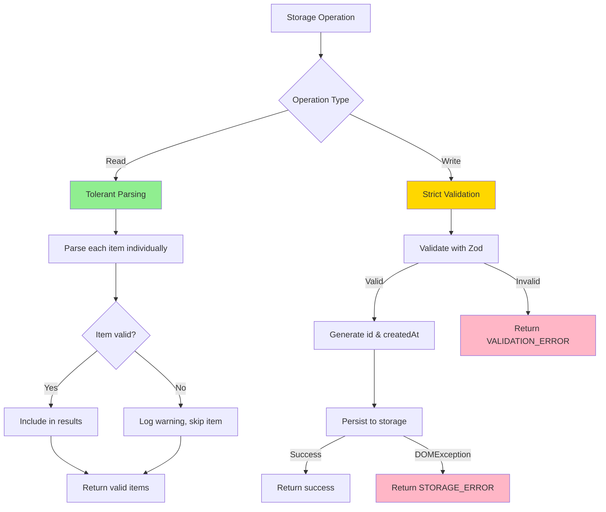
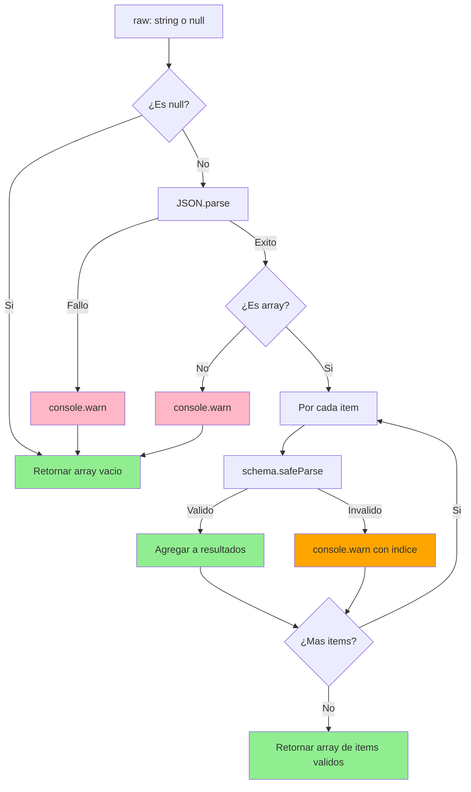

## Introduction

**Previous:** [Part 3: Data Validation with Zod](/posts/nutritional-tracker-part-3)

### Recap: Part 3

In the previous installment, we implemented robust data validation using Zod. We defined TypeScript types and enums, created comprehensive validation schemas, and wrote unit tests to ensure our data model accepts valid records while rejecting invalid ones.

### Goals for Part 4

In this fourth installment, we'll implement the persistence layer using `localStorage`. Building on the validation schemas from Part 3, we'll create a robust, fault-tolerant storage API that handles:

- Saving and retrieving nutritional records
- Graceful handling of corrupted data
- Error management for storage limitations
- Filtering and querying capabilities
- Maintenance operations for testing

By the end, we'll have a production-ready persistence layer with comprehensive test coverage.

## Design Principles

Our storage implementation follows these key principles:

### 1. Best-Effort Reading

When reading data, parse as much valid data as possible. If some entries are corrupted, return the valid ones and log warnings—don't crash the entire application.

### 2. Strict Validation on Write

Before persisting data, validate strictly using Zod schemas. Prevent invalid data from entering storage in the first place.

### 3. User-Friendly Errors

Return error messages suitable for displaying in the UI. Log technical details to the console for debugging.

### 4. Graceful Degradation

Handle browser API limitations (quota exceeded, security errors) without breaking the application flow.

## Type Definitions

First, let's define the types that will power our storage API:

```typescript
// src/types/storage.ts

import { Register } from './register'

// Input type for creating new registers (omits auto-generated fields)
export type NewRegisterInput = Omit<Register, 'id' | 'createdAt'>

// Result type for operations that can fail
export type Result<T>
  = | { success: true, data: T, message?: string }
    | { success: false, error: { code: string, message: string } }

// Error codes
export const ErrorCodes = {
  VALIDATION_ERROR: 'VALIDATION_ERROR',
  STORAGE_ERROR: 'STORAGE_ERROR',
  SECURITY_ERROR: 'SECURITY_ERROR',
  NOT_FOUND: 'NOT_FOUND',
} as const
```

### Why These Types?

**`NewRegisterInput`**: Users shouldn't provide `id` or `createdAt`—these are generated automatically by the system.

**`Result<T>`**: A discriminated union that forces error handling. TypeScript ensures you check `success` before accessing `data`.

**`ErrorCodes`**: Standardized error codes make it easy to handle specific failures in the UI.

## Storage API Design

Our public API consists of six functions:

```typescript
// Core operations
getAllRegisters(): Register[]
saveRegister(input: NewRegisterInput): Result<Register>
getRegistersByUserId(userId: string): Register[]
deleteRegister(registerId: string): Result<null>

// Utility operations
clearAllRegisters(): Result<null>
getRegisteredFoods(): string[]
```

### API Decision Diagram



## Implementation

### Storage Configuration

```typescript
// src/lib/storage/config.ts

export const STORAGE_KEY = 'nutritional-tracker-registers'
```

### Helper Functions

#### ID Generation

```typescript
// src/lib/storage/helpers.ts

/**
 * Generates a unique identifier
 * Uses crypto.randomUUID() with fallback for older browsers
 */
export function generateId(): string {
  if (typeof crypto !== 'undefined' && crypto.randomUUID) {
    return crypto.randomUUID()
  }

  // Fallback for older browsers
  return 'xxxxxxxx-xxxx-4xxx-yxxx-xxxxxxxxxxxx'.replace(/[xy]/g, (c) => {
    const r = (Math.random() * 16) | 0
    const v = c === 'x' ? r : (r & 0x3) | 0x8
    return v.toString(16)
  })
}
```

#### Safe localStorage Access

```typescript
/**
 * Safely wraps localStorage.getItem with error handling
 */
function safeGetItem(key: string): string | null {
  try {
    return localStorage.getItem(key)
  }
  catch (error) {
    if (error instanceof DOMException) {
      if (error.name === 'SecurityError') {
        console.error('localStorage access denied (SecurityError)')
        return null
      }
    }
    console.error('Unexpected error reading from localStorage:', error)
    return null
  }
}

/**
 * Safely wraps localStorage.setItem with error handling
 */
function safeSetItem(key: string, value: string): Result<null> {
  try {
    localStorage.setItem(key, value)
    return { success: true, data: null }
  }
  catch (error) {
    if (error instanceof DOMException) {
      if (error.name === 'QuotaExceededError') {
        console.error('localStorage quota exceeded')
        return {
          success: false,
          error: {
            code: ErrorCodes.STORAGE_ERROR,
            message: 'Storage quota exceeded. Please delete some records.',
          },
        }
      }
      if (error.name === 'SecurityError') {
        console.error('localStorage access denied (SecurityError)')
        return {
          success: false,
          error: {
            code: ErrorCodes.SECURITY_ERROR,
            message: 'Storage access denied. Check browser settings.',
          },
        }
      }
    }

    console.error('Unexpected error writing to localStorage:', error)
    return {
      success: false,
      error: {
        code: ErrorCodes.STORAGE_ERROR,
        message: 'Failed to save data. Please try again.',
      },
    }
  }
}
```

### Tolerant Parsing

This is the heart of our fault-tolerance strategy:

```typescript
/**
 * Parses registers from JSON with item-level fault tolerance
 * Invalid items are logged and skipped, not thrown
 */
function parseRegisters(
  raw: string | null,
  schema: ZodSchema = RegisterSchema
): Register[] {
  // Handle null/empty storage
  if (!raw) {
    return []
  }

  // Parse JSON
  let parsed: unknown
  try {
    parsed = JSON.parse(raw)
  }
  catch (error) {
    console.warn('Failed to parse storage JSON:', error)
    return []
  }

  // Verify it's an array
  if (!Array.isArray(parsed)) {
    console.warn('Storage data is not an array:', typeof parsed)
    return []
  }

  // Validate each item individually
  const results: Register[] = []

  parsed.forEach((item, index) => {
    const result = schema.safeParse(item)

    if (result.success) {
      results.push(result.data)
    }
    else {
      console.warn(
        `Invalid register at index ${index}:`,
        result.error.flatten()
      )
    }
  })

  return results
}
```

### Parse Flow Diagram



### Core API Functions

#### Get All Registers

```typescript
/**
 * Retrieves all registers with tolerant parsing
 * Corrupted entries are skipped and logged
 */
export function getAllRegisters(): Register[] {
  const raw = safeGetItem(STORAGE_KEY)
  return parseRegisters(raw)
}
```

#### Save Register

```typescript
/**
 * Saves a new register with strict validation
 * Generates id and createdAt automatically
 */
export function saveRegister(input: NewRegisterInput): Result<Register> {
  // Validate input strictly
  const validation = RegisterSchema.omit({ id: true, createdAt: true }).safeParse(input)

  if (!validation.success) {
    console.error('Validation failed:', validation.error.flatten())
    return {
      success: false,
      error: {
        code: ErrorCodes.VALIDATION_ERROR,
        message: 'Invalid data. Please check all fields.',
      },
    }
  }

  // Generate auto fields
  const newRegister: Register = {
    ...validation.data,
    id: generateId(),
    createdAt: new Date().toISOString(),
  }

  // Get existing registers
  const existing = getAllRegisters()

  // Add new register
  const updated = [...existing, newRegister]

  // Persist
  const result = safeSetItem(STORAGE_KEY, JSON.stringify(updated))

  if (!result.success) {
    return result as Result<Register>
  }

  return {
    success: true,
    data: newRegister,
    message: 'Register saved successfully',
  }
}
```

#### Get Registers by User

```typescript
/**
 * Filters registers by userId
 */
export function getRegistersByUserId(userId: string): Register[] {
  const all = getAllRegisters()
  return all.filter(register => register.userId === userId)
}
```

#### Delete Register

```typescript
/**
 * Deletes a register by id
 */
export function deleteRegister(registerId: string): Result<null> {
  const existing = getAllRegisters()

  const filtered = existing.filter(r => r.id !== registerId)

  // Check if anything was deleted
  if (filtered.length === existing.length) {
    return {
      success: false,
      error: {
        code: ErrorCodes.NOT_FOUND,
        message: 'Register not found',
      },
    }
  }

  return safeSetItem(STORAGE_KEY, JSON.stringify(filtered))
}
```

#### Utility Functions

```typescript
/**
 * Clears all registers (useful for testing)
 */
export function clearAllRegisters(): Result<null> {
  try {
    localStorage.removeItem(STORAGE_KEY)
    return { success: true, data: null }
  }
  catch (error) {
    console.error('Failed to clear registers:', error)
    return {
      success: false,
      error: {
        code: ErrorCodes.STORAGE_ERROR,
        message: 'Failed to clear data',
      },
    }
  }
}

/**
 * Gets unique food names sorted alphabetically
 */
export function getRegisteredFoods(): string[] {
  const registers = getAllRegisters()
  const foodSet = new Set(registers.map(r => r.food))
  return Array.from(foodSet).sort()
}
```

## Comprehensive Test Suite

### Test Structure

```typescript
// tests/localStorage.test.ts

import { beforeEach, describe, expect, it, vi } from 'vitest'
import {
  clearAllRegisters,
  deleteRegister,
  getAllRegisters,
  getRegisteredFoods,
  getRegistersByUserId,
  saveRegister,
} from '../src/lib/storage/localStorage'

describe('localStorage persistence layer', () => {
  beforeEach(() => {
    clearAllRegisters()
  })

  // Test cases will go here
})
```

### Test Cases

#### 1. Save and Retrieve

```typescript
describe('saveRegister', () => {
  it('should save a valid register and generate id and createdAt', () => {
    const input: NewRegisterInput = {
      userId: 'user-123',
      userName: 'John',
      food: 'Apple',
      amount: 1,
      unit: 'unit',
      date: '2025-11-10',
      time: '08:30',
      mealType: 'breakfast',
    }

    const result = saveRegister(input)

    expect(result.success).toBe(true)
    if (result.success) {
      expect(result.data.id).toBeDefined()
      expect(result.data.createdAt).toBeDefined()
      expect(result.data.food).toBe('Apple')
    }
  })

  it('should return VALIDATION_ERROR for invalid data', () => {
    const invalid: any = {
      userId: 'user-123',
      userName: 'John',
      food: 'Apple',
      amount: -5, // Invalid: negative
      unit: 'unit',
      date: '2025-11-10',
      time: '08:30',
      mealType: 'breakfast',
    }

    const result = saveRegister(invalid)

    expect(result.success).toBe(false)
    if (!result.success) {
      expect(result.error.code).toBe('VALIDATION_ERROR')
    }
  })
})
```

#### 2. Tolerant Parsing

```typescript
describe('parseRegisters (tolerant parsing)', () => {
  it('should return empty array for null storage', () => {
    const registers = getAllRegisters()
    expect(registers).toEqual([])
  })

  it('should skip invalid items and log warnings', () => {
    const consoleWarnSpy = vi.spyOn(console, 'warn').mockImplementation(() => {})

    // Save valid register
    saveRegister({
      userId: 'user-1',
      userName: 'Alice',
      food: 'Banana',
      amount: 2,
      unit: 'unit',
      date: '2025-11-10',
      time: '09:00',
      mealType: 'breakfast',
    })

    // Manually corrupt storage
    const validRegisters = getAllRegisters()
    const corrupted = [
      ...validRegisters,
      { invalid: 'data' }, // Corrupted entry
    ]
    localStorage.setItem('nutritional-tracker-registers', JSON.stringify(corrupted))

    // Should return only valid registers
    const result = getAllRegisters()
    expect(result).toHaveLength(1)
    expect(result[0].food).toBe('Banana')

    // Should have logged warning
    expect(consoleWarnSpy).toHaveBeenCalled()

    consoleWarnSpy.mockRestore()
  })
})
```

#### 3. Storage Quota Simulation

```typescript
describe('storage error handling', () => {
  it('should handle QuotaExceededError gracefully', () => {
    // Mock localStorage.setItem to throw QuotaExceededError
    const setItemSpy = vi.spyOn(Storage.prototype, 'setItem')
    const quotaError = new DOMException('Quota exceeded', 'QuotaExceededError')
    setItemSpy.mockImplementation(() => {
      throw quotaError
    })

    const input: NewRegisterInput = {
      userId: 'user-123',
      userName: 'John',
      food: 'Apple',
      amount: 1,
      unit: 'unit',
      date: '2025-11-10',
      time: '08:30',
      mealType: 'breakfast',
    }

    const result = saveRegister(input)

    expect(result.success).toBe(false)
    if (!result.success) {
      expect(result.error.code).toBe('STORAGE_ERROR')
      expect(result.error.message).toContain('quota')
    }

    setItemSpy.mockRestore()
  })
})
```

#### 4. Filter and Query

```typescript
describe('getRegistersByUserId', () => {
  it('should filter registers by userId', () => {
    // Save registers for different users
    saveRegister({
      userId: 'user-1',
      userName: 'Alice',
      food: 'Apple',
      amount: 1,
      unit: 'unit',
      date: '2025-11-10',
      time: '08:00',
      mealType: 'breakfast',
    })

    saveRegister({
      userId: 'user-2',
      userName: 'Bob',
      food: 'Banana',
      amount: 2,
      unit: 'unit',
      date: '2025-11-10',
      time: '09:00',
      mealType: 'breakfast',
    })

    const user1Registers = getRegistersByUserId('user-1')
    expect(user1Registers).toHaveLength(1)
    expect(user1Registers[0].userName).toBe('Alice')
  })
})
```

#### 5. Utility Functions

```typescript
describe('getRegisteredFoods', () => {
  it('should return unique sorted food names', () => {
    saveRegister({
      userId: 'user-1',
      userName: 'Alice',
      food: 'Banana',
      amount: 1,
      unit: 'unit',
      date: '2025-11-10',
      time: '08:00',
      mealType: 'breakfast',
    })

    saveRegister({
      userId: 'user-1',
      userName: 'Alice',
      food: 'Apple',
      amount: 1,
      unit: 'unit',
      date: '2025-11-10',
      time: '09:00',
      mealType: 'snack',
    })

    saveRegister({
      userId: 'user-1',
      userName: 'Alice',
      food: 'Banana', // Duplicate
      amount: 2,
      unit: 'unit',
      date: '2025-11-10',
      time: '12:00',
      mealType: 'lunch',
    })

    const foods = getRegisteredFoods()
    expect(foods).toEqual(['Apple', 'Banana']) // Sorted, unique
  })
})
```

## Usage Examples

### In a React Component

```typescript
import { getAllRegisters, saveRegister } from '@/lib/storage/localStorage'
import { NewRegisterInput } from '@/types/storage'

function RegisterForm() {
  const handleSubmit = async (data: NewRegisterInput) => {
    const result = saveRegister(data)

    if (result.success) {
      toast.success(result.message)
      // Refresh UI
      const updated = getAllRegisters()
      setRegisters(updated)
    }
    else {
      toast.error(result.error.message)
      console.error('Save failed:', result.error.code)
    }
  }

  // ...
}
```

### In a Dashboard

```typescript
function UserDashboard({ userId }: { userId: string }) {
  const [registers, setRegisters] = useState<Register[]>([])

  useEffect(() => {
    const userRegisters = getRegistersByUserId(userId)
    setRegisters(userRegisters)
  }, [userId])

  // ...
}
```

## Key Takeaways

At this point, you have:

✅ A robust localStorage persistence layer
✅ Tolerant parsing that handles corrupted data gracefully
✅ Strict validation before writes
✅ User-friendly error messages for the UI
✅ Comprehensive test coverage including error scenarios
✅ Helper functions for common queries

**Best practices established:**

- Always validate before persisting
- Parse tolerantly when reading
- Wrap browser APIs with error handling
- Return structured results that force error handling
- Log technical details, show user-friendly messages
- Test both happy paths and failure scenarios

## Future Enhancements

Potential improvements for production:

1. **Compression**: Use `lz-string` or similar to compress JSON before storing
2. **Migrations**: Version the data structure and handle upgrades
3. **IndexedDB**: Migrate to IndexedDB for larger datasets
4. **Sync**: Add cloud backup/sync capabilities
5. **Batch Operations**: Optimize bulk saves/deletes
6. **Caching**: Add in-memory cache to reduce localStorage reads

## What's Next?

With a solid persistence layer in place, the next steps are:

1. Build the registration form UI
2. Implement the dashboard and analytics views
3. Add export/import functionality
4. Create visualization components (charts, reports)

## Continue Reading

The series continues with UI implementation and feature development. Stay tuned!

**Series Progress:**

- Part 1: Data Model Design ✓
- Part 2: Testing Environment Setup ✓
- Part 3: Data Validation with Zod ✓
- Part 4: Persistence Layer Implementation ✓ ← You are here
- Part 5: Form Implementation (Coming soon)
