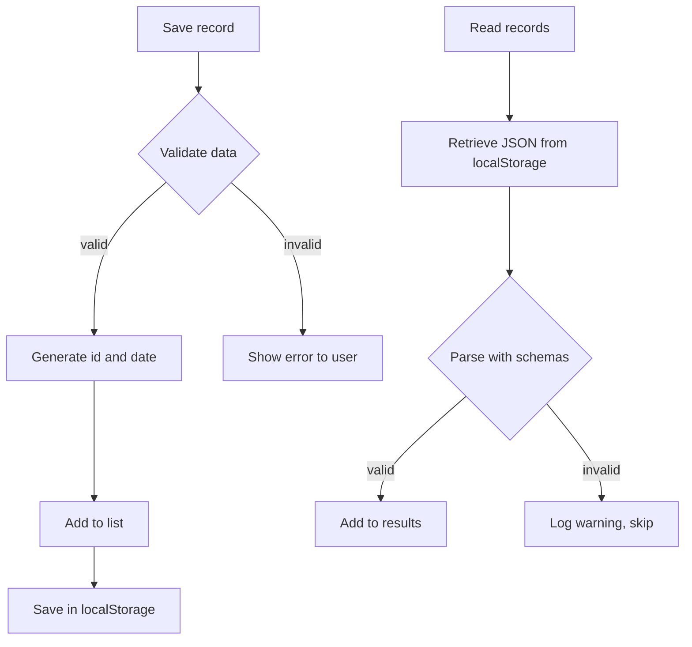

## Part 4: Persistence Layer Implementation — Nutrition Tracker

## Introduction

Our data model already validates entries: now it's time to save and retrieve them using the browser's native **localStorage** capabilities. The idea is that users won't lose their records (even if they close the app), and any corrupt data won't break the application.

---

## Strategy and Principles

- **Tolerant reading:** Try to recover as many valid records as possible.
- **Strict validation on save:** Invalid data is never allowed in storage.
- **Explicit error handling:** Problems are shown to the user and/or logged in the console.
- **Performance and simplicity:** Instant operations with no external dependencies.

---

## Types and Standard Result

This code snippet defines the types and result structure returned by persistence functions:

```typescript
// src/lib/storage/localStorage.ts

import { Register } from './register'

// NewRegisterInput is the input type for new records (without id or createdAt)
export type NewRegisterInput = Omit<Register, 'id' | 'createdAt'>

// Result is a generic type indicating success or error (clear response structure)
export type Result<T>
  = | { success: true, data: T, message?: string }
    | { success: false, error: { code: string, message: string } }

// ErrorCodes is an object listing possible error codes used by the API
export const ErrorCodes = {
  VALIDATION_ERROR: 'VALIDATION_ERROR',
  STORAGE_ERROR: 'STORAGE_ERROR',
  SECURITY_ERROR: 'SECURITY_ERROR',
  NOT_FOUND: 'NOT_FOUND',
} as const
```

These types help structure responses: any storage call forces you to handle success or errors; problems are never ignored.

---

## Persistence API Functions

| Function                   | Description                        |
| -------------------------- | ---------------------------------- |
| `getAllRegisters()`        | Retrieves all records              |
| `saveRegister(input)`      | Saves a record, validating first   |
| `getRegistersByUserId(id)` | Filters records by user            |
| `deleteRegister(id)`       | Deletes a record by id             |
| `clearAllRegisters()`      | Removes all records                |
| `getRegisteredFoods()`     | Lists unique registered food names |

---

## Basic Flow Diagram

This diagram shows how the process of saving and reading records flows, and how validation and error handling are built in:



---

## Example: Tolerant Reading and Strict Validation

This function converts information stored in localStorage to valid records, ignoring corrupt entries:

```typescript
function parseRegisters(raw: string | null): Register[] {
  if (!raw)
    return [] // If no data is stored, returns an empty array
  let arr: unknown
  try {
    arr = JSON.parse(raw) // Tries to convert stored text into a JS array
  }
  catch (e) {
    console.warn('[parseRegisters] Invalid JSON')
    return []
  }
  if (!Array.isArray(arr))
    return []
  return arr
    .map((item, idx) => {
      const result = RegisterSchema.safeParse(item) // Validates each element with Zod
      if (!result.success) {
        // If validation fails, logs a warning and skips the entry
        console.warn(
          `[parseRegisters] Error in record (${idx})`,
          result.error.issues,
        )
        return null
      }
      return result.data // Returns only valid data
    })
    .filter(Boolean) // Removes nulls (corrupt elements)
}
```

**Why this way?**
If a single element is corrupt, the rest are saved. Prevents the whole read from breaking due to one error.

---

## Saving Records with Validation

This function creates a full record, validates it, and saves it in localStorage only if it's correct:

```typescript
function saveRegister(input: NewRegisterInput): Result<Register> {
  const newRegister = {
    ...input,
    id: generateId(),
    createdAt: new Date().toISOString(),
  }
  // Strict validation
  const validation = RegisterSchema.safeParse(newRegister)
  if (!validation.success) {
    return {
      success: false,
      error: {
        code: ErrorCodes.VALIDATION_ERROR,
        message: validation.error.issues.map(i => i.message).join('; '),
      },
    }
  }
  try {
    const all = getAllRegisters() // Gets current records
    all.push(validation.data) // Adds the new valid record
    localStorage.setItem(STORAGE_KEY, JSON.stringify(all)) // Saves everything to storage
    return { success: true, data: validation.data }
  }
  catch (e) {
    return {
      success: false,
      error: {
        code: ErrorCodes.STORAGE_ERROR,
        message: 'Could not save the record.',
      },
    }
  }
}
```

---

## Component Usage Example

This snippet shows how you might interact with the persistence layer from a form, including handling error and success:

```typescript
function handleSubmit(input: NewRegisterInput) {
  const result = saveRegister(input)
  if (result.success) {
    // Update UI, show success message
  }
  else {
    // Show error message to the user
    alert(result.error.message)
  }
}
```

---

## Key Unit Test Examples

This is how you can test that your system really validates, saves, and retrieves data correctly:

```typescript
import { beforeEach, describe, expect, it } from 'vitest'
import {
  clearAllRegisters,
  getAllRegisters,
  saveRegister,
} from './localStorage'

describe('Persistence with localStorage', () => {
  beforeEach(() => clearAllRegisters())

  it('saves and retrieves a valid record', () => {
    const input = {
      userId: 'abc',
      userName: 'John',
      food: 'Orange',
      amount: 1,
      unit: 'unit',
      date: '2025-11-12',
      time: '08:00',
      mealType: 'breakfast',
    }
    const result = saveRegister(input)
    expect(result.success).toBe(true)
    expect(getAllRegisters().length).toBe(1)
    expect(getAllRegisters()[0].food).toBe('Orange')
  })

  it('fails validation for incorrect data', () => {
    const invalid = { ...input, amount: -5 }
    const result = saveRegister(invalid)
    expect(result.success).toBe(false)
    expect(result.error.code).toBe('VALIDATION_ERROR')
  })
})
```

---

## Resilience and Best Practices

- Validate all user data before saving.
- Don't block app flow due to isolated errors: show warnings and keep working.
- Always return a clear success/error structure to make UI integration easy.

---

## What's Next?

You now have a robust, safe persistence layer. Next step: build the registration form and connect everything with the UI and end-to-end tests.

**Continue reading:**
_Part 5: Form Implementation_ → How to build the main visual component and tie all previous concepts together.

---

## Series Navigation

- [← Part 3: Data Validation with Zod](./side-project-nutritional-tracker-3.en.md)
- [Part 5: The Registration Form →](./side-project-nutritional-tracker-5.en.md)
