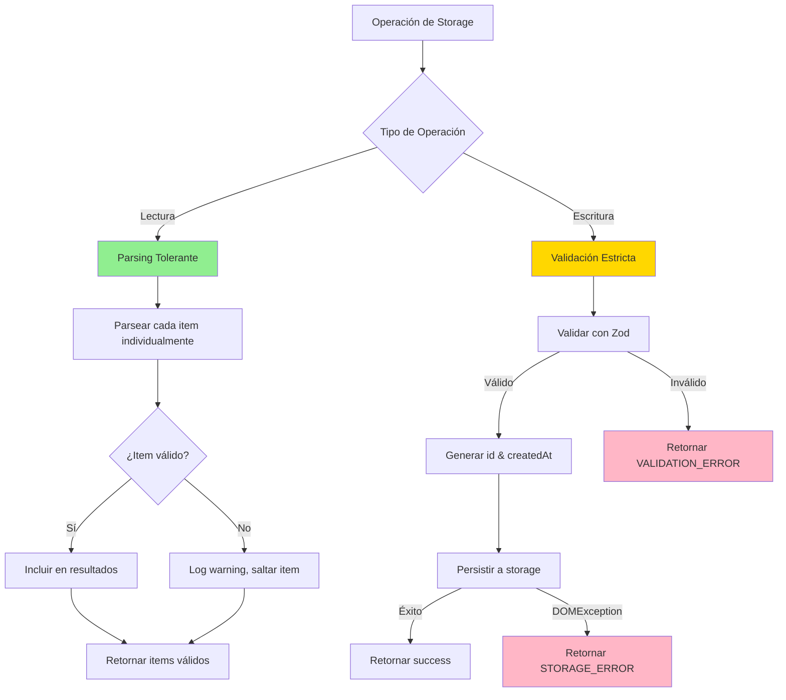
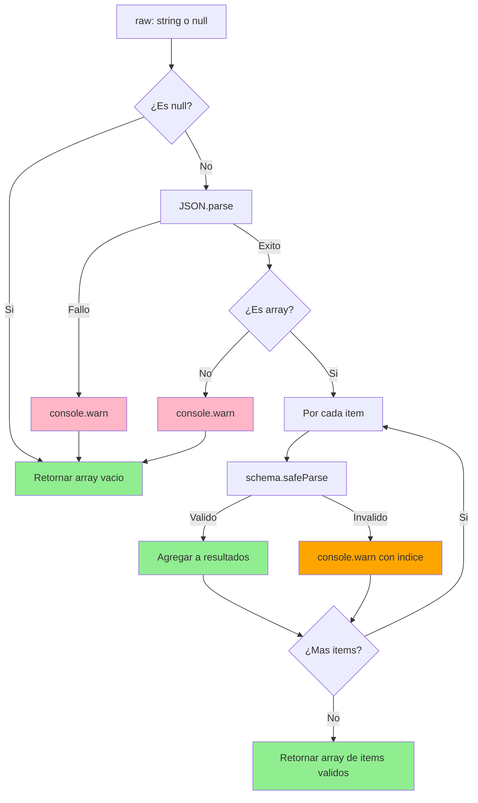

## Introducción

**Anterior:** [Parte 3: Validación de Datos con Zod](/posts/nutritional-tracker-part-3)

### Repaso: Parte 3

En la entrega anterior, implementamos validación robusta de datos usando Zod. Definimos tipos y enums de TypeScript, creamos esquemas de validación comprehensivos y escribimos tests unitarios para asegurar que nuestro modelo de datos acepta registros válidos mientras rechaza los inválidos.

### Objetivos para la Parte 4

En esta cuarta entrega, implementaremos la capa de persistencia usando `localStorage`. Construyendo sobre los esquemas de validación de la Parte 3, crearemos una API de almacenamiento robusta y tolerante a fallos que maneja:

- Guardado y recuperación de registros nutricionales
- Manejo gracioso de datos corruptos
- Gestión de errores para limitaciones de almacenamiento
- Capacidades de filtrado y consulta
- Operaciones de mantenimiento para testing

Al finalizar, tendremos una capa de persistencia lista para producción con cobertura comprehensiva de tests.

## Principios de Diseño

Nuestra implementación de almacenamiento sigue estos principios clave:

### 1. Lectura de Mejor Esfuerzo
Al leer datos, parsear la mayor cantidad de datos válidos posible. Si algunas entradas están corruptas, retornar las válidas y registrar advertencias—no crashear toda la aplicación.

### 2. Validación Estricta en Escritura
Antes de persistir datos, validar estrictamente usando esquemas Zod. Prevenir que datos inválidos entren al almacenamiento desde el principio.

### 3. Errores Amigables para el Usuario
Retornar mensajes de error apropiados para mostrar en la UI. Registrar detalles técnicos en la consola para debugging.

### 4. Degradación Graciosa
Manejar limitaciones de APIs del navegador (cuota excedida, errores de seguridad) sin romper el flujo de la aplicación.

## Definiciones de Tipos

Primero, definamos los tipos que impulsarán nuestra API de almacenamiento:

```typescript
// src/types/storage.ts

import { Register } from './register'

// Tipo de entrada para crear nuevos registros (omite campos auto-generados)
export type NewRegisterInput = Omit<Register, 'id' | 'createdAt'>

// Tipo de resultado para operaciones que pueden fallar
export type Result<T>
  = | { success: true, data: T, message?: string }
    | { success: false, error: { code: string, message: string } }

// Códigos de error
export const ErrorCodes = {
  VALIDATION_ERROR: 'VALIDATION_ERROR',
  STORAGE_ERROR: 'STORAGE_ERROR',
  SECURITY_ERROR: 'SECURITY_ERROR',
  NOT_FOUND: 'NOT_FOUND',
} as const
```

### ¿Por Qué Estos Tipos?

**`NewRegisterInput`**: Los usuarios no deben proporcionar `id` o `createdAt`—estos son generados automáticamente por el sistema.

**`Result<T>`**: Una unión discriminada que fuerza el manejo de errores. TypeScript asegura que verifiques `success` antes de acceder a `data`.

**`ErrorCodes`**: Códigos de error estandarizados facilitan manejar fallos específicos en la UI.

## Diseño de la API de Almacenamiento

Nuestra API pública consiste en seis funciones:

```typescript
// Operaciones centrales
getAllRegisters(): Register[]
saveRegister(input: NewRegisterInput): Result<Register>
getRegistersByUserId(userId: string): Register[]
deleteRegister(registerId: string): Result<null>

// Operaciones de utilidad
clearAllRegisters(): Result<null>
getRegisteredFoods(): string[]
```

### Diagrama de Decisión de API



## Implementación

### Configuración de Storage

```typescript
// src/lib/storage/config.ts

export const STORAGE_KEY = 'nutritional-tracker-registers'
```

### Funciones Helper

#### Generación de ID

```typescript
// src/lib/storage/helpers.ts

/**
 * Genera un identificador único
 * Usa crypto.randomUUID() con fallback para navegadores antiguos
 */
export function generateId(): string {
  if (typeof crypto !== 'undefined' && crypto.randomUUID) {
    return crypto.randomUUID()
  }

  // Fallback para navegadores antiguos
  return 'xxxxxxxx-xxxx-4xxx-yxxx-xxxxxxxxxxxx'.replace(/[xy]/g, (c) => {
    const r = (Math.random() * 16) | 0
    const v = c === 'x' ? r : (r & 0x3) | 0x8
    return v.toString(16)
  })
}
```

#### Acceso Seguro a localStorage

```typescript
/**
 * Envuelve localStorage.getItem con manejo de errores
 */
function safeGetItem(key: string): string | null {
  try {
    return localStorage.getItem(key)
  }
  catch (error) {
    if (error instanceof DOMException) {
      if (error.name === 'SecurityError') {
        console.error('Acceso a localStorage denegado (SecurityError)')
        return null
      }
    }
    console.error('Error inesperado leyendo de localStorage:', error)
    return null
  }
}

/**
 * Envuelve localStorage.setItem con manejo de errores
 */
function safeSetItem(key: string, value: string): Result<null> {
  try {
    localStorage.setItem(key, value)
    return { success: true, data: null }
  }
  catch (error) {
    if (error instanceof DOMException) {
      if (error.name === 'QuotaExceededError') {
        console.error('Cuota de localStorage excedida')
        return {
          success: false,
          error: {
            code: ErrorCodes.STORAGE_ERROR,
            message: 'Cuota de almacenamiento excedida. Por favor elimina algunos registros.',
          },
        }
      }
      if (error.name === 'SecurityError') {
        console.error('Acceso a localStorage denegado (SecurityError)')
        return {
          success: false,
          error: {
            code: ErrorCodes.SECURITY_ERROR,
            message: 'Acceso a almacenamiento denegado. Verifica la configuración del navegador.',
          },
        }
      }
    }

    console.error('Error inesperado escribiendo a localStorage:', error)
    return {
      success: false,
      error: {
        code: ErrorCodes.STORAGE_ERROR,
        message: 'Fallo al guardar datos. Por favor intenta nuevamente.',
      },
    }
  }
}
```

### Parsing Tolerante

Este es el corazón de nuestra estrategia de tolerancia a fallos:

```typescript
/**
 * Parsea registros desde JSON con tolerancia a nivel de item
 * Items inválidos son registrados y saltados, no lanzados
 */
function parseRegisters(
  raw: string | null,
  schema: ZodSchema = RegisterSchema
): Register[] {
  // Manejar storage null/vacío
  if (!raw) {
    return []
  }

  // Parsear JSON
  let parsed: unknown
  try {
    parsed = JSON.parse(raw)
  }
  catch (error) {
    console.warn('Fallo al parsear JSON de storage:', error)
    return []
  }

  // Verificar que es un array
  if (!Array.isArray(parsed)) {
    console.warn('Datos de storage no son un array:', typeof parsed)
    return []
  }

  // Validar cada item individualmente
  const results: Register[] = []

  parsed.forEach((item, index) => {
    const result = schema.safeParse(item)

    if (result.success) {
      results.push(result.data)
    }
    else {
      console.warn(
        `Registro inválido en índice ${index}:`,
        result.error.flatten()
      )
    }
  })

  return results
}
```

### Diagrama de Flujo de Parse



### Funciones de API Central

#### Obtener Todos los Registros

```typescript
/**
 * Recupera todos los registros con parsing tolerante
 * Entradas corruptas son saltadas y registradas
 */
export function getAllRegisters(): Register[] {
  const raw = safeGetItem(STORAGE_KEY)
  return parseRegisters(raw)
}
```

#### Guardar Registro

```typescript
/**
 * Guarda un nuevo registro con validación estricta
 * Genera id y createdAt automáticamente
 */
export function saveRegister(input: NewRegisterInput): Result<Register> {
  // Validar input estrictamente
  const validation = RegisterSchema.omit({ id: true, createdAt: true }).safeParse(input)

  if (!validation.success) {
    console.error('Validación falló:', validation.error.flatten())
    return {
      success: false,
      error: {
        code: ErrorCodes.VALIDATION_ERROR,
        message: 'Datos inválidos. Por favor verifica todos los campos.',
      },
    }
  }

  // Generar campos automáticos
  const newRegister: Register = {
    ...validation.data,
    id: generateId(),
    createdAt: new Date().toISOString(),
  }

  // Obtener registros existentes
  const existing = getAllRegisters()

  // Agregar nuevo registro
  const updated = [...existing, newRegister]

  // Persistir
  const result = safeSetItem(STORAGE_KEY, JSON.stringify(updated))

  if (!result.success) {
    return result as Result<Register>
  }

  return {
    success: true,
    data: newRegister,
    message: 'Registro guardado exitosamente',
  }
}
```

#### Obtener Registros por Usuario

```typescript
/**
 * Filtra registros por userId
 */
export function getRegistersByUserId(userId: string): Register[] {
  const all = getAllRegisters()
  return all.filter(register => register.userId === userId)
}
```

#### Eliminar Registro

```typescript
/**
 * Elimina un registro por id
 */
export function deleteRegister(registerId: string): Result<null> {
  const existing = getAllRegisters()

  const filtered = existing.filter(r => r.id !== registerId)

  // Verificar si algo fue eliminado
  if (filtered.length === existing.length) {
    return {
      success: false,
      error: {
        code: ErrorCodes.NOT_FOUND,
        message: 'Registro no encontrado',
      },
    }
  }

  return safeSetItem(STORAGE_KEY, JSON.stringify(filtered))
}
```

#### Funciones de Utilidad

```typescript
/**
 * Limpia todos los registros (útil para testing)
 */
export function clearAllRegisters(): Result<null> {
  try {
    localStorage.removeItem(STORAGE_KEY)
    return { success: true, data: null }
  }
  catch (error) {
    console.error('Fallo al limpiar registros:', error)
    return {
      success: false,
      error: {
        code: ErrorCodes.STORAGE_ERROR,
        message: 'Fallo al limpiar datos',
      },
    }
  }
}

/**
 * Obtiene nombres de alimentos únicos ordenados alfabéticamente
 */
export function getRegisteredFoods(): string[] {
  const registers = getAllRegisters()
  const foodSet = new Set(registers.map(r => r.food))
  return Array.from(foodSet).sort()
}
```

## Suite de Tests Comprehensiva

### Estructura de Tests

```typescript
// tests/localStorage.test.ts

import { beforeEach, describe, expect, it, vi } from 'vitest'
import {
  clearAllRegisters,
  deleteRegister,
  getAllRegisters,
  getRegisteredFoods,
  getRegistersByUserId,
  saveRegister,
} from '../src/lib/storage/localStorage'

describe('Capa de persistencia localStorage', () => {
  beforeEach(() => {
    clearAllRegisters()
  })

  // Los casos de test irán aquí
})
```

### Casos de Test

#### 1. Guardar y Recuperar

```typescript
describe('saveRegister', () => {
  it('debe guardar un registro válido y generar id y createdAt', () => {
    const input: NewRegisterInput = {
      userId: 'user-123',
      userName: 'Juan',
      food: 'Manzana',
      amount: 1,
      unit: 'unit',
      date: '2025-11-10',
      time: '08:30',
      mealType: 'breakfast',
    }

    const result = saveRegister(input)

    expect(result.success).toBe(true)
    if (result.success) {
      expect(result.data.id).toBeDefined()
      expect(result.data.createdAt).toBeDefined()
      expect(result.data.food).toBe('Manzana')
    }
  })

  it('debe retornar VALIDATION_ERROR para datos inválidos', () => {
    const invalid: any = {
      userId: 'user-123',
      userName: 'Juan',
      food: 'Manzana',
      amount: -5, // Inválido: negativo
      unit: 'unit',
      date: '2025-11-10',
      time: '08:30',
      mealType: 'breakfast',
    }

    const result = saveRegister(invalid)

    expect(result.success).toBe(false)
    if (!result.success) {
      expect(result.error.code).toBe('VALIDATION_ERROR')
    }
  })
})
```

#### 2. Parsing Tolerante

```typescript
describe('parseRegisters (parsing tolerante)', () => {
  it('debe retornar array vacío para storage null', () => {
    const registers = getAllRegisters()
    expect(registers).toEqual([])
  })

  it('debe saltar items inválidos y registrar warnings', () => {
    const consoleWarnSpy = vi.spyOn(console, 'warn').mockImplementation(() => {})

    // Guardar registro válido
    saveRegister({
      userId: 'user-1',
      userName: 'Alice',
      food: 'Banana',
      amount: 2,
      unit: 'unit',
      date: '2025-11-10',
      time: '09:00',
      mealType: 'breakfast',
    })

    // Corromper storage manualmente
    const validRegisters = getAllRegisters()
    const corrupted = [
      ...validRegisters,
      { invalid: 'data' }, // Entrada corrupta
    ]
    localStorage.setItem('nutritional-tracker-registers', JSON.stringify(corrupted))

    // Debe retornar solo registros válidos
    const result = getAllRegisters()
    expect(result).toHaveLength(1)
    expect(result[0].food).toBe('Banana')

    // Debe haber registrado warning
    expect(consoleWarnSpy).toHaveBeenCalled()

    consoleWarnSpy.mockRestore()
  })
})
```

#### 3. Simulación de Cuota de Storage

```typescript
describe('manejo de errores de storage', () => {
  it('debe manejar QuotaExceededError graciosamente', () => {
    // Mockear localStorage.setItem para lanzar QuotaExceededError
    const setItemSpy = vi.spyOn(Storage.prototype, 'setItem')
    const quotaError = new DOMException('Cuota excedida', 'QuotaExceededError')
    setItemSpy.mockImplementation(() => {
      throw quotaError
    })

    const input: NewRegisterInput = {
      userId: 'user-123',
      userName: 'Juan',
      food: 'Manzana',
      amount: 1,
      unit: 'unit',
      date: '2025-11-10',
      time: '08:30',
      mealType: 'breakfast',
    }

    const result = saveRegister(input)

    expect(result.success).toBe(false)
    if (!result.success) {
      expect(result.error.code).toBe('STORAGE_ERROR')
      expect(result.error.message).toContain('cuota')
    }

    setItemSpy.mockRestore()
  })
})
```

#### 4. Filtrar y Consultar

```typescript
describe('getRegistersByUserId', () => {
  it('debe filtrar registros por userId', () => {
    // Guardar registros para diferentes usuarios
    saveRegister({
      userId: 'user-1',
      userName: 'Alice',
      food: 'Manzana',
      amount: 1,
      unit: 'unit',
      date: '2025-11-10',
      time: '08:00',
      mealType: 'breakfast',
    })

    saveRegister({
      userId: 'user-2',
      userName: 'Bob',
      food: 'Banana',
      amount: 2,
      unit: 'unit',
      date: '2025-11-10',
      time: '09:00',
      mealType: 'breakfast',
    })

    const user1Registers = getRegistersByUserId('user-1')
    expect(user1Registers).toHaveLength(1)
    expect(user1Registers[0].userName).toBe('Alice')
  })
})
```

#### 5. Funciones de Utilidad

```typescript
describe('getRegisteredFoods', () => {
  it('debe retornar nombres de alimentos únicos ordenados', () => {
    saveRegister({
      userId: 'user-1',
      userName: 'Alice',
      food: 'Banana',
      amount: 1,
      unit: 'unit',
      date: '2025-11-10',
      time: '08:00',
      mealType: 'breakfast',
    })

    saveRegister({
      userId: 'user-1',
      userName: 'Alice',
      food: 'Manzana',
      amount: 1,
      unit: 'unit',
      date: '2025-11-10',
      time: '09:00',
      mealType: 'snack',
    })

    saveRegister({
      userId: 'user-1',
      userName: 'Alice',
      food: 'Banana', // Duplicado
      amount: 2,
      unit: 'unit',
      date: '2025-11-10',
      time: '12:00',
      mealType: 'lunch',
    })

    const foods = getRegisteredFoods()
    expect(foods).toEqual(['Banana', 'Manzana']) // Ordenado, único
  })
})
```

## Ejemplos de Uso

### En un Componente React

```typescript
import { getAllRegisters, saveRegister } from '@/lib/storage/localStorage'
import { NewRegisterInput } from '@/types/storage'

function RegisterForm() {
  const handleSubmit = async (data: NewRegisterInput) => {
    const result = saveRegister(data)

    if (result.success) {
      toast.success(result.message)
      // Refrescar UI
      const updated = getAllRegisters()
      setRegisters(updated)
    }
    else {
      toast.error(result.error.message)
      console.error('Guardado falló:', result.error.code)
    }
  }

  // ...
}
```

### En un Dashboard

```typescript
function UserDashboard({ userId }: { userId: string }) {
  const [registers, setRegisters] = useState<Register[]>([])

  useEffect(() => {
    const userRegisters = getRegistersByUserId(userId)
    setRegisters(userRegisters)
  }, [userId])

  // ...
}
```

## Conclusiones Clave

En este punto, tienes:

✅ Una capa de persistencia robusta con localStorage
✅ Parsing tolerante que maneja datos corruptos graciosamente
✅ Validación estricta antes de escrituras
✅ Mensajes de error amigables para la UI
✅ Cobertura comprehensiva de tests incluyendo escenarios de error
✅ Funciones helper para consultas comunes

**Mejores prácticas establecidas:**

- Siempre validar antes de persistir
- Parsear tolerantemente al leer
- Envolver APIs del navegador con manejo de errores
- Retornar resultados estructurados que fuercen manejo de errores
- Registrar detalles técnicos, mostrar mensajes amigables
- Testear tanto caminos felices como escenarios de fallo

## Mejoras Futuras

Mejoras potenciales para producción:

1. **Compresión**: Usar `lz-string` o similar para comprimir JSON antes de almacenar
2. **Migraciones**: Versionar la estructura de datos y manejar upgrades
3. **IndexedDB**: Migrar a IndexedDB para datasets más grandes
4. **Sincronización**: Añadir capacidades de backup/sync en la nube
5. **Operaciones en Batch**: Optimizar guardados/eliminaciones masivas
6. **Caché**: Añadir caché en memoria para reducir lecturas de localStorage

## ¿Qué Sigue?

Con una capa de persistencia sólida en su lugar, los próximos pasos son:

1. Construir la UI del formulario de registro
2. Implementar el dashboard y vistas de analytics
3. Añadir funcionalidad de exportar/importar
4. Crear componentes de visualización (gráficos, reportes)

## Continuar Leyendo

La serie continúa con implementación de UI y desarrollo de funcionalidades. ¡Mantente atento!

**Progreso de la Serie:**

- Parte 1: Diseño del Modelo de Datos ✓
- Parte 2: Configuración del Entorno de Testing ✓
- Parte 3: Validación de Datos con Zod ✓
- Parte 4: Implementación de la Capa de Persistencia ✓ ← Estás aquí
- Parte 5: Implementación de Formularios (Próximamente)
