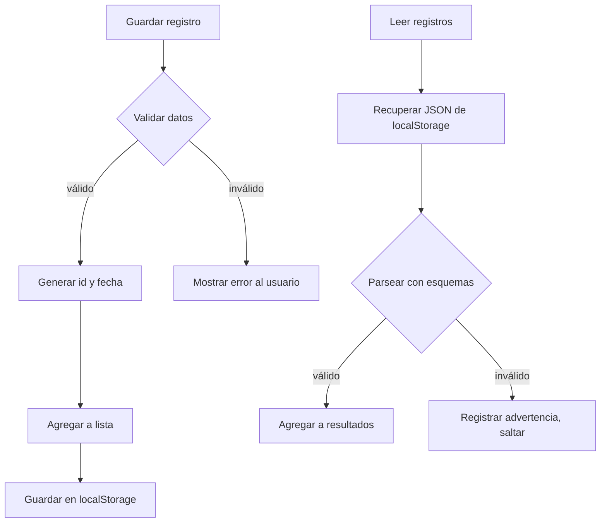

## Parte 4: Implementación de la Capa de Persistencia — Nutrition Tracker

## Introducción

El modelo de datos ya valida entradas: ahora toca guardarlas y recuperarlas, aprovechando las capacidades nativas de **localStorage** del navegador. La idea es que el usuario no pierda sus registros (incluso si cierra la app) y que cualquier dato corrupto no rompa la aplicación.

---

## Estrategia y principios

- **Lectura tolerante:** Intentar recuperar la mayor cantidad de registros válidos posibles.
- **Validación estricta al guardar:** No permitimos datos incorrectos en storage.
- **Manejo explícito de errores:** Los problemas se informan al usuario y/o se registran en consola.
- **Desempeño y facilidad:** Operaciones instantáneas y sin dependencias externas.

---

## Tipos y resultado estándar

Este fragmento define los tipos y el resultado que retornan las funciones de persistencia:

```typescript
// src/lib/storage/localStorage.ts

import { Register } from './register'

// NewRegisterInput es el tipo de entrada para nuevos registros (no incluye id ni createdAt)
export type NewRegisterInput = Omit<Register, 'id' | 'createdAt'>

// Result es un tipo genérico que indica éxito o error (estructura de respuesta clara)
export type Result<T>
  = | { success: true, data: T, message?: string }
    | { success: false, error: { code: string, message: string } }

// ErrorCodes es un objeto con los posibles códigos de error que usará la API
export const ErrorCodes = {
  VALIDATION_ERROR: 'VALIDATION_ERROR',
  STORAGE_ERROR: 'STORAGE_ERROR',
  SECURITY_ERROR: 'SECURITY_ERROR',
  NOT_FOUND: 'NOT_FOUND',
} as const
```

Estos tipos ayudan a estructurar la respuesta: el llamado a storage fuerza a manejar el éxito o los errores, nunca se silencian los problemas.

---

## Funciones de la API de persistencia

| Función                    | Descripción                                   |
| -------------------------- | --------------------------------------------- |
| `getAllRegisters()`        | Obtiene todos los registros                   |
| `saveRegister(input)`      | Guarda un registro validando antes            |
| `getRegistersByUserId(id)` | Filtra registros por usuario                  |
| `deleteRegister(id)`       | Elimina un registro por id                    |
| `clearAllRegisters()`      | Borra todos los registros                     |
| `getRegisteredFoods()`     | Lista nombres únicos de alimentos registrados |

---

## Diagrama de flujo básico

Este diagrama muestra cómo fluye el proceso de guardar y leer registros, y cómo la validación y el manejo de errores son parte del sistema:



---

## Ejemplo: lectura tolerante y validación estricta

Esta función convierte la información guardada en el localStorage a registros válidos, ignorando las entradas corruptas:

```typescript
function parseRegisters(raw: string | null): Register[] {
  if (!raw)
    return [] // Si no hay datos guardados, retorna array vacío
  let arr: unknown
  try {
    arr = JSON.parse(raw) // Intenta convertir el texto guardado a array JS
  }
  catch (e) {
    console.warn('[parseRegisters] JSON inválido')
    return []
  }
  if (!Array.isArray(arr))
    return []
  return arr
    .map((item, idx) => {
      const result = RegisterSchema.safeParse(item) // Valida cada elemento con Zod
      if (!result.success) {
        // Si falla la validación, registra la advertencia y descarta el elemento
        console.warn(
          `[parseRegisters] Error en registro (${idx})`,
          result.error.issues,
        )
        return null
      }
      return result.data // Devuelve solo los datos válidos
    })
    .filter(Boolean) // Elimina los nulos (elementos corruptos)
}
```

**¿Por qué así?**
Si un elemento está corrupto, los demás se salvan. Evita que toda la lectura se rompa por un solo error.

---

## Guardar registros con validación

Esta función crea un registro completo, lo valida y lo guarda en localStorage solo si es correcto:

```typescript
function saveRegister(input: NewRegisterInput): Result<Register> {
  const newRegister = {
    ...input,
    id: generateId(),
    createdAt: new Date().toISOString(),
  }
  // Validación estricta
  const validation = RegisterSchema.safeParse(newRegister)
  if (!validation.success) {
    return {
      success: false,
      error: {
        code: ErrorCodes.VALIDATION_ERROR,
        message: validation.error.issues.map(i => i.message).join('; '),
      },
    }
  }
  try {
    const all = getAllRegisters() // Recupera los registros actuales
    all.push(validation.data) // Agrega el nuevo registro válido
    localStorage.setItem(STORAGE_KEY, JSON.stringify(all)) // Guarda todo en storage
    return { success: true, data: validation.data }
  }
  catch (e) {
    return {
      success: false,
      error: {
        code: ErrorCodes.STORAGE_ERROR,
        message: 'No se pudo guardar el registro.',
      },
    }
  }
}
```

---

## Ejemplo de uso en un componente

Este fragmento muestra cómo podrías interactuar con la capa de persistencia desde el formulario, incluyendo manejo de error y éxito:

```typescript
function handleSubmit(input: NewRegisterInput) {
  const result = saveRegister(input)
  if (result.success) {
    // Actualizar la UI, mostrar mensaje de éxito
  }
  else {
    // Mostrar mensaje de error al usuario
    alert(result.error.message)
  }
}
```

---

## Tests unitarios clave

Así puedes probar que tu sistema realmente valida, guarda y recupera correctamente los datos:

```typescript
import { beforeEach, describe, expect, it } from 'vitest'
import {
  clearAllRegisters,
  getAllRegisters,
  saveRegister,
} from './localStorage'

describe('Persistencia con localStorage', () => {
  beforeEach(() => clearAllRegisters())

  it('guarda y recupera un registro válido', () => {
    const input = {
      userId: 'abc',
      userName: 'Juan',
      food: 'Naranja',
      amount: 1,
      unit: 'unit',
      date: '2025-11-12',
      time: '08:00',
      mealType: 'breakfast',
    }
    const result = saveRegister(input)
    expect(result.success).toBe(true)
    expect(getAllRegisters().length).toBe(1)
    expect(getAllRegisters()[0].food).toBe('Naranja')
  })

  it('falla en validación de datos incorrectos', () => {
    const invalid = { ...input, amount: -5 }
    const result = saveRegister(invalid)
    expect(result.success).toBe(false)
    expect(result.error.code).toBe('VALIDATION_ERROR')
  })
})
```

---

## Resiliencia y buenas prácticas

- Valida todos los datos de usuario antes de guardar.
- No interrumpas el flujo por errores aislados: muestra advertencias y sigue trabajando.
- Devuelve siempre una estructura clara de éxito/error para facilitar la integración con la interfaz.

---

## ¿Qué sigue?

Ya tienes una capa de persistencia robusta y segura. El próximo paso será montar el formulario de registro y conectar todo con la interfaz y los tests end-to-end.

**Continúa leyendo:**
_Parte 5: Implementación del Formulario_ → Cómo armar el componente visual principal y unir todos los conceptos previos.
