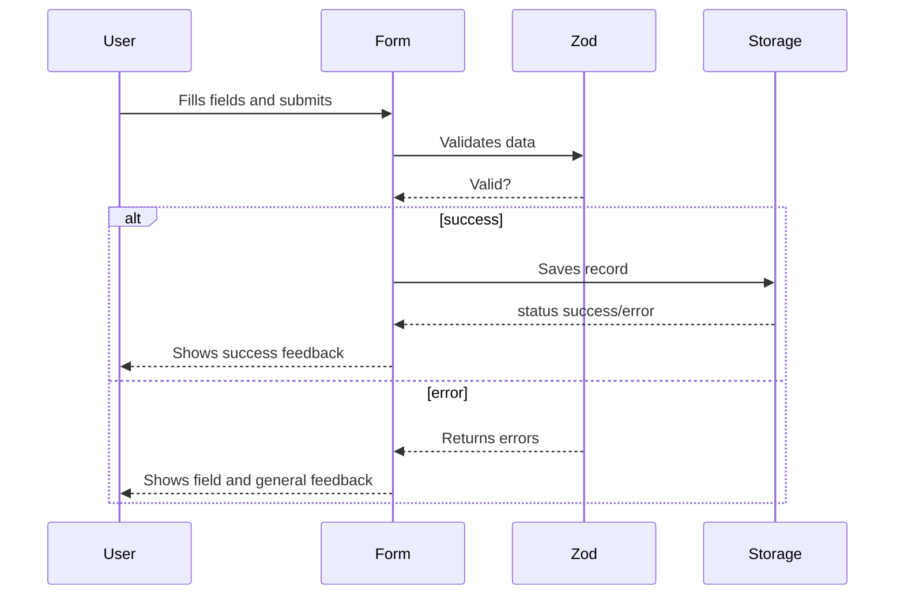

## Part 5: The Registration Form — Nutrition Tracker

## Introduction

Up to this point, our app validates data, persists it in the browser, and tests it automatically. The next challenge was to connect all the pieces in the **main registration form**, where the user enters their daily nutritional intake.

---

## What does the form integrate?

- **Validation:** Uses the Zod schema and TypeScript to never accept invalid data.
- **Persistence:** Automatically saves records in localStorage.
- **React UI:** Componentization, states, visual feedback.
- **React Hook Form:** Manages the form lifecycle and efficient communication with validators.

---

## Basic component structure

```typescript
import React from "react";
import { useForm } from "react-hook-form";
import { zodResolver } from "@hookform/resolvers/zod";
import { RegisterInputSchema } from "@/lib/schemas/register.schema";
import { saveRegister } from "@/lib/storage/localStorage";

function RegistrationForm() {
  const { register, handleSubmit, formState: { errors }, reset } = useForm({
    resolver: zodResolver(RegisterInputSchema),
    defaultValues: {
      // ...initial values
    },
  });

  const onSubmit = (data) => {
    const result = saveRegister(data);
    if (result.success) {
      reset();
      // Show success feedback
    } else {
      // Show error feedback and field messages
    }
  };

  return (
    <form onSubmit={handleSubmit(onSubmit)}>
      <input {...register("food")} />
      {errors.food && <span>{errors.food.message}</span>}
      {/* repeat for the rest of the fields */}
      <button type="submit">Save</button>
    </form>
  );
}

export default RegistrationForm;
```

**Explanations:**

- The form receives pre-configured functions from `react-hook-form`.
- On submit, it validates with Zod and saves to localStorage only if the data is valid.
- Feedback shows messages for incorrect fields and a global message on save.

---

## Interaction diagram: Form Submission



---

## Advantages of this design

- **Scalable:** Changes in the data model are automatically reflected in the form.
- **Type safe:** All data is strictly typed and validated without duplication.
- **Clear UX:** The user gets clear feedback and invalid fields are highlighted.
- **Modularity:** Separating validation, persistence, and UI logic increases maintainability.

---

## How do we ensure the form works? Tests and practical examples

Here are some examples and concepts from the test suite that validate the real behavior of the form:

### Test: The form blocks invalid data

**Why?**
This prevents unwanted saves and shows clear errors to the user.

```typescript
it("prevents submission if required fields are empty", async () => {
  render(<RegistrationForm />);
  fireEvent.click(screen.getByRole("button", { name: /save record/i }));
  await waitFor(() => {
    expect(screen.getByText(/user.*required/i)).toBeInTheDocument();
    expect(screen.getByText(/food.*required/i)).toBeInTheDocument();
  });
});
```

### Test: Visual feedback on save

**Why?**
The user needs to know if their data was saved or if there was an error.

```typescript
it("shows success message on save", async () => {
  render(<RegistrationForm />);
  // ...fill and submit...
  fireEvent.click(screen.getByRole("button", { name: /save record/i }));
  await waitFor(() => {
    expect(screen.getByRole("alert")).toHaveTextContent(/saved/i);
  });
});
```

### Test: Persistence and field reset

**Why?**
Prevents duplicate entries, helps UX, and ensures storage works with the form.

```typescript
it("saves record and resets fields keeping user", async () => {
  render(<RegistrationForm />);
  // ...fill data, select user...
  fireEvent.click(screen.getByRole("button", { name: /save record/i }));
  await waitFor(() => {
    expect(screen.getByLabelText(/food/i).value).toBe("");
    expect(screen.getByLabelText(/user/i).value).not.toBe("");
  });
});
```

### Test: Correct data reaches storage

**Why?**
Verifies integration between frontend and persistence.

```typescript
it("persists correctly in localStorage", async () => {
  render(<RegistrationForm />);
  // ...fill data and submit...
  fireEvent.click(screen.getByRole("button", { name: /save record/i }));
  await waitFor(() => {
    const raw = localStorage.getItem("nutrition-tracker-registers");
    expect(raw).toBeTruthy();
    const arr = JSON.parse(raw);
    expect(Array.isArray(arr)).toBe(true);
    expect(arr[arr.length - 1].food).toBe("Apple");
  });
});
```

---

## Why test this way?

- Prevents user frustration from unexpected errors.
- Ensures storage **always** receives correct data.
- On-screen feedback and
