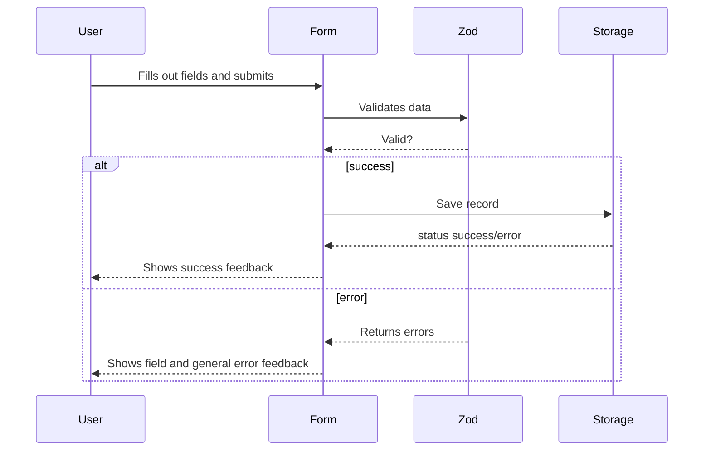

## Part 5: The Registration Form — Nutrition Tracker

## Introduction

At this point, our app is validating data, persisting it in the browser, and automatically testing that everything works. The next challenge was to bring all the pieces together in the **main registration form**, where users log their daily nutritional intake.

---

## What does the form integrate?

- **Validation:** Uses the Zod schema and TypeScript, never accepting invalid data.
- **Persistence:** Automatically saves records in localStorage.
- **React UI:** Componentization, state management, and visual feedback.
- **React Hook Form:** Efficiently handles the form lifecycle and validator communication.

---

## Basic component structure

```typescript
import React from "react";
import { useForm } from "react-hook-form";
import { zodResolver } from "@hookform/resolvers/zod";
import { RegisterInputSchema } from "@/lib/schemas/register.schema";
import { saveRegister } from "@/lib/storage/localStorage";

function RegistrationForm() {
  const { register, handleSubmit, formState: { errors }, reset } = useForm({
    resolver: zodResolver(RegisterInputSchema),
    defaultValues: {
      // ...initial values
    },
  });

  const onSubmit = (data) => {
    const result = saveRegister(data);
    if (result.success) {
      reset();
      // Show success feedback
    } else {
      // Show error feedback and field messages
    }
  };

  return (
    <form onSubmit={handleSubmit(onSubmit)}>
      <input {...register("food")} />
      {errors.food && <span>{errors.food.message}</span>}
      {/* repeat for the rest of the fields */}
      <button type="submit">Save</button>
    </form>
  );
}

export default RegistrationForm;
```

**Explanation:**

- The form receives ready-to-use functions from `react-hook-form`.
- On submit, it validates with Zod and saves to localStorage only if the data is valid.
- Feedback shows error messages on invalid fields and a global message after saving.

---

## Interaction Diagram: Form Submission



---

## Advantages of this design

- **Scalable:** Changes to the data model automatically update the form.
- **Type safe:** All data is strictly typed and validated, with no duplication.
- **Clear UX:** The user gets clear feedback and invalid fields are highlighted.
- **Modular:** Separating validation, persistence, and UI logic increases maintainability.

---

## How do we ensure the form works? Practical tests and examples

Here are examples and concepts from the test suite that validate the real-world behavior of the form:

### Test: The form blocks invalid data

**Why?**  
This prevents unwanted saves and displays clear error messages to the user.

```typescript
it("prevents submit if required fields are empty", async () => {
  render(<RegistrationForm />);
  fireEvent.click(screen.getByRole("button", { name: /save/i }));
  await waitFor(() => {
    expect(screen.getByText(/user.*required/i)).toBeInTheDocument();
    expect(screen.getByText(/food.*required/i)).toBeInTheDocument();
  });
});
```

### Test: Visual feedback on save

**Why?**  
The user needs to know whether their data was saved or if there was an error.

```typescript
it("shows a success message on save", async () => {
  render(<RegistrationForm />);
  // ...fill and submit...
  fireEvent.click(screen.getByRole("button", { name: /save/i }));
  await waitFor(() => {
    expect(screen.getByRole("alert")).toHaveTextContent(/saved/i);
  });
});
```

### Test: Persistence and field reset

**Why?**  
Avoids duplicate entries, improves UX, and ensures storage works properly with the form.

```typescript
it("saves a record and resets fields while keeping user", async () => {
  render(<RegistrationForm />);
  // ...fill data, select user...
  fireEvent.click(screen.getByRole("button", { name: /save/i }));
  await waitFor(() => {
    expect(screen.getByLabelText(/food/i).value).toBe("");
    expect(screen.getByLabelText(/user/i).value).not.toBe("");
  });
});
```

### Test: Data arrives correctly in storage

**Why?**  
Verifies integration between frontend and persistence.

```typescript
it("persists correctly in localStorage", async () => {
  render(<RegistrationForm />);
  // ...fill data and submit...
  fireEvent.click(screen.getByRole("button", { name: /save/i }));
  await waitFor(() => {
    const raw = localStorage.getItem("nutrition-tracker-registers");
    expect(raw).toBeTruthy();
    const arr = JSON.parse(raw);
    expect(Array.isArray(arr)).toBe(true);
    expect(arr[arr.length - 1].food).toBe("Apple");
  });
});
```

---

## Why test like this?

- Prevents user frustration due to unexpected errors.
- Guarantees that storage **always** receives correct data.
- On-screen feedback and form state always reflect the real situation.

## State of the application at this point

- The main form works: model, validation, and storage are connected.
- Data can be displayed visually or processed for reporting.
- The next big opportunity for improvement is **visual experience and styling**: the form works, but it's minimal and basic.
- The tests cover almost every possible flow (errors, success, reset, persistence).

---

## Next step: Styles and visual experience

- Define a strategy: CSS Modules, Tailwind, Styled Components, etc.
- Separate styles into dedicated files or systems.
- Improve visual feedback (colors, icons, animations).
- Make the app responsive.
- Apply global variables (theme, colors, fonts).

---

## Summary

So far we’ve focused on robustness, validation, and persistence. The next chapter will be all about transforming the form and the app into a modern, friendly visual experience—building on the technical foundation we’ve just solidified.

**Continue reading:**  
_Part 6: Styles and UX in Nutrition Tracker_ → Guide to styling, accessibility, and creating an attractive interface.
