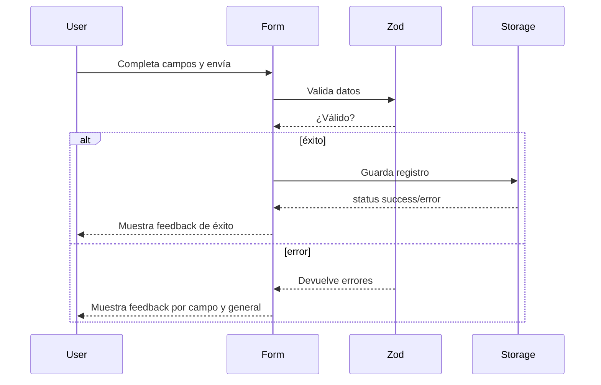

## Parte 5: El Formulario de Registro — Nutrition Tracker

## Introducción

Hasta aquí, nuestra app valida datos, los persiste en el navegador y los testea automáticamente. El siguiente reto fue conectar todas las piezas en el **formulario principal de registro**, donde el usuario ingresa su consumo nutricional diario.

---

## ¿Qué integra el formulario?

- **Validación:** Usa el esquema Zod y TypeScript para nunca aceptar datos inválidos.
- **Persistencia:** Guarda registros automáticamente en localStorage.
- **UI React:** Componentización, estados, feedback visual.
- **React Hook Form:** Maneja el ciclo de vida del formulario y la comunicación eficiente con validadores.

---

## Estructura básica del componente

```typescript
import React from "react";
import { useForm } from "react-hook-form";
import { zodResolver } from "@hookform/resolvers/zod";
import { RegisterInputSchema } from "@/lib/schemas/register.schema";
import { saveRegister } from "@/lib/storage/localStorage";

function RegistrationForm() {
  const { register, handleSubmit, formState: { errors }, reset } = useForm({
    resolver: zodResolver(RegisterInputSchema),
    defaultValues: {
      // ...valores iniciales
    },
  });

  const onSubmit = (data) => {
    const result = saveRegister(data);
    if (result.success) {
      reset();
      // Mostrar feedback de éxito
    } else {
      // Mostrar feedback de error y mensajes por campo
    }
  };

  return (
    <form onSubmit={handleSubmit(onSubmit)}>
      <input {...register("food")} />
      {errors.food && <span>{errors.food.message}</span>}
      {/* repeat for the rest of the fields */}
      <button type="submit">Guardar</button>
    </form>
  );
}

export default RegistrationForm;
```

**Explicaciones:**

- El formulario recibe funciones pre-configuradas de `react-hook-form`.
- Al hacer submit, valida con Zod y guarda en localStorage solo si los datos son válidos.
- El feedback muestra mensajes en los campos incorrectos, y uno global al guardar.

---

## Diagrama de interacción: Form Submission



---

## Ventajas de este diseño

- **Escalable:** Cambios en el modelo de datos se reflejan automáticamente en el formulario.
- **Type safe:** Todos los datos están estrictamente tipados y validados sin duplicación.
- **UX clara:** El usuario tiene feedback claro y los campos inválidos se resaltan.
- **Modularidad:** Separar lógica de validación, persistencia y UI aumenta la mantenibilidad.

---

## ¿Cómo aseguramos que el formulario funciona? Tests y ejemplos prácticos

Aquí algunos ejemplos y conceptos de la suite de tests que validan el comportamiento real del formulario:

### Test: El formulario bloquea datos inválidos

**¿Por qué?**
Así prevenimos guardados no deseados y mostramos errores claros al usuario.

```typescript
it("impide enviar si los campos obligatorios están vacíos", async () => {
  render(<RegistrationForm />);
  fireEvent.click(screen.getByRole("button", { name: /guardar registro/i }));
  await waitFor(() => {
    expect(screen.getByText(/usuario.*requerido/i)).toBeInTheDocument();
    expect(screen.getByText(/alimento.*requerido/i)).toBeInTheDocument();
  });
});
```

### Test: Feedback visual al guardar

**¿Por qué?**
El usuario necesita saber si sus datos se guardaron o si hubo error.

```typescript
it("muestra mensaje de éxito al guardar", async () => {
  render(<RegistrationForm />);
  // ...llenado y envío...
  fireEvent.click(screen.getByRole("button", { name: /guardar registro/i }));
  await waitFor(() => {
    expect(screen.getByRole("alert")).toHaveTextContent(/guardado/i);
  });
});
```

### Test: Persistencia y reseteo de campos

**¿Por qué?**
Evita entradas duplicadas, ayuda en la UX y asegura que el storage funciona junto al formulario.

```typescript
it("guarda registro y resetea campos manteniendo usuario", async () => {
  render(<RegistrationForm />);
  // ...llenar datos, seleccionar usuario...
  fireEvent.click(screen.getByRole("button", { name: /guardar registro/i }));
  await waitFor(() => {
    expect(screen.getByLabelText(/alimento/i).value).toBe("");
    expect(screen.getByLabelText(/usuario/i).value).not.toBe("");
  });
});
```

### Test: Los datos correctos llegan al storage

**¿Por qué?**
Verifica integración entre frontend y persistencia.

```typescript
it("persiste correctamente en localStorage", async () => {
  render(<RegistrationForm />);
  // ...llenar datos y enviar...
  fireEvent.click(screen.getByRole("button", { name: /guardar registro/i }));
  await waitFor(() => {
    const raw = localStorage.getItem("nutrition-tracker-registers");
    expect(raw).toBeTruthy();
    const arr = JSON.parse(raw);
    expect(Array.isArray(arr)).toBe(true);
    expect(arr[arr.length - 1].food).toBe("Manzana");
  });
});
```

---

## ¿Por qué testear así?

- Evitas que el usuario se frustre por errores inesperados.
- Garantizas que el storage **siempre** reciba datos correctos.
- El feedback en pantalla y el estado del formulario siempre reflejan la situación real

## Estado de la aplicación en este punto

- El formulario principal funciona: conecta modelo, validación y storage.
- Los datos quedan guardados y pueden mostrarse visualmente o procesarse para reportes.
- La próxima gran área de mejora es **la experiencia visual y de estilos**: el formulario funciona pero es minimalista y básico.
- Los tests cubren casi todos los flujos posibles (errores, éxitos, reseteo, persistencia).

---

## Próximo paso: Estilos y experiencia visual

- Definir estrategia: CSS Modules, Tailwind, Styled Components, etc.
- Separar los estilos en archivos o sistemas dedicados.
- Mejorar feedback visual (colores, iconos, animaciones).
- Hacer la app responsive.
- Aplicar variables globales (tema, colores, fuentes).

---

## Resumiendo

El foco hasta ahora fue robustez, validación y persistencia. El siguiente capítulo se centrará en transformar el formulario y la app en una experiencia visual moderna y amigable, aprovechando las bases técnicas que ya construimos.

**Continúa leyendo:**
_Parte 6: Estilos y UX en Nutrition Tracker_ → Guía para aplicar estilos, mejorar accesibilidad y crear una interfaz atractiva.

---

## Navegación de la serie

- [← Parte 4: Implementación de la Capa de Persistencia](/posts/nutritional-tracker-part4/)
- [Parte 6: Arquitectura Visual y Accesibilidad →](/posts/nutritional-tracker-part6/)

### Recursos adicionales

- [Repositorio completo del proyecto Nutrition Tracker](https://github.com/RadikeCosa/nutrition-tracker)
- [Documentación de React Hook Form](https://react-hook-form.com/)
