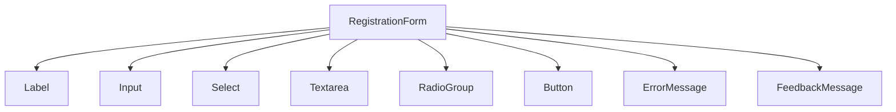

## Part 6: Visual Architecture and Accessibility — Nutrition Tracker

## Introduction

After building the form logic, validation, and persistence, it was time to transform the interface into a modern, accessible, and scalable visual experience. **Phase 4** of the project focused on applying **mobile-first** principles, ensuring **WCAG accessibility**, and establishing a reusable UI component architecture.

In this article, I'll walk you through how we configured TailwindCSS v4, created consistent UI components, automated accessibility tests with axe-core, and integrated Storybook for visual documentation.

## Why shift the focus to UI

Early phases proved the form worked: Zod validation, browser persistence, green tests. Still, the experience felt bare. I asked: what stops someone from using this daily without friction? The answer led to three priorities: mobile-first, accessibility, and visual consistency.

This chapter tells the story behind those choices: the problem each change solved, the alternatives I skipped, and the signals that showed we were on track.

---

## Objectives (and the reason behind them)

- Mobile-first: real usage happens on small screens. One thumb, short sessions, little patience. 48px+ touch targets aren’t a fad; they prevent misses and fatigue.
- Practical accessibility: readers, keyboard, contrast. Not to “tick a box,” but because the most expensive errors happen when someone can’t complete a simple task.
- Visual consistency: one language for colors, type and spacing. The UI is a system—if each piece “speaks” differently, cognitive load spikes.
- Light documentation: so future me (or a teammate) can continue without breaking what already works.

---

## Decision 1: TailwindCSS v4

Problem: I needed iteration speed and a single place to keep design decisions.

Why Tailwind v4: `@import "tailwindcss"` simplifies setup, `@tailwindcss/postcss` plays nicely with Vite, and the theme centralizes colors, fonts, and breakpoints. I moved from “where’s that style?” to “it’s in the theme.”

Signals it worked:

- Less ad‑hoc CSS in components.
- Global tweaks to spacing and typography without side effects.

Minimal base in `src/styles/tailwind.css`:

```css
@import "tailwindcss";

@layer base {
  html {
    -webkit-font-smoothing: antialiased;
    -moz-osx-font-smoothing: grayscale;
  }
}
```

> 
> Extended theme view (colors, fonts, breakpoints).

```js
/** @type {import('tailwindcss').Config} */
module.exports = {
  content: ['./index.html', './src/**/*.{js,jsx,ts,tsx}'],
  theme: {
    extend: {
      colors: {
        primary: {
          DEFAULT: '#0ea5e9', // primary blue
          light: '#38bdf8', // light blue
          dark: '#0369a1', // dark blue
        },
        secondary: {
          DEFAULT: '#f59e42', // secondary orange
          light: '#fbbf24',
          dark: '#b45309',
        },
        error: {
          DEFAULT: '#ef4444', // error red
          bg: '#fee2e2', // error background
        },
        success: {
          DEFAULT: '#22c55e', // success green
          bg: '#dcfce7', // success background
        },
        neutral: {
          50: '#f9fafb',
          100: '#f3f4f6',
          200: '#e5e7eb',
          300: '#d1d5db',
          400: '#9ca3af',
          500: '#6b7280',
          600: '#4b5563',
          700: '#374151',
          800: '#1f2937',
          900: '#111827',
        },
      },
      fontFamily: {
        sans: [
          'Inter',
          'system-ui',
          'Avenir',
          'Helvetica',
          'Arial',
          'sans-serif',
        ],
        heading: ['Montserrat', 'Inter', 'system-ui', 'sans-serif'],
      },
      spacing: {
        xs: '0.5rem', // 8px
        sm: '1rem', // 16px
        md: '1.5rem', // 24px
        lg: '2rem', // 32px
        xl: '3rem', // 48px
      },
      borderRadius: {
        sm: '0.375rem', // 6px
        md: '0.5rem', // 8px
        lg: '1rem', // 16px
      },
      screens: {
        'xs': '400px',
        'sm': '640px',
        'md': '768px',
        'lg': '1024px',
        'xl': '1280px',
        '2xl': '1536px',
      },
    },
  },
  plugins: [],
}
```

### How to read this config (quick)

- Palette: `theme.extend.colors` defines brand and state colors (`primary`, `secondary`, `error`, `success`, `neutral`). Use with utilities like `text-primary`, `bg-primary-light`, `border-error`, and the `neutral` scale for backgrounds/dividers.
- Typography: `theme.extend.fontFamily` sets `sans` (body text) and `heading` (titles). The UI applies `font-sans` to body text and the `heading` family in heading components.
- Breakpoints: `theme.extend.screens` centralizes breakpoints (`xs` → `2xl`). Add responsive styles with prefixes like `sm:`, `md:`, `lg:` while keeping a mobile‑first mindset.

---

## Decision 2: Reusable UI components

Problem: each field drifted in style and validation details. Unscalable.

Why extract components: encapsulate patterns (“label on top,” `aria-invalid`, error borders, focus states) and let form logic focus on data.

What changed in practice:

- `Input`, `Select`, `Textarea` and `RadioGroup` share conventions.
- `Label` adds an accessible required indicator.
- `ErrorMessage` and `FeedbackMessage` standardize how we show issues and success.

Real form snippet:

```tsx
<div>
  <Label htmlFor="food" required>Food</Label>
  <Input id="food" placeholder="e.g. Apple" hasError={!!errors.food} {...register('food')} />
  <ErrorMessage message={errors.food?.message} />
</div>
```

> 
> The form “speaks” one visual language.

---

## Decision 3: Accessibility from day one

Problem: accessibility often slips and costs double later. I wanted to avoid that debt.

What I did: added axe-core to the suite and designed real states (visible errors, loading, disabled, empty radiogroups, etc.).

Signals it worked:

- Zero violations after turning on contrast rules.
- Labels tied to controls; visible focus; keyboard navigation works.

Small helper used in tests:

```ts
async function runAxe(container: HTMLElement) {
  return await axe.run(container)
}
```

> 
> Accessibility is verified on every run, not just pre‑release.

### Test snippets (axe-core)

```tsx
// Reusable helper
async function runAxe(container: HTMLElement) {
  return await axe.run(container)
}

// Initial render without violations (contrast included)
it('has no violations on initial render (including contrast)', async () => {
  // const { container } = render(<RegistrationForm />)
  const results = await runAxe(container)
  expect(results.violations).toHaveLength(0)
})
```

```tsx
// Dynamic states: loading and linked error
it('Loading Button state has no violations', async () => {
  // const { container } = render(<Button isLoading>Save record</Button>)
  const results = await runAxe(container)
  expect(results.violations).toHaveLength(0)
})

it('Input with aria-invalid + linked ErrorMessage has no violations', async () => {
  // const { container } = render(
  //   <div>
  //     <label htmlFor="food">Food</label>
  //     <Input id="food" aria-invalid="true" aria-describedby="food-error" />
  //     <ErrorMessage id="food-error" message="Food is required" />
  //   </div>
  // )
  const results = await runAxe(container)
  expect(results.violations).toHaveLength(0)
})
```

## Decision 4: Storybook to see what tests can’t say

Problem: unit tests don’t show “how it looks.” Edge cases surface late.

Why Storybook: documents states (error, disabled, loading) and variants (primary/secondary, vertical/grid) in isolation. Great for visual QA and quick feedback.

> 
> Lightweight stories with interactions to validate styles and states.

---

## What truly changed (before / after)

- From scattered styles to a single theme.
- From “similar” inputs to truly consistent components.
- From “probably accessible” to a suite that proves it.
- From manual checks to stories that live beside the code.

Component diagram:



---

## Results that matter

- Comfortable mobile usage (targets >= 48px, clear focus).
- 0 axe-core violations with contrast enabled.
- Style refactors are local: tweak theme, everything updates.
- Enough docs for a teammate to continue without breaking things.

---

## What I’d do differently next time

- Ship `Button` (variants + loading) on day one: it sets the visual tone and appears everywhere.
- Introduce design tokens (via theme) before writing the first component: iterations get even faster.
- Add end‑to‑end keyboard navigation tests to cover real flows.

---

## What’s next

- Data visualization and reports (simple charts first—utility over sophistication).
- Search and history filters.
- Short onboarding to set realistic goals.

---

## References

- [TailwindCSS v4](https://tailwindcss.com)
- [axe-core](https://github.com/dequelabs/axe-core)
- [Storybook](https://storybook.js.org)
- [WCAG 2.1](https://www.w3.org/WAI/WCAG21/quickref/)
- [React Hook Form](https://react-hook-form.com)

> Note: screenshots are placeholders and will be added later.

---

**Author:** Ramiro Miranda
**Date:** November 17, 2025
**Series:** Nutrition Tracker - Part 6/N
> 
