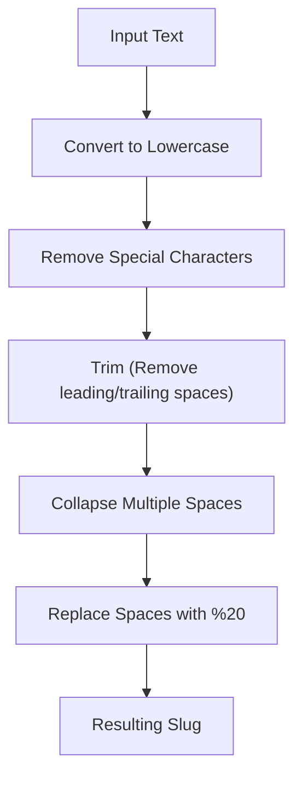

## Slug Generator - Analysis and Explanation

## Problem Statement

Given a string, the goal is to return a version suitable for use in a URL (slug) by applying the following rules:

- All letters must be in **lowercase**.
- Remove all characters that are **not** letters, numbers, or spaces.
- Replace spaces with their URL-encoded equivalent `%20`.
- Consecutive spaces must be replaced by a single `%20`.
- There should be no `%20` at the beginning or end of the slug.

## Initial Analysis

### Understanding the Problem

The challenge consists of transforming free text into a normalized string for URLs. We must clean special characters, handle capitalization, and ensure that spaces are encoded correctly without leaving residues at the ends.

### Process Visualization



### Identified Test Cases

1. **Basic:** `"Hello World!"` $\rightarrow$ `"hello%20world"`
2. **Multiple spaces:** `" Multiple   spaces "` $\rightarrow$ `"multiple%20spaces"`
3. **Special characters:** `"Café & résumé"` $\rightarrow$ `"caf%20rsum"` (Note: accents are removed according to the rule).
4. **Numbers:** `"123 go!"` $\rightarrow$ `"123%20go"`
5. **Empty:** `""` $\rightarrow$ `""`

## Solution Development

### Chosen Approach

We will use a sequence of chained transformations on the string. This approach is declarative, easy to read, and avoids manual index manipulation.

### Implementation

```typescript
/**
 * Generates a URL-friendly slug from a string.
 * @param str Original text.
 * @returns Formatted slug string with %20.
 */
function generateSlug(str: string): string {
  if (!str)
    return ''

  return str
    .toLowerCase()
    // 1. Remove everything that is not a letter (a-z), number (0-9), or space
    .replace(/[^a-z0-9 ]/g, '')
    // 2. Remove leading and trailing spaces
    .trim()
    // 3. Replace one or more spaces with a single %20
    .replace(/\s+/g, '%20')
}
```

## Complexity Analysis

### Time Complexity

$O(n)$, where $n$ is the length of the input string. Each operation (`toLowerCase`, `replace`, `trim`) traverses the string once or a constant number of times.

### Space Complexity

$O(n)$. A new string is generated to store the result of the transformations.

## Edge Cases and Considerations

- **Accents and diacritics:** The rule asks to remove characters that are not basic letters. If we wanted to preserve the meaning (e.g., `é` $\rightarrow$ `e`), we should normalize the string with `.normalize('NFD')` before filtering.
- **Unicode and Emojis:** They will be removed by the regular expression `[^a-z0-9 ]`.
- **Symbol-only strings:** If the input is `"!!!"`, the result will be an empty string `""`.

## Reflections and Learnings

### Applied Concepts

- **Regular Expressions:** Use of negated character classes (`[^...]`) for cleaning and quantifiers (`+`) to collapse spaces.
- **String Methods:** Method chaining for cleaner and more maintainable code.

### Why `%20` and not `-`?
Although most modern blogs prefer the hyphen (`-`) for readability and SEO, this specific challenge explicitly asks for standard URL encoding for spaces. It's a good reminder that we must always follow the technical requirements of the client or platform.

## Resources and References

- [MDN - String.prototype.replace()](https://developer.mozilla.org/en-US/docs/Web/JavaScript/Reference/Global_Objects/String/replace)
- [RegEx101](https://regex101.com/) - Tool for testing and explaining regular expression patterns.
