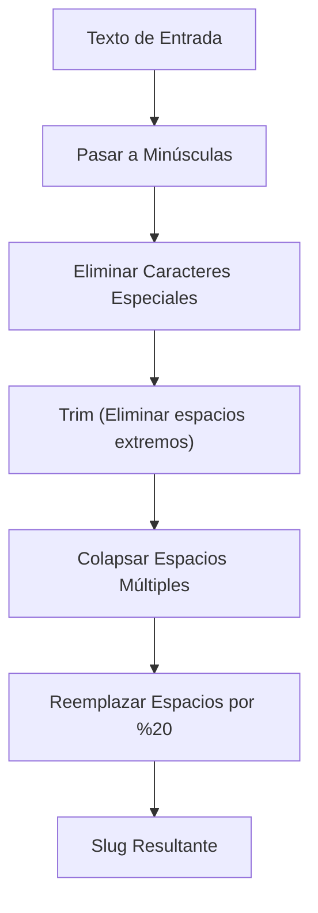

## Slug Generator - Análisis y Explicación

## Enunciado del Problema

Dada una cadena de texto, el objetivo es devolver una versión apta para usar en una URL (slug) aplicando las siguientes reglas:

- Todas las letras deben estar en **minúscula**.
- Elimina todos los caracteres que **no** sean letras, números o espacios.
- Reemplaza los espacios por su equivalente URL-encoded `%20`.
- Los espacios consecutivos deben ser reemplazados por un solo `%20`.
- No debe quedar `%20` al inicio ni al final del slug.

## Análisis Inicial

### Comprensión del Problema

El desafío consiste en transformar texto libre en una cadena normalizada para URLs. Debemos limpiar caracteres especiales, manejar la capitalización y asegurar que los espacios se codifiquen correctamente sin dejar residuos en los extremos.

### Visualización del Proceso



### Casos de Prueba Identificados

1. **Básico:** `"Hello World!"` $\rightarrow$ `"hello%20world"`
2. **Espacios múltiples:** `" Multiple   spaces "` $\rightarrow$ `"multiple%20spaces"`
3. **Caracteres especiales:** `"Café & résumé"` $\rightarrow$ `"caf%20rsum"` (Nota: se eliminan acentos según la regla).
4. **Números:** `"123 go!"` $\rightarrow$ `"123%20go"`
5. **Vacío:** `""` $\rightarrow$ `""`

## Desarrollo de la Solución

### Enfoque Elegido

Utilizaremos una secuencia de transformaciones encadenadas sobre el string. Este enfoque es declarativo, fácil de leer y evita la manipulación manual de índices.

### Implementación

```typescript
/**
 * Genera un slug amigable para URL a partir de un string.
 * @param str Texto original.
 * @returns String formateado como slug con %20.
 */
function generateSlug(str: string): string {
  if (!str)
    return ''

  return str
    .toLowerCase()
    // 1. Eliminar todo lo que no sea letra (a-z), número (0-9) o espacio
    .replace(/[^a-z0-9 ]/g, '')
    // 2. Eliminar espacios al inicio y final
    .trim()
    // 3. Reemplazar uno o más espacios por un solo %20
    .replace(/\s+/g, '%20')
}
```

## Análisis de Complejidad

### Complejidad Temporal

$O(n)$, donde $n$ es la longitud del string de entrada. Cada operación (`toLowerCase`, `replace`, `trim`) recorre el string una o un número constante de veces.

### Complejidad Espacial

$O(n)$. Se genera un nuevo string para almacenar el resultado de las transformaciones.

## Casos Edge y Consideraciones

- **Acentos y diacríticos:** La regla pide eliminar caracteres que no sean letras básicas. Si quisiéramos preservar el significado (ej: `é` $\rightarrow$ `e`), deberíamos normalizar el string con `.normalize('NFD')` antes de filtrar.
- **Unicode y Emojis:** Serán eliminados por la expresión regular `[^a-z0-9 ]`.
- **Cadenas de solo símbolos:** Si la entrada es `"!!!"`, el resultado será un string vacío `""`.

## Reflexiones y Aprendizajes

### Conceptos Aplicados

- **Expresiones Regulares:** Uso de clases de caracteres negadas (`[^...]`) para limpieza y cuantificadores (`+`) para colapsar espacios.
- **Métodos de String:** Encadenamiento de métodos para un código más limpio y mantenible.

### ¿Por qué `%20` y no `-`?
Aunque en la mayoría de los blogs modernos se prefiere el guion (`-`) por legibilidad y SEO, este reto específico pide explícitamente la codificación URL estándar para espacios. Es un buen recordatorio de que siempre debemos seguir los requisitos técnicos del cliente o la plataforma.

## Recursos y Referencias

- [MDN - String.prototype.replace()](https://developer.mozilla.org/es/docs/Web/JavaScript/Reference/Global_Objects/String/replace)
- [RegEx101](https://regex101.com/) - Herramienta para probar patrones de expresiones regulares.
- [MDN - String.normalize()](https://developer.mozilla.org/en-US/docs/Web/JavaScript/Reference/Global_Objects/String/normalize)
- [MDN - encodeURIComponent()](https://developer.mozilla.org/en-US/docs/Web/JavaScript/Reference/Global_Objects/encodeURIComponent)
