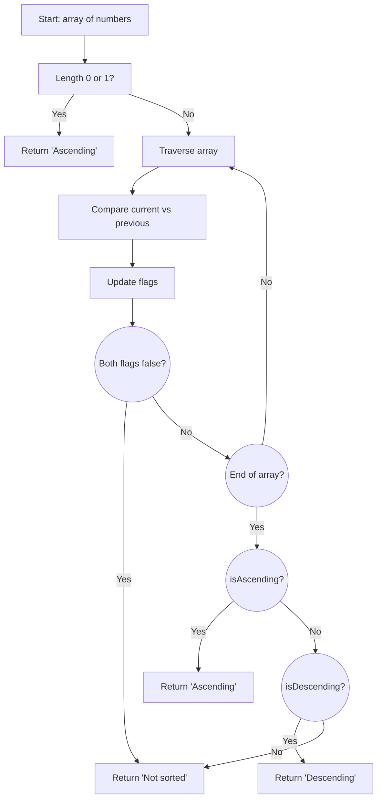

## Problem Statement

Given an array of numbers, determine if it is sorted in ascending order, descending order, or not sorted.

- If the array is in ascending order (from smallest to largest), return "Ascending".
- If it is in descending order (from largest to smallest), return "Descending".
- If neither, return "Not sorted".

## Initial Analysis

The function must analyze the array and decide if all its elements are strictly ascending, strictly descending, or neither. To do this, we just compare each element with the previous one and keep track of the order type.

### Test Cases

1. `[1, 2, 3, 4, 5]` → "Ascending"
2. `[10, 8, 6, 4, 2]` → "Descending"
3. `[1, 3, 2, 4, 5]` → "Not sorted"
4. `[3.14, 2.71, 1.61, 0.57]` → "Descending"
5. `[12.3, 23.4, 34.5, 45.6, 56.7, 67.8, 78.9]` → "Ascending"
6. `[0.4, 0.5, 0.3]` → "Not sorted"

## Solution Development

### Approach

We traverse the array once, using two flags: `isAscending` and `isDescending`, both initialized to `true`. When comparing each element with the previous one:

- If the current is greater than the previous, we discard descending order.
- If the current is less than the previous, we discard ascending order.

At the end, if either flag is still `true`, we return the order type. If both are `false`, the array is not sorted.

### Commented Code

```js
function sortedArrayType(arr) {
  if (arr.length === 0 || arr.length === 1)
    return 'Ascending' // Convention
  let isAscending = true
  let isDescending = true
  for (let i = 1; i < arr.length; i++) {
    if (arr[i] > arr[i - 1])
      isDescending = false
    if (arr[i] < arr[i - 1])
      isAscending = false
    // If both flags are false, we can exit early
    if (!isAscending && !isDescending)
      return 'Not sorted'
  }
  if (isAscending)
    return 'Ascending'
  if (isDescending)
    return 'Descending'
  return 'Not sorted'
}
```

#### Decision Diagram



## Complexity Analysis

### Time Complexity

The algorithm traverses the array only once, so the time complexity is $O(n)$, where $n$ is the length of the array. Each comparison is constant time.

### Space Complexity

Space complexity is $O(1)$, since only a couple of extra variables are used regardless of array size.

### Edge Cases and Considerations

- **Empty array**: returns "Ascending" (by convention, an empty array is considered ascending).
- **Single element**: returns "Ascending".
- **Repeated elements**: if there are consecutive equal elements, the algorithm considers them as part of the order (not strictly increasing/decreasing, but non-decreasing/non-increasing).

## Reflections and Learnings

**Applied concepts:**
- Linear array traversal
- Use of boolean flags
- Comparison of adjacent elements

**Possible optimizations:**
The algorithm is optimal. If the array is very large, we can return "Not sorted" as soon as both flags are `false`, without traversing the rest.

## Resources

- [Array sorting - MDN](https://developer.mozilla.org/en-US/docs/Web/JavaScript/Reference/Global_Objects/Array/sort)
- [Array iteration patterns](https://javascript.info/array-iteration)
