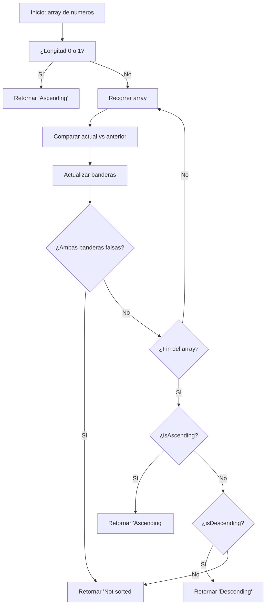

## Enunciado

Dado un array de números, determina si está ordenado de forma ascendente, descendente o no está ordenado.

- Si el array está en orden ascendente (de menor a mayor), retorna "Ascending".
- Si está en orden descendente (de mayor a menor), retorna "Descending".
- Si no cumple ninguna de las anteriores, retorna "Not sorted".

## Análisis Inicial

La función debe analizar el array y decidir si todos sus elementos están ordenados de forma estrictamente ascendente, estrictamente descendente, o si no cumplen ninguna de estas condiciones. Para ello, basta con comparar cada elemento con el anterior y llevar registro del tipo de orden.

### Casos de Prueba

1. `[1, 2, 3, 4, 5]` → "Ascending"
2. `[10, 8, 6, 4, 2]` → "Descending"
3. `[1, 3, 2, 4, 5]` → "Not sorted"
4. `[3.14, 2.71, 1.61, 0.57]` → "Descending"
5. `[12.3, 23.4, 34.5, 45.6, 56.7, 67.8, 78.9]` → "Ascending"
6. `[0.4, 0.5, 0.3]` → "Not sorted"

## Desarrollo de la Solución

### Enfoque

Recorremos el array una sola vez, usando dos banderas: `isAscending` y `isDescending`, ambas inicializadas en `true`. Al comparar cada elemento con el anterior:

- Si el actual es mayor que el anterior, descartamos que sea descendente.
- Si el actual es menor que el anterior, descartamos que sea ascendente.

Al terminar, si alguna bandera sigue en `true`, devolvemos el tipo de orden. Si ambas son `false`, el array no está ordenado.

### Código Comentado

```js
function sortedArrayType(arr) {
  if (arr.length === 0 || arr.length === 1)
    return 'Ascending' // Convención
  let isAscending = true
  let isDescending = true
  for (let i = 1; i < arr.length; i++) {
    if (arr[i] > arr[i - 1])
      isDescending = false
    if (arr[i] < arr[i - 1])
      isAscending = false
    // Si ambas banderas son falsas, podemos cortar temprano
    if (!isAscending && !isDescending)
      return 'Not sorted'
  }
  if (isAscending)
    return 'Ascending'
  if (isDescending)
    return 'Descending'
  return 'Not sorted'
}
```

#### Diagrama de Decisión



## Análisis de Complejidad

### Complejidad Temporal

El algoritmo recorre el array una sola vez, por lo que la complejidad temporal es $O(n)$, donde $n$ es la longitud del array. Cada comparación es de costo constante.

### Complejidad Espacial

La complejidad espacial es $O(1)$, ya que solo se utilizan un par de variables adicionales independientemente del tamaño del array.

### Casos Edge y Consideraciones

- **Array vacío**: retorna "Ascending" (por convención, un array vacío se considera ordenado ascendente).
- **Un solo elemento**: retorna "Ascending".
- **Elementos repetidos**: si hay elementos iguales consecutivos, el algoritmo los considera parte del orden (no estrictamente creciente/ decreciente, sino no decreciente/no creciente).

## Reflexiones y Aprendizajes

**Conceptos aplicados:**
- Recorrido lineal de arrays
- Uso de banderas booleanas
- Comparación de elementos adyacentes

**Posibles optimizaciones:**
El algoritmo es óptimo. Si el array es muy grande, se puede retornar "Not sorted" tan pronto ambas banderas sean `false`, sin recorrer el resto.

## Recursos

- [Ordenamiento en arrays - MDN](https://developer.mozilla.org/es/docs/Web/JavaScript/Reference/Global_Objects/Array/sort)
- [Patrones de recorrido de arrays](https://javascript.info/array-iteration)
