### Problem Statement

Given a speed in miles per hour (MPH) and a limit in kilometers per hour (KPH):

- If your speed (converted to KPH) is less than or equal to the limit, return **"Not Speeding"**.
- If you exceed the limit by up to 5 KPH, return **"Warning"**.
- If you exceed the limit by more than 5 KPH, return **"Ticket"**.

> **Useful fact:** $1$ mile = $1.60934$ kilometers.

---

## 🔍 Initial Analysis

Before coding, let's clarify the decision flow:

```mermaid
flowchart TD
  A["Speed in MPH"] --> B["Convert to KPH"]
  B --> C{"speedKPH ≤ limit?"}
  C -- Yes --> D["Not Speeding"]
  C -- No --> E{"≤ limit + 5?"}
  E -- Yes --> F["Warning"]
  E -- No --> G["Ticket"]
```



### Key Test Cases

- Case 1: Speed within the limit
  - Input: speedMph = 30, speedLimitKph = 70
  - Expected Output: "Not Speeding"
- Case 2: Speed with warning
  - Input: speedMph = 40, speedLimitKph = 60
  - Expected Output: "Warning"
- Case 3: Speed right at the warning threshold
  - Input: speedMph = 40, speedLimitKph = 65
  - Expected Output: "Not Speeding"
- Case 4: Speed with ticket
  - Input: speedMph = 60, speedLimitKph = 90
  - Expected Output: "Ticket"
- Case 5: Speed with warning near the limit
  - Input: speedMph = 65, speedLimitKph = 100
- Expected Output: "Warning"
- Case 6: Speed far above the limit
  - Input: speedMph = 88, speedLimitKph = 40
  - Expected Output: "Ticket"

## 🛠️ Solution Development

### Strategy

1. **Convert units:**
  $$speedKPH = speedMph \times 1.60934$$

2. **Compare with the limit:**

- If $speedKPH \leq speedLimitKph$ → "Not Speeding"
- If $speedKPH \leq speedLimitKph + 5$ → "Warning"
- If $speedKPH > speedLimitKph + 5$ → "Ticket"

### JavaScript Implementation

```js
function speedCheck(speedMph, speedLimitKph) {
  const speedKPH = speedMph * 1.60934
  if (speedKPH <= speedLimitKph)
    return 'Not Speeding'
  if (speedKPH <= speedLimitKph + 5)
    return 'Warning'
  return 'Ticket'
}
```

## ⚡ Complexity Analysis

- **Time:**
  $$O(1)$$
- **Space:**
  $$O(1)$$

## 🧩 Edge Cases and Considerations

- If the speed is **equal** to the limit → "Not Speeding"
- If it is **exactly 5 KPH** above → "Warning"
- Negative or zero speed → "Not Speeding" (not realistic, but the code allows it)
- Precision depends on the conversion factor ($1.60934$)

## 💡 Reflections and Learnings

What did we learn?

- Unit conversion
- Thinking about edge cases

## 📚 Resources and References

- [Miles to kilometers conversion - Wikipedia](https://en.wikipedia.org/wiki/Mile_per_hour)
- [freeCodeCamp Daily Coding Challenge](https://www.freecodecamp.org/learn/daily-coding-challenge/2025-12-15/)
