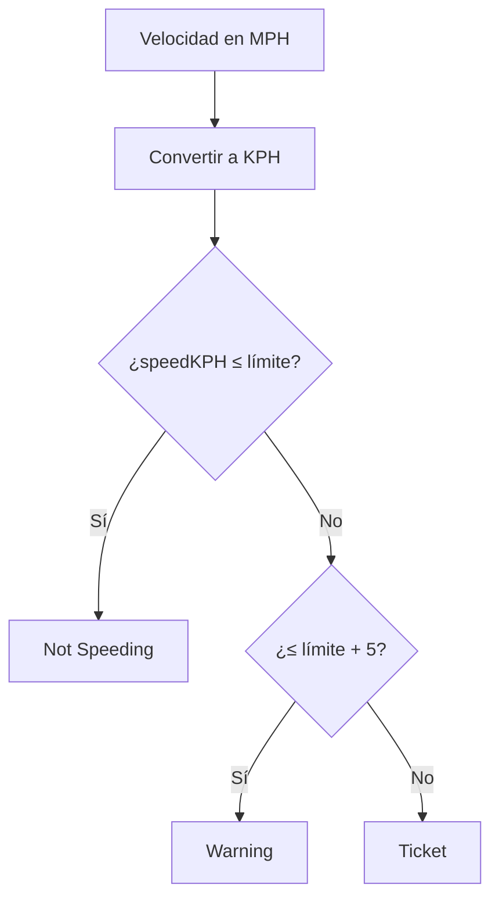

### Enunciado

Dada una velocidad en millas por hora (MPH) y un límite en kilómetros por hora (KPH):

- Si tu velocidad (convertida a KPH) es menor o igual al límite, devuelve **"Not Speeding"**.
- Si excedes el límite por hasta 5 KPH, devuelve **"Warning"**.
- Si excedes el límite por más de 5 KPH, devuelve **"Ticket"**.

> **Dato útil:** $1$ milla = $1.60934$ kilómetros.

---

## 🔍 Análisis Inicial

Antes de programar, aclaremos el flujo de decisión:



### Casos de Prueba Clave

- Caso 1: Velocidad dentro del límite
  - Entrada: speedMph = 30, speedLimitKph = 70
  - Salida Esperada: "Not Speeding"
- Caso 2: Velocidad con advertencia
  - Entrada: speedMph = 40, speedLimitKph = 60
  - Salida Esperada: "Warning"
- Caso 3: Velocidad justo en el límite de advertencia
  - Entrada: speedMph = 40, speedLimitKph = 65
  - Salida Esperada: "Not Speeding"
- Caso 4: Velocidad con multa
  - Entrada: speedMph = 60, speedLimitKph = 90
  - Salida Esperada: "Ticket"
- Caso 5: Velocidad con advertencia cerca del límite
  - Entrada: speedMph = 65, speedLimitKph = 100
  - Salida Esperada: "Warning"
- Caso 6: Velocidad muy por encima del límite
  - Entrada: speedMph = 88, speedLimitKph = 40
  - Salida Esperada: "Ticket"

## 🛠️ Desarrollo de la Solución

### Estrategia

1. **Convertir unidades:**
  $$speedKPH = speedMph \times 1.60934$$

2. **Comparar con el límite:**

- Si $speedKPH \leq speedLimitKph$ → "Not Speeding"
- Si $speedKPH \leq speedLimitKph + 5$ → "Warning"
- Si $speedKPH > speedLimitKph + 5$ → "Ticket"

### Implementación en JavaScript

```js
function speedCheck(speedMph, speedLimitKph) {
  const speedKPH = speedMph * 1.60934
  if (speedKPH <= speedLimitKph)
    return 'Not Speeding'
  if (speedKPH <= speedLimitKph + 5)
    return 'Warning'
  return 'Ticket'
}
```

## ⚡ Análisis de Complejidad

- **Tiempo:**
  $$O(1)$$
- **Espacio:**
  $$O(1)$$

## 🧩 Casos Edge y Consideraciones

- Si la velocidad es **igual** al límite → "Not Speeding"
- Si es **exactamente 5 KPH** arriba → "Warning"
- Velocidad negativa o cero → "Not Speeding" (no tiene sentido real, pero el código lo permite)
- La precisión depende del factor de conversión ($1.60934$)

## 💡 Reflexiones y Aprendizajes

¿Qué aprendimos?

- Convertir unidades
- Pensar en los edge cases

## 📚 Recursos y Referencias

- [Conversión de millas a kilómetros - Wikipedia](https://es.wikipedia.org/wiki/Milla_por_hora)
- [freeCodeCamp Daily Coding Challenge](https://www.freecodecamp.org/learn/daily-coding-challenge/2025-12-15/)
