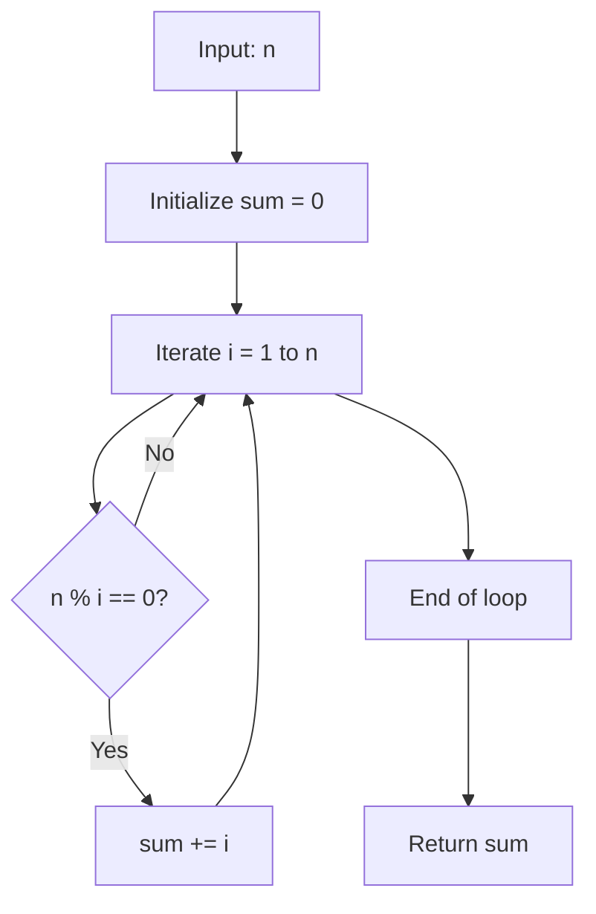

## Problem Statement: Sum of Divisors

Given a positive integer $n$, return the sum of all its divisors (integers that divide $n$ with no remainder).

For example, for $n = 6$, the divisors are $1, 2, 3, 6$ and the sum is $12$.

**Examples:**

- `sumOfDivisors(6)` → $12$
- `sumOfDivisors(13)` → $14$
- `sumOfDivisors(28)` → $56$
- `sumOfDivisors(84)` → $224$
- `sumOfDivisors(549)` → $806$
- `sumOfDivisors(9348)` → $23520$

## Analysis and Test Cases

To solve the problem, we just need to identify all divisors of $n$ (that is, all $i$ such that $n \% i = 0$) and sum them. Here are some cases:

| n    | Divisors                      | Sum |
|------|--------------------------------|------|
| 6    | 1, 2, 3, 6                    | 12   |
| 13   | 1, 13                         | 14   |
| 28   | 1, 2, 4, 7, 14, 28            | 56   |
| 84   | 1, 2, 3, 4, 6, 7, 12, 14, 21, 28, 42, 84 | 224  |
| 549  | 1, 3, 9, 61, 183, 549         | 806  |
| 9348 | 1, 2, 3, 4, 6, 12, 13, 26, 39, 52, 78, 156, 59, 118, 177, 236, 354, 708, 779, 1558, 2337, 3116, 4674, 9348 | 23520 |

These examples cover small, prime, composite, and large values to validate efficiency.

## Solution and Explanation

### Strategy

We use a direct approach: iterate from $1$ to $n$ and sum the values that divide $n$ exactly. It's simple, clear, and sufficient for the problem's input sizes.

### Flowchart



### JavaScript Code

```js
function sumOfDivisors(n) {
  let sum = 0
  for (let i = 1; i <= n; i++) {
    if (n % i === 0)
      sum += i
  }
  return sum
}
```

## Complexity

- **Time:** $O(n)$ (one iteration per number up to $n$).
- **Space:** $O(1)$ (only scalar variables).

## Edge Cases and Considerations

- If $n = 1$, the only divisor is $1$ (the function should return $1$).
- The statement assumes $n$ is positive.
- For primes, the sum is $n + 1$.
- Negatives and zero are not considered.

## Reflections and Learnings

- The modulo operator is key to identifying divisors.
- For large $n$, you can optimize by iterating up to $\sqrt{n}$ and summing both divisors, achieving $O(\sqrt{n})$.
- The current version is didactic and clear for beginners.

## Resources

- [Divisor (Wikipedia)](https://en.wikipedia.org/wiki/Divisor)
- [Sum of Divisors - GeeksforGeeks](https://www.geeksforgeeks.org/sum-of-all-divisors-from-1-to-n/)
