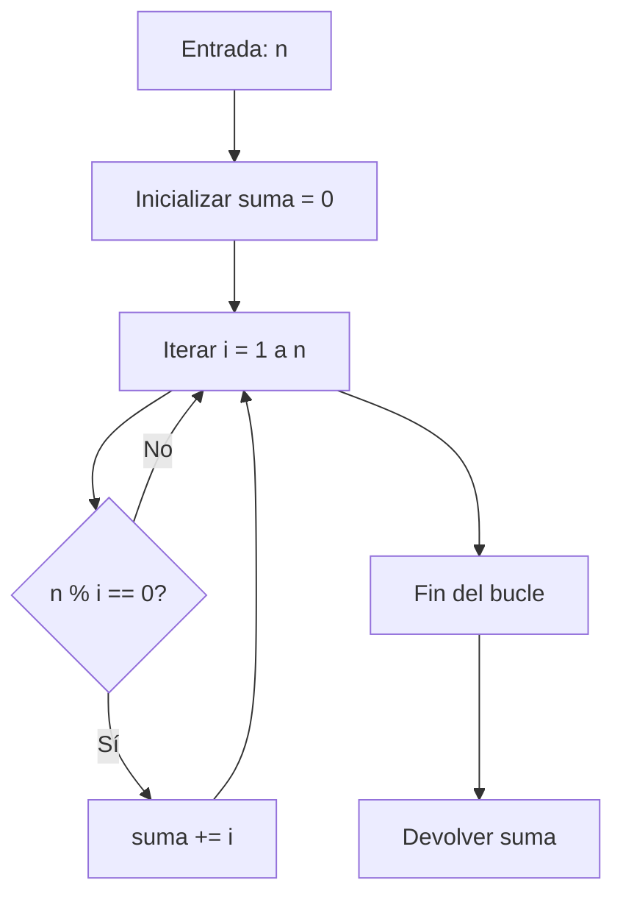

## Enunciado: Suma de Divisores

Dado un número entero positivo $n$, devuelve la suma de todos sus divisores (enteros que dividen a $n$ sin dejar resto).

Por ejemplo, para $n = 6$, los divisores son $1, 2, 3, 6$ y la suma es $12$.

**Ejemplos:**

- `sumOfDivisors(6)` → $12$
- `sumOfDivisors(13)` → $14$
- `sumOfDivisors(28)` → $56$
- `sumOfDivisors(84)` → $224$
- `sumOfDivisors(549)` → $806$
- `sumOfDivisors(9348)` → $23520$

## Análisis y Casos de Prueba

Para resolver el problema, basta con identificar todos los divisores de $n$ (es decir, todos los $i$ tales que $n \% i = 0$) y sumarlos. Veamos algunos casos:

| n    | Divisores                      | Suma |
|------|--------------------------------|------|
| 6    | 1, 2, 3, 6                    | 12   |
| 13   | 1, 13                         | 14   |
| 28   | 1, 2, 4, 7, 14, 28            | 56   |
| 84   | 1, 2, 3, 4, 6, 7, 12, 14, 21, 28, 42, 84 | 224  |
| 549  | 1, 3, 9, 61, 183, 549         | 806  |
| 9348 | 1, 2, 3, 4, 6, 12, 13, 26, 39, 52, 78, 156, 59, 118, 177, 236, 354, 708, 779, 1558, 2337, 3116, 4674, 9348 | 23520 |

Estos ejemplos cubren casos pequeños, primos, compuestos y un valor grande para validar eficiencia.

## Solución y Explicación

### Estrategia

Usamos un enfoque directo: iterar de $1$ a $n$ y sumar los valores que dividen a $n$ exactamente. Es simple, claro y suficiente para los tamaños de entrada del reto.

### Diagrama de Flujo



### Código en JavaScript

### Código Final

```js
function sumOfDivisors(n) {
  let suma = 0
  for (let i = 1; i <= n; i++) {
    if (n % i === 0)
      suma += i
  }
  return suma
}
```

## Complejidad

- **Tiempo:** $O(n)$ (una iteración por cada número hasta $n$).
- **Espacio:** $O(1)$ (solo variables escalares).

## Casos Edge y Consideraciones

- Si $n = 1$, el único divisor es $1$ (la función debe devolver $1$).
- El enunciado asume $n$ positivo.
- Para primos, la suma es $n + 1$.
- No se consideran negativos ni cero.

## Reflexiones y Aprendizajes

- El operador módulo es clave para identificar divisores.
- Para $n$ grandes, se puede optimizar iterando hasta $\sqrt{n}$ y sumando ambos divisores, logrando $O(\sqrt{n})$.
- La versión actual es didáctica y clara para quienes inician.

## Recursos

- [Divisor (Wikipedia)](https://es.wikipedia.org/wiki/Divisor)
- [Sum of Divisors - GeeksforGeeks](https://www.geeksforgeeks.org/sum-of-all-divisors-from-1-to-n/)
