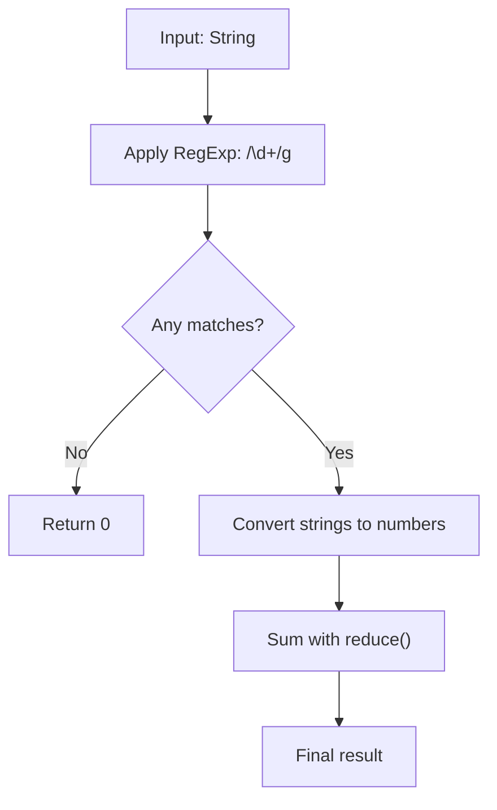

## Sum The String - Analysis and Explanation

## Problem Statement

Given a string containing digits and other characters, the goal is to return the **sum of all numbers** present in the string.

- Consecutive digits form a single number. For example, `"13"` counts as 13, not as $1 + 3$.
- All other non-numeric characters should be ignored.

## Initial Analysis

### Understanding the Problem

The key lies in identifying uninterrupted sequences of digits as a single numerical unit. We are not summing individual digits, but rather numeric blocks.

### Identified Test Cases

1. `stringSum("3apples2bananas")` → `5` ($3 + 2$).
2. `stringSum("10cats5dogs2birds")` → `17` ($10 + 5 + 2$).
3. `stringSum("125344")` → `125344`.
4. `stringSum("a1b20c300")` → `321` ($1 + 20 + 300$).

Edge cases:
- `stringSum("")` → `0` (empty string).
- `stringSum("abc")` → `0` (no numbers).
- `stringSum("0a0b0")` → `0` (explicit zeros).

---

## Solution Development

### Approach: Regular Expressions

We will use a **regular expression** (`/\d+/g`) to capture all sequences of one or more digits. This approach is the most efficient and readable in JavaScript/TypeScript for pattern extraction tasks.

### Solution Flow



### Implementation

```typescript
/**
 * Sums all numbers found in a string.
 * @param str Text string to process.
 * @returns The total sum of the numbers found.
 */
function stringSum(str: string): number {
  // Look for sequences of one or more digits (\d+) globally (g)
  const matches = str.match(/\d+/g)

  if (!matches) {
    return 0
  }

  // Convert each match to a number and accumulate
  return matches.reduce((acc, num) => acc + Number(num), 0)
}

export default stringSum
```

---

## Complexity Analysis

### Time Complexity

- **$O(n)$**: Where $n$ is the length of the input string. The regular expression engine must traverse the entire string once to find all matches. Subsequently, the `reduce` method iterates through the found matches, which is proportional to $n$ in the worst case.

### Space Complexity

- **$O(n)$**: In the worst case (a string composed of numbers separated by a single non-numeric character), the matches array could occupy space proportional to the size of the original string.

---

## Edge Cases and Considerations

- **No numbers**: If the string contains no digits, `match` returns `null`. We handle this by returning `0` immediately.
- **Large numbers**: JavaScript handles integers safely up to `Number.MAX_SAFE_INTEGER` ($2^{53} - 1$). For larger values, `BigInt` would be required.
- **Zeros**: Leading zeros in sequences like `"007"` are correctly treated by `Number()` as `7`.

## Reflections and Lessons Learned

### Key Concepts

- **RegExp**: Using quantifiers (`+`) and flags (`g`) for global search.
- **Higher-Order Functions**: Using `reduce` for clean and declarative accumulations.
- **Nullish Handling**: Importance of validating the `match()` return value before operating.

## Resources and References

- [MDN - String.prototype.match()](https://developer.mozilla.org/en-US/docs/Web/JavaScript/Reference/Global_Objects/String/match)
- [MDN - Regular Expressions](https://developer.mozilla.org/en-US/docs/Web/JavaScript/Guide/Regular_Expressions)
