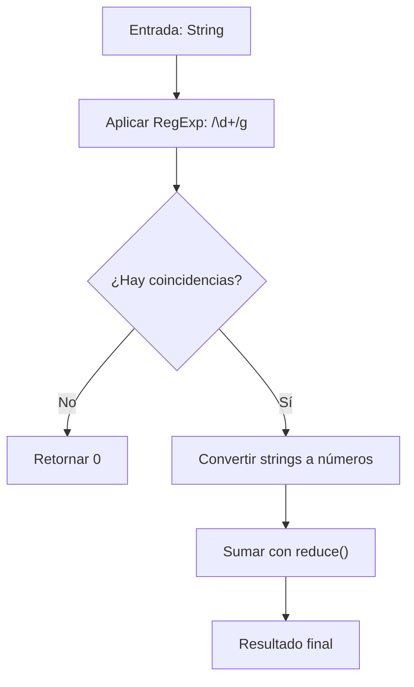

## Sum The String - Análisis y Explicación

## Enunciado

Dado un string que contiene dígitos y otros caracteres, el objetivo es retornar la **suma de todos los números** presentes en el string.

- Los números consecutivos forman un solo número. Por ejemplo, `"13"` cuenta como 13, no como $1 + 3$.
- Se deben ignorar el resto de los caracteres no numéricos.

## Análisis inicial

### Comprensión del problema

La clave reside en identificar secuencias ininterrumpidas de dígitos como una única unidad numérica. No estamos sumando dígitos individuales, sino bloques numéricos.

### Casos de prueba identificados

1. `stringSum("3apples2bananas")` → `5` ($3 + 2$).
2. `stringSum("10cats5dogs2birds")` → `17` ($10 + 5 + 2$).
3. `stringSum("125344")` → `125344`.
4. `stringSum("a1b20c300")` → `321` ($1 + 20 + 300$).

Casos borde:
- `stringSum("")` → `0` (string vacío).
- `stringSum("abc")` → `0` (sin números).
- `stringSum("0a0b0")` → `0` (ceros explícitos).

---

## Desarrollo de la solución

### Enfoque: Expresiones Regulares

Utilizaremos una **expresión regular** (`/\d+/g`) para capturar todas las secuencias de uno o más dígitos. Este enfoque es el más eficiente y legible en JavaScript/TypeScript para tareas de extracción de patrones.

### Flujo de la solución



### Implementación

```typescript
/**
 * Suma todos los números encontrados en un string.
 * @param str Cadena de texto a procesar.
 * @returns La suma total de los números encontrados.
 */
function stringSum(str: string): number {
  // Buscamos secuencias de uno o más dígitos (\d+) globalmente (g)
  const matches = str.match(/\d+/g);

  if (!matches) {
    return 0;
  }

  // Convertimos cada coincidencia a número y acumulamos
  return matches.reduce((acc, num) => acc + Number(num), 0);
}

export default stringSum;
```

---

## Análisis de complejidad

### Complejidad Temporal

- **$O(n)$**: Donde $n$ es la longitud de la cadena de entrada. El motor de expresiones regulares debe recorrer el string completo una vez para encontrar todas las coincidencias. Posteriormente, el método `reduce` recorre las coincidencias encontradas, lo cual es proporcional a $n$ en el peor de los casos.

### Complejidad Espacial

- **$O(n)$**: En el peor de los casos (un string compuesto por números separados por un solo carácter no numérico), el array de coincidencias podría ocupar un espacio proporcional al tamaño de la cadena original.

---

## Casos borde y consideraciones

- **Sin números**: Si el string no contiene dígitos, `match` devuelve `null`. Manejamos esto retornando `0` inmediatamente.
- **Números grandes**: JavaScript maneja números enteros de forma segura hasta `Number.MAX_SAFE_INTEGER` ($2^{53} - 1$). Para valores mayores, se requeriría `BigInt`.
- **Ceros**: Los ceros a la izquierda en secuencias como `"007"` son tratados correctamente por `Number()` como `7`.

## Reflexiones y aprendizajes

### Conceptos clave

- **RegExp**: Uso de cuantificadores (`+`) y flags (`g`) para búsqueda global.
- **Higher-Order Functions**: Uso de `reduce` para acumulaciones limpias y declarativas.
- **Manejo de Nullish**: Importancia de validar el retorno de `match()` antes de operar.

## Recursos y referencias

- [MDN - String.prototype.match()](https://developer.mozilla.org/es/docs/Web/JavaScript/Reference/Global_Objects/String/match)
- [MDN - Expresiones Regulares](https://developer.mozilla.org/es/docs/Web/JavaScript/Guide/Regular_Expressions)

- [MDN - RegExp.prototype.exec() / match()](https://developer.mozilla.org/es/docs/Web/JavaScript/Reference/Global_Objects/String/match)
- [MDN - Array.prototype.reduce()](https://developer.mozilla.org/es/docs/Web/JavaScript/Reference/Global_Objects/Array/reduce)
- [MDN - Number()](https://developer.mozilla.org/es/docs/Web/JavaScript/Reference/Global_Objects/Number)
