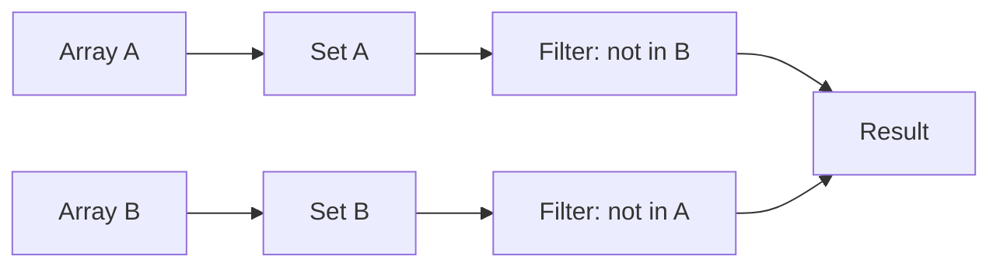

## Introduction - Problem Statement

Given two arrays, return a new array containing the symmetric difference between them.

The symmetric difference between two sets is the set of values that appear in one or the other set, but not in both.

Return the values in the order they first appear in the input arrays.

Array A: [1, 2, 3]
Array B: [2, 3, 4]

- 1 is only in A ✓
- 2 is in both ✗
- 3 is in both ✗
- 4 is only in B ✓

Symmetric difference: [1, 4]

## Initial Analysis

### Understanding the Problem

We need to find the unique elements of each array. The **symmetric difference** involves removing elements present in both arrays and keeping only the exclusive ones from each.

**The function must:**

1. Receive two arrays as input
2. Identify unique elements in each array
3. Combine these unique elements into a single output array
4. Maintain the order of appearance

It's a set operation:

$$
A \triangle B = (A - B) \cup (B - A)
$$



| Question                                 | Answer                         |
| ---------------------------------------- | ------------------------------ |
| What do we do with duplicates in result? | Include only once              |
| Does order matter?                       | Yes, order of first appearance |
| Can the arrays be empty?                 | Yes, it's an edge case         |
| What data types do they contain?         | Typically numbers              |

### Identified Test Cases

```javascript
// Basic case
sym([1, 2, 3], [2, 3, 4]); // → [1, 4]

// No common elements
sym([1, 2], [3, 4]); // → [1, 2, 3, 4]

// All elements in common
sym([1, 2], [1, 2]); // → []

// Empty array
sym([], [1, 2]); // → [1, 2]
sym([1, 2], []); // → [1, 2]

// With duplicates in input
sym([1, 1, 2], [2, 3]); // → [1, 3]

// Identical arrays
sym([1, 2, 3], [1, 2, 3]); // → []
```

## Solution Development

### Chosen Approach

We use **Set** as the main data structure for two reasons:

1. **Automatically removes duplicates** when converting each array
2. **O(1) lookup** with the `.has()` method to verify existence

The strategy consists of:

1. Convert both arrays to Sets
2. Filter elements from A that are **not in** B
3. Filter elements from B that are **not in** A
4. Concatenate both results

### Step-by-Step Implementation

```javascript
function sym(arrA, arrB) {
  // Step 1: Convert to Sets (removes duplicates)
  const setA = new Set(arrA);
  const setB = new Set(arrB);

  // Step 2: Elements from A that are NOT in B
  const onlyInA = [...setA].filter((x) => !setB.has(x));

  // Step 3: Elements from B that are NOT in A
  const onlyInB = [...setB].filter((x) => !setA.has(x));

  // Step 4: Combine both results
  return [...onlyInA, ...onlyInB];
}
```

> **Why spread operator (`...`)?**
>
> `Set` doesn't have the `.filter()` method — it only has `.has()`, `.add()`, `.delete()`, and `.forEach()`. By using `[...setA]` we convert the Set to an Array, which allows us to use `.filter()`. Equivalent alternatives would be `Array.from(setA)` or a manual loop with `for...of`.

```text
Input: arrA = [1, 1, 2, 3], arrB = [2, 3, 4, 4]

Step 1 - Create Sets:
setA = {1, 2, 3}
setB = {2, 3, 4}

Step 2 - Filter A (is it in B?):
1 → setB.has(1) = false ✓ → include
2 → setB.has(2) = true ✗ → exclude
3 → setB.has(3) = true ✗ → exclude
onlyInA = [1]

Step 3 - Filter B (is it in A?):
2 → setA.has(2) = true ✗ → exclude
3 → setA.has(3) = true ✗ → exclude
4 → setA.has(4) = false ✓ → include
onlyInB = [4]

Step 4 - Combine:
result = [1, 4]

```

## Complexity Analysis

### Time Complexity

| Operation           | Complexity         |
| ------------------- | ------------------ |
| Create `setA`       | O(n)               |
| Create `setB`       | O(m)               |
| Filter `setA`       | O(n) × O(1) = O(n) |
| Filter `setB`       | O(m) × O(1) = O(m) |
| Concatenate results | O(n + m)           |

**Total: O(n + m)** where `n` and `m` are the sizes of the input arrays.

> The lookup with `.has()` in a Set is O(1), which makes the filtering linear.

### Space Complexity

| Structure    | Space               |
| ------------ | ------------------- |
| `setA`       | O(n)                |
| `setB`       | O(m)                |
| `onlyInA`    | O(n) worst case     |
| `onlyInB`    | O(m) worst case     |
| Result array | O(n + m) worst case |

**Total: O(n + m)** where `n` and `m` are the sizes of the input arrays.

## Edge Cases and Considerations

| Case             | Input               | Output         | Handled? |
| ---------------- | ------------------- | -------------- | -------- |
| Empty arrays     | `[], []`            | `[]`           | ✅       |
| One empty array  | `[1, 2], []`        | `[1, 2]`       | ✅       |
| No intersection  | `[1, 2], [3, 4]`    | `[1, 2, 3, 4]` | ✅       |
| Completely equal | `[1, 2], [1, 2]`    | `[]`           | ✅       |
| With duplicates  | `[1, 1, 2], [2, 3]` | `[1, 3]`       | ✅       |

## Reflections and Learnings

### Applied Concepts

- **Set**: data structure that stores unique values and allows O(1) lookup
- **Spread operator (`...`)**: to convert iterables (like Set) to Array
- **Higher-order functions**: using `.filter()` with a callback function to filter repeated elements.
- **Set theory**: symmetric difference as $A \triangle B = (A - B) \cup (B - A)$

### Possible Optimizations

An alternative is to use manual loops instead of `.filter()`, avoiding intermediate arrays:

```javascript
function sym(arrA, arrB) {
  const setA = new Set(arrA);
  const setB = new Set(arrB);
  const result = [];

  for (const x of setA) {
    if (!setB.has(x)) result.push(x);
  }
  for (const x of setB) {
    if (!setA.has(x)) result.push(x);
  }

  return result;
}
```

| Aspect              | Version with filter | Version with loop  |
| ------------------- | ------------------- | ------------------ |
| Time complexity     | O(n + m)            | O(n + m)           |
| Space complexity    | O(n + m)            | O(n + m)           |
| Readability         | ✅ More declarative | ⚠️ More imperative |
| Intermediate arrays | 2 extra arrays      | 0 extra arrays     |

> **Conclusion**: the performance difference is minimal. The `.filter()` version is more readable and expressive, which is usually preferable unless optimizing for extreme memory cases.

## Resources and References

- [MDN Set](https://developer.mozilla.org/en-US/docs/Web/JavaScript/Reference/Global_Objects/Set)
- [Array.prototype.filter()](https://developer.mozilla.org/en-US/docs/Web/JavaScript/Reference/Global_Objects/Array/filter)
- [Set Theory - Symmetric Difference](https://en.wikipedia.org/wiki/Symmetric_difference)
