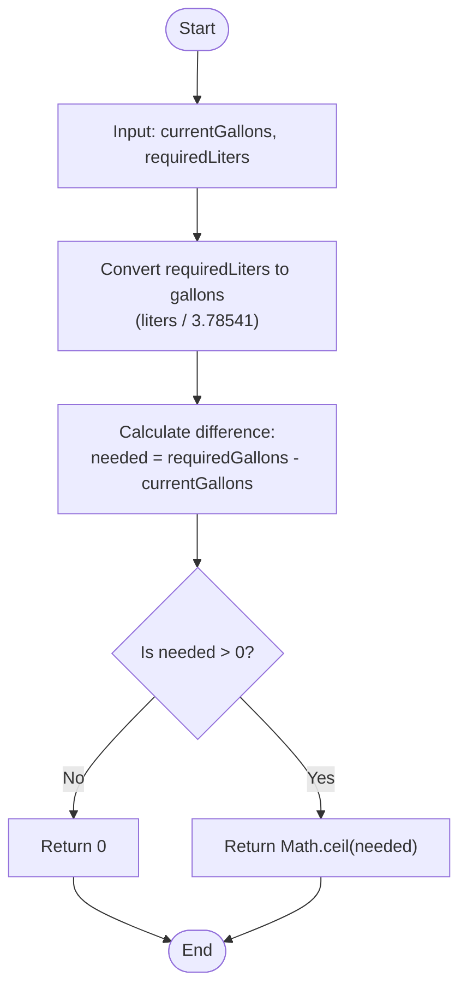

## Problem Statement

Given the number of gallons of fuel your plane currently has, and the required number of liters of fuel to reach your destination, determine how many additional gallons you need to add to complete the trip.

- 1 gallon = 3.78541 liters
- If the plane already has enough fuel, return 0.
- You can only add fuel in whole gallons.
- Do not include decimals in the answer.

## Initial Analysis

### Understanding the Problem

The goal is to determine the minimum number of whole gallons of fuel we must add to a plane to complete a journey. The problem provides the current fuel in **gallons** and the required fuel in **liters**, which implies an initial conversion using the rate of $1 \text{ gallon} = 3.78541 \text{ liters}$.

We must consider three key conditions:

1. **Sufficiency:** If the current fuel already covers the required liters, the result should be `0`.
2. **Loading Units:** Only full gallons (integers) can be added.
3. **Rounding:** If fuel is missing, any fraction of a gallon needed forces loading the next full gallon (rounding up or _ceiling_), ensuring that fuel is never lacking due to decimals.

### Identified Test Cases

1. **No initial fuel:** `fuelToAdd(0, 1)` returns `1`. Although a minimum amount of liters is required, since we have no fuel and can only load whole gallons, the minimum to add is 1.
2. **Insufficient fuel (with decimals):** `fuelToAdd(5, 40)` returns `6`. 40 liters are equivalent to $\approx 10.56$ gallons. Since we already have 5, $\approx 5.56$ are missing, which forces loading 6 whole gallons to cover the excess.
3. **Sufficient fuel:** `fuelToAdd(10, 30)` returns `0`. 30 liters are equivalent to $\approx 7.92$ gallons. Having 10 gallons, the plane already exceeds the requirement, so nothing is added.
4. **Large volumes:** `fuelToAdd(896, 20500)` returns `4520` and `fuelToAdd(1000, 50000)` returns `12209`. These cases validate that the conversion and rounding logic is accurate even with high amounts of fuel.

## Solution Development

### Chosen Approach

To solve this problem, we will use a purely mathematical and sequential approach. The strategy is based on **unifying magnitudes** and **rounding towards the ceiling**.



The logic follows these steps:

1. **Normalization:** Convert the liter requirement to gallons to compare it directly with the current fuel.
2. **Gap Calculation:** Determine the difference between what is needed and what is already there.
3. **Adjustment to Restrictions:** If fuel is missing, round the result to the next integer to comply with the "whole gallons only" rule.

### Step-by-Step Implementation

1. **Define the conversion constant:** Set $1 \text{ gallon} = 3.78541 \text{ liters}$.
2. **Calculate required gallons:** Divide `requiredLiters` by the conversion constant.
3. **Calculate the shortage:** Subtract `currentGallons` from the value obtained in the previous step.
4. **Return the result:**
   - If the shortage is less than or equal to 0, return `0`.
   - If it is greater than 0, return `Math.ceil(shortage)` to ensure we cover the requirement with whole units.

### Complete Code

```javascript
function fuelToAdd(currentGallons, requiredLiters) {
  const LITERS_PER_GALLON = 3.78541
  const requiredGallons = requiredLiters / LITERS_PER_GALLON
  const needed = requiredGallons - currentGallons

  return needed <= 0 ? 0 : Math.ceil(needed)
}
```

## Complexity Analysis

### Time Complexity

The time complexity is **$O(1)$** (constant time). The function performs a fixed number of arithmetic operations (division, subtraction) and a logical comparison, regardless of the magnitude of the input values. Execution time does not scale with data size.

### Space Complexity

The space complexity is **$O(1)$** (constant space). We only use a minimal amount of memory to store constants and intermediate variables (`LITERS_PER_GALLON`, `requiredGallons`, `needed`), which do not depend on any dynamic data structure.

## Edge Cases and Considerations

- **Exact fuel:** If the current fuel is exactly equal to the required fuel after conversion, the difference will be `0` and the function will correctly return `0`.
- **Zero inputs:** If `requiredLiters` is `0`, the result will be `0` (or negative if there is already fuel), correctly handling the absence of loading need.
- **Floating point precision:** Working with a 5-decimal conversion constant ($3.78541$), JavaScript handles the necessary precision for `Math.ceil` to act correctly on even the smallest decimal remainder.

## Reflections and Learnings

### Applied Concepts

- **Unit Conversion:** Application of conversion factors to normalize data before operating.
- **Rounding Logic:** Use of `Math.ceil()` to satisfy business requirements where "any fraction counts as an additional whole unit".
- **Defensive Programming:** Use of the ternary or conditional operator to ensure that a negative number of gallons to add is never returned.

### Possible Optimizations

Since the current solution already operates in constant time and space ($O(1)$), there are no significant performance optimizations. Readability is the key factor here, so keeping the conversion constant clear and the intermediate steps well-defined is the best practice.

## Resources and References

- [MDN Web Docs: Math.ceil()](https://developer.mozilla.org/en-US/docs/Web/JavaScript/Reference/Global_Objects/Math/ceil)
- [FreeCodeCamp: Take Off Fuel](https://www.freecodecamp.org/learn/daily-coding-challenge/2025-12-29/)
