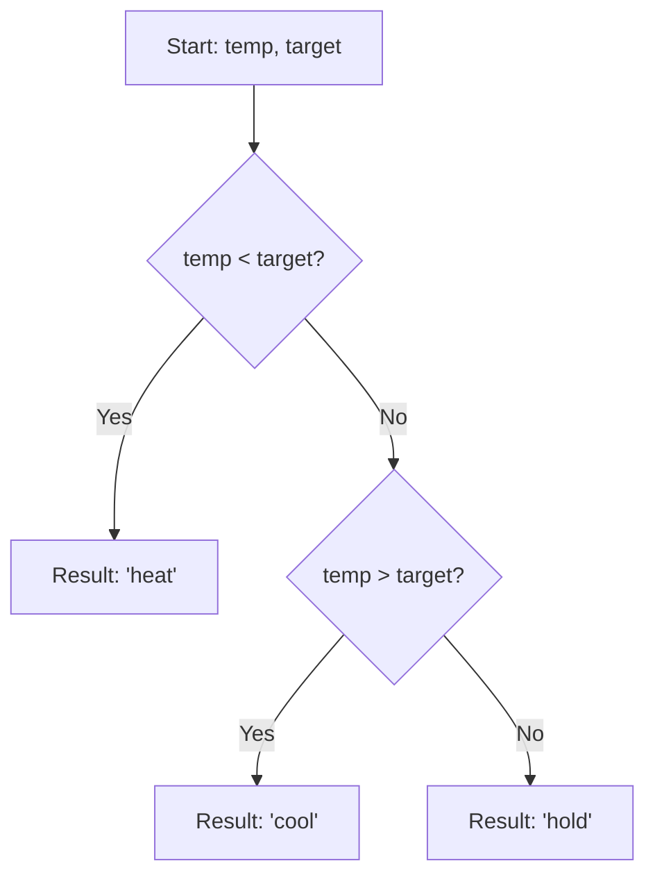

## Thermostat Adjuster - Analysis and Explanation

## Problem Statement

Given the current temperature of a room and a target temperature, the goal is to return a string indicating how to adjust the thermostat based on the following rules:

- Return `"heat"` if the current temperature is **less** than the target temperature.
- Return `"cool"` if the current temperature is **greater** than the target temperature.
- Return `"hold"` if the current temperature is **equal** to the target temperature.

## Initial Analysis

### Understanding the Problem

The problem requires implementing the basic logic of a thermostat. We must compare two numerical values (`temp` and `target`) and return an action instruction. It is a fundamental exercise for practicing conditional control structures and numerical comparisons.

### Logic Visualization



### Identified Test Cases

1. **Heat:** `temp < target` (e.g., $68 < 72$) $\rightarrow$ `"heat"`.
2. **Cool:** `temp > target` (e.g., $75 > 72$) $\rightarrow$ `"cool"`.
3. **Hold:** `temp === target` (e.g., $72 === 72$) $\rightarrow$ `"hold"`.
4. **Negative Numbers:** The logic must be consistent even at sub-zero temperatures.
5. **Decimals:** The comparison must handle floating-point numbers accurately.

## Solution Development

### Chosen Approach

The most direct and readable approach is to use an `if...else if...else` control structure. Since the three conditions are mutually exclusive, this structure allows for a clear and efficient execution flow.

### Implementation

```typescript
/**
 * Adjusts the thermostat by comparing the current temperature with the target.
 * @param temp Current temperature.
 * @param target Desired temperature.
 * @returns Action to perform: 'heat', 'cool', or 'hold'.
 */
function adjustThermostat(temp: number, target: number): string {
  if (temp < target) {
    return 'heat'
  }
  else if (temp > target) {
    return 'cool'
  }
  else {
    return 'hold'
  }
}
```

## Complexity Analysis

### Time Complexity

$O(1)$. The function performs a constant number of comparisons (maximum 2) regardless of the magnitude of the input values.

### Space Complexity

$O(1)$. No additional memory is used that depends on the input size; only a predefined string literal is returned.

## Edge Cases and Considerations

- **Floating-point precision:** In JavaScript/TypeScript, decimal number comparisons are direct. Although critical systems often use a margin of error (*epsilon*), for this challenge, we assume strict equality.
- **Extreme values:** The logic correctly handles very high, very low, or absolute zero values.

## Reflections and Learnings

### Applied Concepts

- **Control Structures:** Use of conditionals for logical decision-making.
- **Early Returns:** Although we use `else if`, the structure allows returning as soon as a condition is met, avoiding unnecessary evaluations.

### Concise Alternative

We could use a chained ternary operator to reduce lines, although in physical device logic, the clarity of `if` is usually preferred:

```typescript
function adjustThermostat(temp: number, target: number): string {
  return temp < target ? 'heat' : temp > target ? 'cool' : 'hold'
}
```

## Resources and References

- [MDN - if...else](https://developer.mozilla.org/en-US/docs/Web/JavaScript/Reference/Statements/if...else)
- [MDN - Comparison operators](https://developer.mozilla.org/en-US/docs/Web/JavaScript/Reference/Operators/Comparison_Operators)
