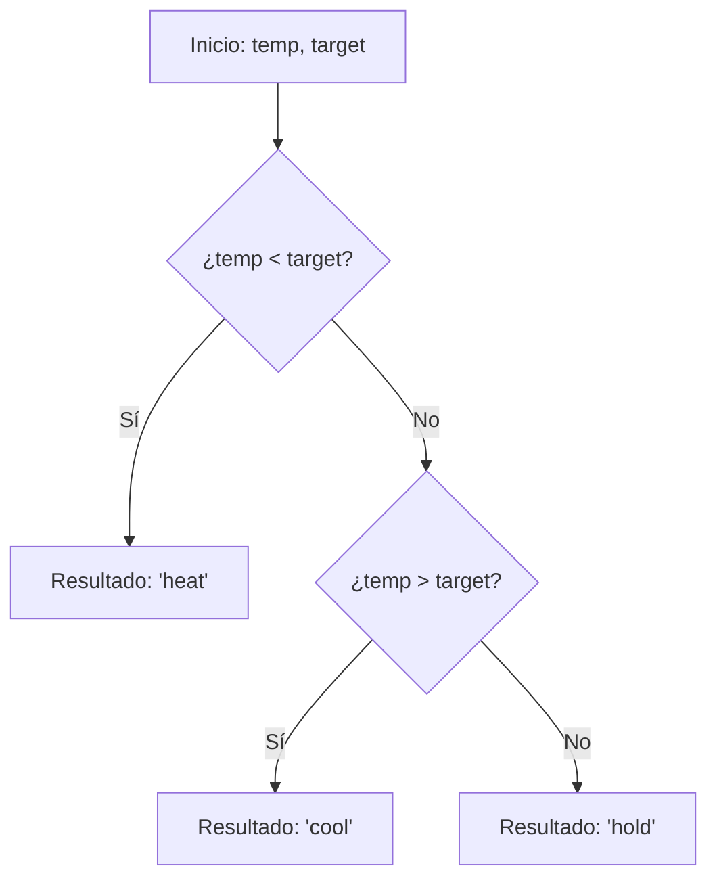

## Thermostat Adjuster - Análisis y Explicación

## Enunciado del Problema

Dada la temperatura actual de una sala y una temperatura objetivo, el objetivo es retornar un string que indique cómo ajustar el termostato basándose en las siguientes reglas:

- Retorna `"heat"` si la temperatura actual es **menor** que la temperatura objetivo.
- Retorna `"cool"` si la temperatura actual es **mayor** que la temperatura objetivo.
- Retorna `"hold"` si la temperatura actual es **igual** a la temperatura objetivo.

## Análisis Inicial

### Comprensión del Problema

El problema requiere implementar la lógica básica de un termostato. Debemos comparar dos valores numéricos (`temp` y `target`) y devolver una instrucción de acción. Es un ejercicio fundamental para practicar estructuras de control condicionales y comparaciones numéricas.

### Visualización de la Lógica



### Casos de Prueba Identificados

1. **Calentar:** `temp < target` (ej: $68 < 72$) $\rightarrow$ `"heat"`.
2. **Enfriar:** `temp > target` (ej: $75 > 72$) $\rightarrow$ `"cool"`.
3. **Mantener:** `temp === target` (ej: $72 === 72$) $\rightarrow$ `"hold"`.
4. **Números Negativos:** La lógica debe ser consistente incluso en temperaturas bajo cero.
5. **Decimales:** La comparación debe manejar números de punto flotante con precisión.

## Desarrollo de la Solución

### Enfoque Elegido

El enfoque más directo y legible es utilizar una estructura de control `if...else if...else`. Dado que las tres condiciones son mutuamente excluyentes, esta estructura permite un flujo de ejecución claro y eficiente.

### Implementación

```typescript
/**
 * Ajusta el termostato comparando la temperatura actual con la objetivo.
 * @param temp Temperatura actual.
 * @param target Temperatura deseada.
 * @returns Acción a realizar: 'heat', 'cool' o 'hold'.
 */
function adjustThermostat(temp: number, target: number): string {
  if (temp < target) {
    return 'heat'
  }
  else if (temp > target) {
    return 'cool'
  }
  else {
    return 'hold'
  }
}
```

## Análisis de Complejidad

### Complejidad Temporal

$O(1)$. La función realiza un número constante de comparaciones (máximo 2) independientemente de la magnitud de los valores de entrada.

### Complejidad Espacial

$O(1)$. No se utiliza memoria adicional que dependa del tamaño de la entrada; solo se devuelve un string literal predefinido.

## Casos Edge y Consideraciones

- **Precisión de punto flotante:** En JavaScript/TypeScript, las comparaciones de números decimales son directas. Aunque en sistemas críticos se suele usar un margen de error (*epsilon*), para este reto asumimos igualdad estricta.
- **Valores extremos:** La lógica maneja correctamente valores muy altos, muy bajos o el cero absoluto.

## Reflexiones y Aprendizajes

### Conceptos Aplicados

- **Estructuras de Control:** Uso de condicionales para la toma de decisiones lógica.
- **Early Returns:** Aunque usamos `else if`, la estructura permite retornar apenas se cumple una condición, lo que evita evaluaciones innecesarias.

### Alternativa Concisa

Podríamos usar un operador ternario encadenado para reducir líneas, aunque en lógica de dispositivos físicos, la claridad del `if` suele ser preferible:

```typescript
function adjustThermostat(temp: number, target: number): string {
  return temp < target ? 'heat' : temp > target ? 'cool' : 'hold'
}
```

## Recursos y Referencias

- [MDN - if...else](https://developer.mozilla.org/es/docs/Web/JavaScript/Reference/Statements/if...else)
- [MDN - Operadores de comparación](https://developer.mozilla.org/es/docs/Web/JavaScript/Reference/Operators/Comparison_Operators)
