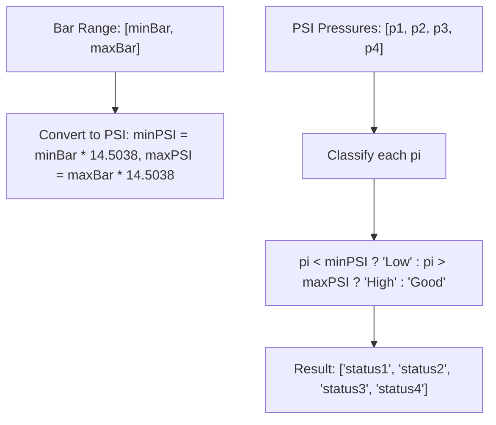

## Tire Pressure - Analysis and Explanation

## Problem Statement

Given an array with four numbers representing the pressure in PSI of a vehicle's four tires and another array with two values representing the minimum and maximum acceptable pressure for your tires expressed in bar, return an array of the four tires expressing their status.

- One bar equals 14.5038 PSI.

Return an array with the following values for each wheel:

- "Low" if the pressure is less than the minimum.
- "Good" if the pressure is between the minimum and maximum (inclusive).
- "High" if the pressure is greater than the maximum.

## Initial Analysis

### Understanding the Problem

The `tireStatus` function receives two parameters: an array `pressuresPSI` with the pressures of the four tires in PSI units (pounds per square inch), and an array `rangeBar` with two values indicating the acceptable pressure range in bar units. The goal is to convert the bar range to PSI and classify each tire pressure into one of three categories: "Low", "Good", or "High", returning an array with these statuses for each tire.

The necessary conversion is 1 bar = 14.5038 PSI, so each range limit is multiplied by this factor to obtain the PSI equivalents.

### Identified Test Cases

Based on the implemented tests, the test cases cover various situations:

1. `tireStatus([32, 28, 35, 29], [2, 3])` → `["Good", "Low", "Good", "Low"]`: Mixed pressures within and outside the range.
2. `tireStatus([32, 28, 35, 30], [2, 2.3])` → `["Good", "Low", "High", "Good"]`: Includes a "High" case.
3. `tireStatus([29, 26, 31, 28], [2.1, 2.5])` → `["Low", "Low", "Good", "Low"]`: Majority "Low".
4. `tireStatus([31, 31, 30, 29], [1.5, 2])` → `["High", "High", "High", "Good"]`: Majority "High".
5. `tireStatus([30, 28, 30, 29], [1.9, 2.1])` → `["Good", "Good", "Good", "Good"]`: All "Good".

These cases verify correct conversion and precise classification, including inclusive limits.

## Process Visualization



## Solution Development

### Chosen Approach

The approach is straightforward: convert the bar range to PSI once at the beginning, then iterate over each PSI pressure and compare it to the converted limits to assign the corresponding status. The array `map` method is used to transform each pressure into its status, maintaining simplicity and readability.

### Step-by-Step Implementation

1. Destructure the `rangeBar` array to obtain `minBar` and `maxBar`.
2. Define the conversion constant `BAR_TO_PSI = 14.5038`.
3. Calculate `minPSI = minBar * BAR_TO_PSI` and `maxPSI = maxBar * BAR_TO_PSI`.
4. Use `pressuresPSI.map()` to iterate over each pressure:
   - If `pressure < minPSI`, return "Low".
   - If `pressure > maxPSI`, return "High".
   - Otherwise, return "Good".
5. Return the resulting array.

### Complete Code

```javascript
/**
 * FreeCodeCamp Problem: Tire Pressure
 * Category: FreeCodeCamp
 *
 * @param {Array<number>} pressuresPSI - Array of tire pressures in PSI
 * @param {Array<number>} rangeBar - Array with two numbers representing the minimum and maximum pressure in bar
 * @returns {Array<string>} - Array of strings indicating the status of each tire ("Low", "Good", "High")
 */
function tireStatus(pressuresPSI, rangeBar) {
  const [minBar, maxBar] = rangeBar
  const BAR_TO_PSI = 14.5038

  // Convert min and max from bar to PSI
  const minPSI = minBar * BAR_TO_PSI
  const maxPSI = maxBar * BAR_TO_PSI

  return pressuresPSI.map((pressure) => {
    if (pressure < minPSI) {
      return 'Low'
    }
    else if (pressure > maxPSI) {
      return 'High'
    }
    else {
      return 'Good'
    }
  })
}

export default tireStatus
```

## Complexity Analysis

### Time Complexity

O(n), where n is the number of elements in `pressuresPSI` (always 4 in this problem, but the algorithm scales linearly). The initial conversion is O(1), and the `map` iterates once over the array.

### Space Complexity

O(n), since `map` creates a new array of the same size as the input. No additional significant structures are used.

## Edge Cases and Considerations

- The problem assumes arrays of exactly 4 elements, as indicated by the tests.
- Negative or non-numeric values are not explicitly handled, but in a real context, validation could be added.
- The comparison is inclusive for "Good", matching the statement.
- If `minBar > maxBar`, the range would be invalid, but it is not considered in the tests.

## Reflections and Learnings

### Applied Concepts

- Unit conversion: Use of constants for physical conversions.
- Array methods: `map` for functional transformation.
- Destructuring: To concisely extract values from arrays.

### Possible Optimizations

The code is efficient for the fixed array size. No optimizations are necessary, as it is simple and readable. If generalized to arrays of any size, it would remain optimal.

## Resources and References

- [FreeCodeCamp Daily Coding Challenge](https://www.freecodecamp.org/learn/daily-coding-challenge/2026-01-05/)
- Related concepts: Unit conversion in JavaScript, array methods.
