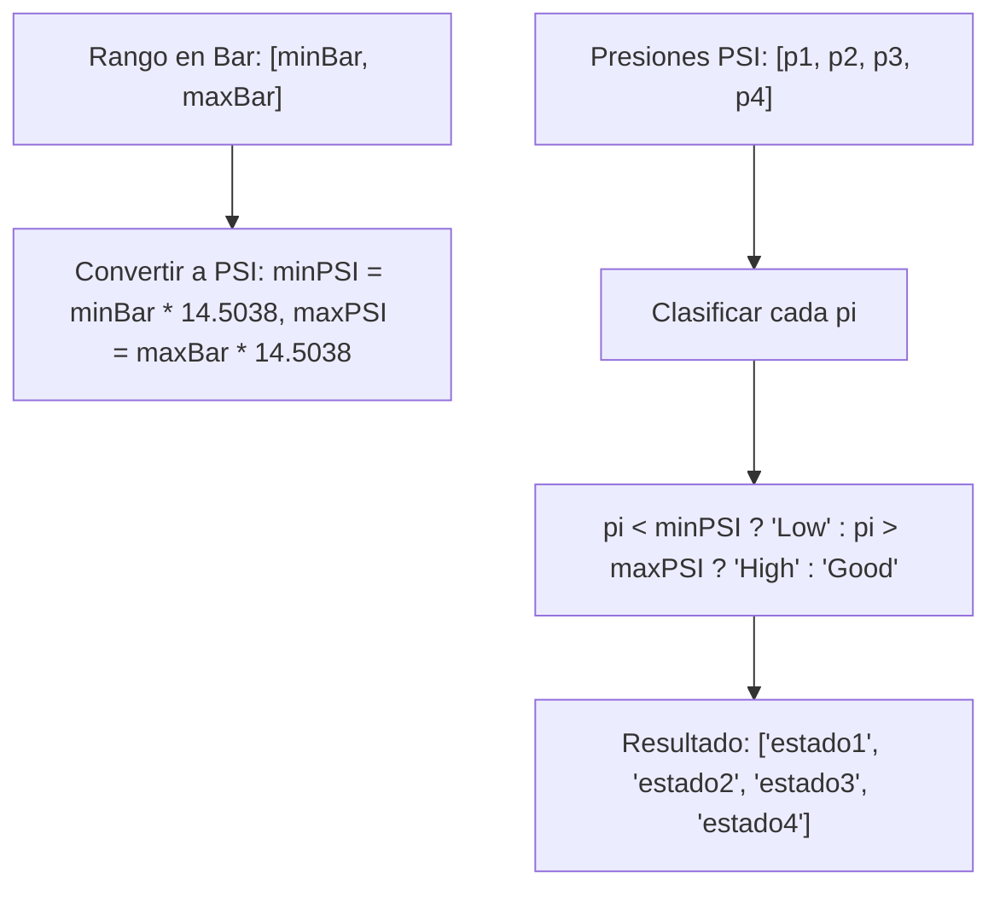

## Presión de Neumáticos - Análisis y Explicación

## Enunciado del Problema

Dado un array con cuatro números que representan la presión en PSI de las cuatro llantas de un vehículo y otro array con dos valores representando el mínimo y el máximo valor aceptable para tus llantas expresado en bar, retorna un array de las cuatro llantas expresando su estado.

- Un bar equivale a 14.5038 PSI.

Retorna un array con los siguientes valores para cada rueda:

- "Low" si la presión es menor al mínimo.
- "Good" si la presión está entre el mínimo y máximo (inclusive).
- "High" si la presión es mayor al máximo.

## Análisis Inicial

### Comprensión del Problema

La función `tireStatus` recibe dos parámetros: un array `pressuresPSI` con las presiones de las cuatro llantas en unidades PSI (libras por pulgada cuadrada), y un array `rangeBar` con dos valores que indican el rango aceptable de presión en unidades bar. El objetivo es convertir el rango de bar a PSI y clasificar cada presión de las llantas en una de tres categorías: "Low", "Good" o "High", retornando un array con estos estados para cada llanta.

La conversión necesaria es 1 bar = 14.5038 PSI, por lo que se multiplica cada límite del rango por este factor para obtener los equivalentes en PSI.

### Casos de Prueba Identificados

Basado en los tests implementados, los casos de prueba cubren diversas situaciones:

1. `tireStatus([32, 28, 35, 29], [2, 3])` → `["Good", "Low", "Good", "Low"]`: Presiones mixtas dentro y fuera del rango.
2. `tireStatus([32, 28, 35, 30], [2, 2.3])` → `["Good", "Low", "High", "Good"]`: Incluye un caso "High".
3. `tireStatus([29, 26, 31, 28], [2.1, 2.5])` → `["Low", "Low", "Good", "Low"]`: Mayoría "Low".
4. `tireStatus([31, 31, 30, 29], [1.5, 2])` → `["High", "High", "High", "Good"]`: Mayoría "High".
5. `tireStatus([30, 28, 30, 29], [1.9, 2.1])` → `["Good", "Good", "Good", "Good"]`: Todas "Good".

Estos casos verifican la conversión correcta y la clasificación precisa, incluyendo límites inclusivos.

## Visualización del Proceso



## Desarrollo de la Solución

### Enfoque Elegido

El enfoque es directo: convertir el rango de bar a PSI una vez al inicio, luego iterar sobre cada presión en PSI y compararla con los límites convertidos para asignar el estado correspondiente. Se utiliza el método `map` de arrays para transformar cada presión en su estado, manteniendo la simplicidad y legibilidad.

### Implementación Paso a Paso

1. Desestructurar el array `rangeBar` para obtener `minBar` y `maxBar`.
2. Definir la constante de conversión `BAR_TO_PSI = 14.5038`.
3. Calcular `minPSI = minBar * BAR_TO_PSI` y `maxPSI = maxBar * BAR_TO_PSI`.
4. Usar `pressuresPSI.map()` para iterar sobre cada presión:
   - Si `pressure < minPSI`, retornar "Low".
   - Si `pressure > maxPSI`, retornar "High".
   - De lo contrario, retornar "Good".
5. Retornar el array resultante.

### Código Completo

```javascript
/**
 * FreeCodeCamp Problem: Tire Pressure
 * Category: FreeCodeCamp
 *
 * @param {Array<number>} pressuresPSI - Array of tire pressures in PSI
 * @param {Array<number>} rangeBar - Array with two numbers representing the minimum and maximum pressure in bar
 * @returns {Array<string>} - Array of strings indicating the status of each tire ("Low", "Good", "High")
 */
function tireStatus(pressuresPSI, rangeBar) {
  const [minBar, maxBar] = rangeBar
  const BAR_TO_PSI = 14.5038

  // Convert min and max from bar to PSI
  const minPSI = minBar * BAR_TO_PSI
  const maxPSI = maxBar * BAR_TO_PSI

  return pressuresPSI.map((pressure) => {
    if (pressure < minPSI) {
      return 'Low'
    }
    else if (pressure > maxPSI) {
      return 'High'
    }
    else {
      return 'Good'
    }
  })
}

export default tireStatus
```

## Análisis de Complejidad

### Complejidad Temporal

O(n), donde n es el número de elementos en `pressuresPSI` (siempre 4 en este problema, pero el algoritmo escala linealmente). La conversión inicial es O(1), y el `map` itera una vez sobre el array.

### Complejidad Espacial

O(n), ya que `map` crea un nuevo array del mismo tamaño que el de entrada. No se utilizan estructuras adicionales significativas.

## Casos Edge y Consideraciones

- El problema asume arrays de exactamente 4 elementos, como indican los tests.
- No se manejan valores negativos o no numéricos explícitamente, pero en un contexto real, se podría agregar validación.
- La comparación es inclusiva en "Good", lo que coincide con el enunciado.
- Si `minBar > maxBar`, el rango sería inválido, pero no se considera en los tests.

## Reflexiones y Aprendizajes

### Conceptos Aplicados

- Conversión de unidades: Uso de constantes para conversiones físicas.
- Métodos de arrays: `map` para transformación funcional.
- Desestructuración: Para extraer valores de arrays de manera concisa.

### Posibles Optimizaciones

El código es eficiente para el tamaño fijo del array. No hay optimizaciones necesarias, ya que es simple y legible. Si se generalizara a arrays de cualquier tamaño, permanecería óptimo.

## Recursos y Referencias

- [FreeCodeCamp Daily Coding Challenge](https://www.freecodecamp.org/learn/daily-coding-challenge/2026-01-05/)
- Conceptos relacionados: Conversión de unidades en JavaScript, métodos de arrays.
